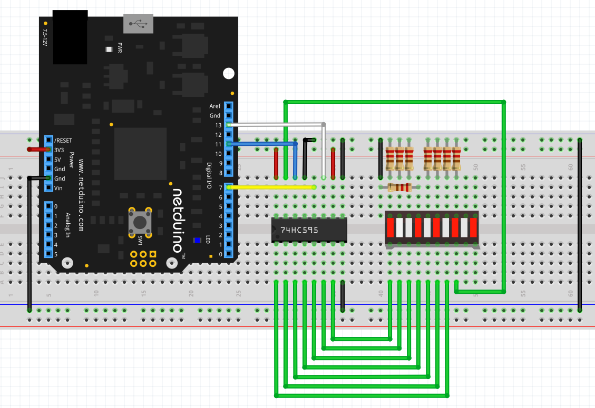

Start your article with a brief introduction explaining the purpose of the article.

Use one or two paragraphs to capture the readers interest.

# Article Structure

## Separation of Conceptual and Concrete Examples


# Markdown Syntax Reference

## Inline Code/Backticks

Use backticks (\`) for inline code, variable names, pins, or other code-like symbols. 

### Examples

#### Inline code 

In this, case, we'd use the `foo` var to store our data.

#### Pin/Wire Symbols

The two bus wires used are usually labelled `SDA` (Data) and `SCK` (Clock). 

#### Part Values

Capacitance/resistance values should also be back-ticked:

  "supplied then a `47K` resistor..."

## Code Blocks/Triple Backtick

In addition to code blocks, console output, terminal commands, etc., should be in a triple backtick code block.

### Examples

#### Source Code

The initial triple backticks should be followed by the _csharp_ modifier to indicate that the following section should use C# syntax highlighting.  For example:

<pre>
```csharp
while (true)
{
    ToggleLED();
}
```
</pre>

will appear as:

```csharp
while (true)
{
    ToggleLED();
}
```

#### Application/Console Output

Putting console text in a triple backtick block has the benefit of differentiating it from prose, as well as removing the need for `<br/>` tags:

```
Configuration register: 0x60, 0xa0
Temperature data: 0x0c, 0xb1
13-bit value retrieved.
25.375 C / 77.675000000000011 F
Temperature data: 0x0c, 0xb1
13-bit value retrieved.
25.375 C / 77.675000000000011 F
Temperature data: 0x0c, 0xb1
13-bit value retrieved.
25.375 C / 77.675000000000011 F
```

## Coding Style

Use standard C# coding and bracing conventions.  There are many examples of the C# style on [Microsoft's C# Language Reference](https://docs.microsoft.com/en-us/dotnet/csharp/index) site.

### Tabs or Spaces?

Spaces should be used in preference to tabs for consistency in rendering the output in the browser.  This is especially critical in example code enclosed in backticks.

Use four spaces when indenting code, again this is consistent with the style used on Microsoft's sites.

# Hardware

When selecting hardware, try to select commonly available components and breakout boards.  This will make it easier for someone to replicate project being discussed.

## Schematics and Breadboard Layout

### Schematics

### Breadboard

Make it easier for the reader to reproduce the work on breadboard by including a diagram such as the following:



The above was produced using [Fritzing](http://fritzing.org/home/).

A good convention is to reserve red wires for power and black wires for ground signals.

Try not to cross wires of the same color as this can be confusing.

## Photographs

A photograph of a component or layout can also help the reader get a feel for the project.

# Additional Resources / See Also / Further Information

The _Additional Resources_ Section should go at the bottom of the article and use the following general pattern:

### Further Reading

 * **[Article Title](Link)** - Brief description/relevance.
 * **[Article Title](Link)** - Brief description/relevance.

### Product Links
 
 * **[Product Title](Link)** - Brief description/relevance.
 * **[Product Title](Link)** - Brief description/relevance.

