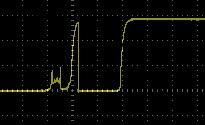

A capacitor is an electrical device capable of storing energy.

Capacitors are made up of two electrical conductors separated by an insulator.  Early experimental capacitors were made from two metal plates separated by an air gap.  The metal plates are the conducting material and air acted as an insulator.  The insulating layer between the metal plates is called a [dielectric](https://en.wikipedia.org/wiki/Dielectric).

Two leads connect the capacitor to an electronic circuit.  It should be noted that some capacitors have the leads marked with a + and / or - symbol.  These capacitors **must** be connected with the + lead connected to the positive voltage and the - lead connected to the negative voltage (or ground).  These capacitors are _polarized_ capacitors.  Failure to observe this can cause the capacitor to explode or burst into flames.  Electrolytic and tantalum capacitors are examples of polarized capacitors.

The separation of the two metal plates in a capacitor means that a charge can build up on each plate.  Doing this is _charging_ the capacitor.  The capacitor can be _discharged_ by removing the power source and connecting it to a circuit.  The charge will then be released until the capacitor has fully discharged.

## Capacitance

The measurement of capacitance is the Farad (symbol F).  The Farad is a large quantity and capacitance values are ofter prefixed by one of the following:

| Letter | Prefix | Multiple         |
|--------|--------|------------------|
| p      | Pico   | 10-12 |
| n      | Nano   | 10-9  |
| &mu;   | Micro  | 10-6  |
| m      | Milli  | 10-13 |

So a 1&mu;F capacitor has a capacitance of 0.000001 F (or 10-6 F).

## Voltage Rating

Capacitors are often given a voltage rating.  This is the maximum voltage that they can tolerate before they breakdown and become unusable and possibly explode.

Always choose a capacitor with a voltage rating higher than the circuit voltage it will be exposed to.

## Typical Uses

The ability of a capacitor to store and release energy at short notice makes it extremely useful.  Typical application include:

* Switch debouncing (RC Circuit)
* Decoupling
* Filters

### Switch Debouncing

Mechanical switches are noisy devices.  Pressing a button does not always result in a single clean signal.  The mechanical properties of the switch mean that contact can sometimes generate spurious signals:

RC Circuits can be used to smooth out the signal.  Adding an RC circuit results in signals such as the following:

Notice the curved nature of both the falling and rising signals.

### Decoupling

A power supply is an efficient device capable of supplying current varying from a few milliamps to the maximum rating of the power supply.  It responds to the changing demand of the circuit it is connected to by increasing or decreasing the amount of current available as required.  These changes are not always instantaneous.

Sometimes a circuit will place a sudden demand for an increase in current.  The power supply may take a (very) short time to respond to this demand.  A decoupling capacitor can be used to make up the shortfall.  It acts like a small local battery making up the shortfall when necessary and recharging when the power levels return to normal.

### Filters

Filters circuits can be used to remove (filter out) signals of a defined frequency.  There are several filter types:

* Low pass filter
* High pass filter
* Band pass filter

Various combination of capacitors, [resistors](../Resistors/) and inductors are used to build these filters.

# Further Reading
* [Capacitor description on Wikipedia](https://en.wikipedia.org/wiki/Capacitor)
* [RC Circuits](https://en.wikipedia.org/wiki/RC_circuit)
* [Decoupling Capacitor](https://en.wikipedia.org/wiki/Decoupling_capacitor)
* [High Pass Filters](https://en.wikipedia.org/wiki/High-pass_filter)
* [Low pass filters](https://en.wikipedia.org/wiki/Low-pass_filter)
* [Band pass filters](https://en.wikipedia.org/wiki/Band-pass_filter)