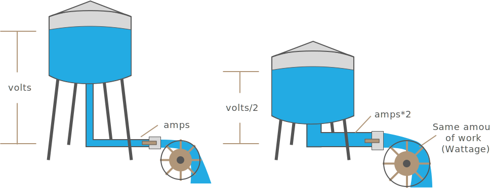

North American and European household electricity mains have different voltages (110V and 220V, respectively), but with a plug adapter, appliances generally work on both. In fact, the total amount work that they can do is essentially the same. This is because while European mains are twice the voltage, they're actually half the amperage; most wall outlets in North America are rated for 12A (technically, 80% of 15A), whereas European wall outlets are typically rated for 6A.

Through an induction circuit, we can actually trade voltage for amperage, or vice-versa, as long as the overall amount of work (amps & volts) stays the same. Going back to our water analogy, we can think of water in a pipe. If we use a bigger pipe, but lower our drop (voltage), more water will travel through (amps), but it will have less speed/force:



This proportional relationship between amperage and voltage is codified in a rule called [_ohm's law_](https://en.wikipedia.org/wiki/Ohm%27s_law), which we'll explore in part 3.

Notice that in the diagram above, the water wheel had to get larger to accomodate the larger quantity of water flowing over it. While this is just an analogy; this concept carries through to the physical realities of electricity. An electric motor that is designed to run on 220V @ 5A will be physically different than one that runs on 110V @ 10A. 

<!--
## Transformers

-->

## Wattage

Because in order to properly describe the amount of work that electrical current can do you need to use both amperage and voltage, there is a convenience unit called a _[watt](https://en.wikipedia.org/wiki/Watt)_ (W) that can be described as follows:

```
Watts = Volts * Amps
```

With the watt, we can see that both North American and European wall outlets actually have the same power:

```
North American Wall Outlet = 110V * 12A = 1,320W
European Wall Outlet = 220V * 6A = 1,320W
```

Now, comparing some of the common electrical currents, sorted by wattage, they make a lot more sense when taken as a whole:

| Electrical Current              | Voltage | Amperage | Wattage |
|---------------------------------|---------|----------|---------|
| Hair Dryer                      | 117V    | 12A      | 1,404W  |
| 60 Watt Incandescent Light Bulb | 117V    | ~0.5A    | ~60W    |
| iPad/Tablet Charger             | 5V      | ~2A      | 10W     |
| Netduino                        | 5V      | 40mA     | 0.2W    |

### Wattage == Power

Because wattage describes the total amount work a current can do, it's often referred to as _power_.

## [Next - Source, Load, and Ground](../Source_Load_and_Ground)

<br/>
