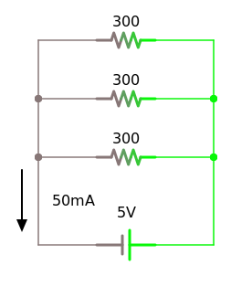

We're going to dive deeper into resistors and resistor networks later, but 

 * _Resistors_ are electronic components made of materials that restrict the flow of electricity.
 * Resistance is measured in _ohms_, often denoted as `Ω`.
 * _Ohm's law_ states that the resistance provides a proportional reduction of current flowm and is codified as:
   * `Voltage = Amperage * Resistance` or `V = I*R` 
   * `Amperage = Voltage / Resistance` or `I = V/R`
   * `Resistance = Voltage / Amperage` or `R = V/I`
   * Where `I` is amps, `R` is ohms, and `V` is voltage.
 * Resistors have a _power rating_ which specifies the amount of power (wattage) they can safely handle.
 * Resistors wired in _series_ (end-to-end) have a total resistance which is the sum of the resistance of each resistor.
 * _Conductance_ is the reciprocal of resistance, `(1/R)`, and is measured in siemens (S), but most often abbreviated as `G`.
 * Resistors wired in _parallel_ have a total resistance which is the sum of the conductance (in siemens) of each resistor, and then converted back to resistance.

<!--
## Circuit Comparison [stashed here]

| Single Resistor   | Resistors in Series  | Resistors in Parallel     |
|-------------------|--------------|----------|
|  |  |  |
-->

## Part 4 - Coming Soon!