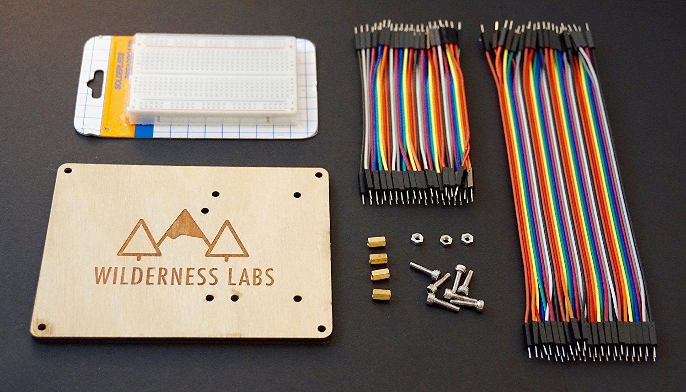
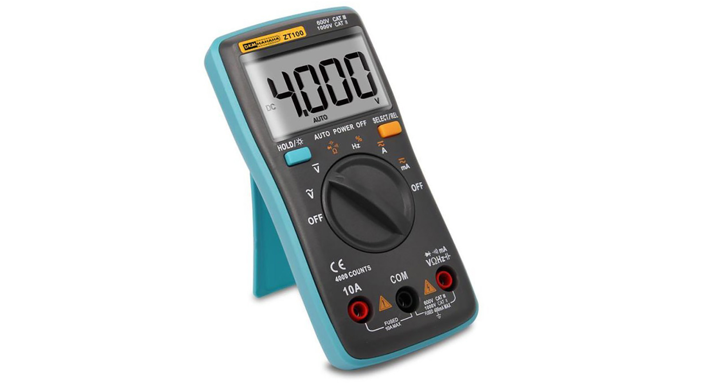
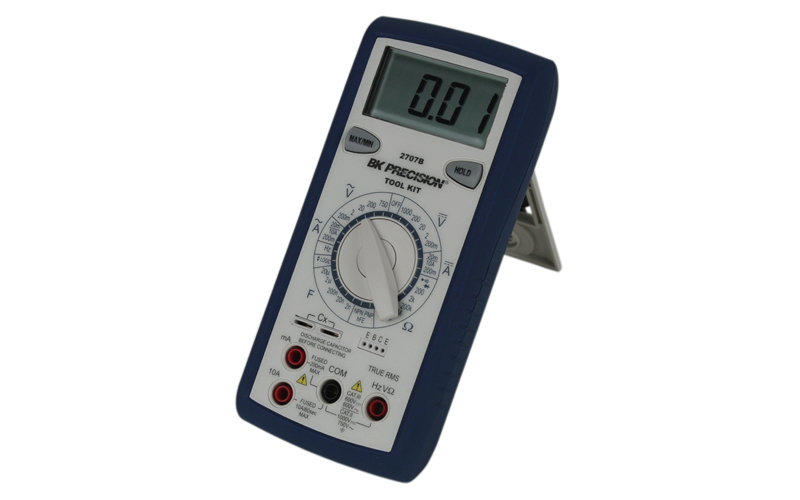
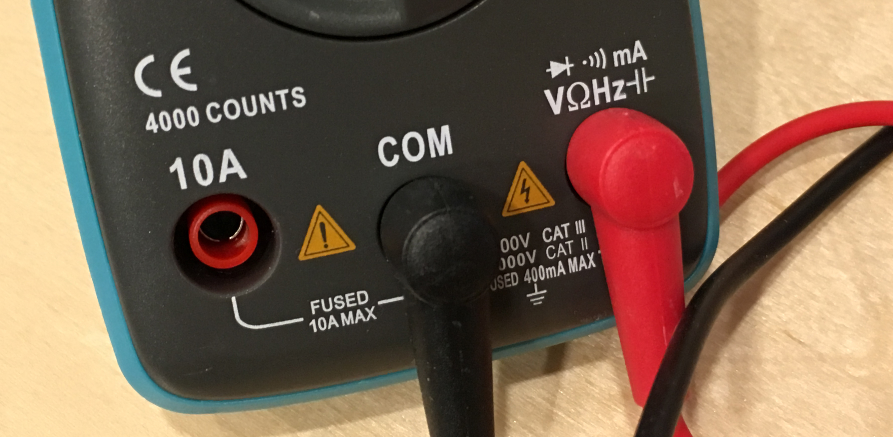
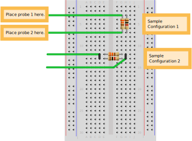

In this lab we're going to build some very simple resistance circuits using a breadboard, which is a common prototyping surface, and measure the resistance in the circuits using a multimeter.

### Requirements

To do this lab, you'll need the following components and tools:

| Item                                   | Approximate Cost (USD) |
|----------------------------------------|------------------------|
| 1/4 Watt resistor kit                  | $8 - $20               |
| Half size breadboard with power rails  | $16 for 10 pieces      |
| Breadboard jumper wires                | $7 - $15               |
| Multimeter                             | $10 - $40              |
| Wire cutter (optional)                 | $10 - $25              |

## Resistor Pack

This lab will only use a few resistors, but it's worth it to buy a resistor kit. They're inexpensive, and resistors are something that you'll use all the time prototyping. For nearly every circuit we'll build in this entire tutorial, 1/4 watt resistors will be fine. 

Resistor kits are available from a number of suppliers, most kits have a selection of the most common resistors.

SparkFun makes a [great one that runs about USD$8](https://www.sparkfun.com/products/10969) and has 500 of the most common resistors in 5% tolerance:


Joe Knows Electronics also makes [a great kit that contains 860, 1% tolerance resistors for ~USD$20](http://amzn.to/2iwbWtq), and is available on Amazon.com.

## Breadboards

Both circuits in this lab will fit on a single half size breadboard, though I recommend buying 3 or more of them; they're cheap and it's nice to be able to keep circuits around.

A [pack of 10 of them](http://amzn.to/2zUjcZt) runs ~USD$16 on Amazon.com.

Breadboards simplify prototyping by creating connections without soldering. The following illustration is of a half size bread board with power rails (my favorite kind for prototyping), and an "xray" view on the right showing the copper traces that connect the _wells_ (holes):


Each row of 5 pins (they're numbered in the illustration, and most good breadboards also have numbering) are connected, and the well or division down the middle of the board divides the two sides, so components can be placed across it, with the leads being separated. Additionally, many breadboards, such as the one pictured above, have power rails along the edges that are connected the whole way down. 

### Power and Ground Rails

Usually, the positive (`+`) side of power rails are connected to the `3.3V` or `5V` pin on the Netduino, and the negative (`-`) side is connected to ground:


This provides a very useful base for adding more complex circuits that share power and ground.

#### 3.3V and 5V Power and Ground

Sometimes, when building circuits, they might require both `3.3V` and `5V` power, in which case, you can wire one power rail to the `3.3V` pin, and one to the `5V` pin, while they both share a ground connnection:


### Breadboard Jumper Wires

There are two main kinds of breadboard jumper wires; straight wires, and flexible wires.

#### Straight Wires

Straight wires are made from single strand wire and are usually sold in a kit which has a variety of pre-cut sizes and colors. They can be easily bent to fit whatever circuit routing necessary. A [140 piece kit](http://amzn.to/2B6aINg) like the one shown below can be had for ~USD$7 on Amazon.com:


And a [350 piece kit](http://amzn.to/2hEdsJ3) runs around USD$15:


I have both, and prefer the organization of the 350 piece kit, but the 140 piece kit is just fine.

#### Flexible wires

Flexible jumper wires come in combinations of male to male, male to female, and female to female. They are made of multi stranded wires and so are very flexible, and are good for long connections. However, unlike the straight wires, they usually only come in two sizes, so they're not very practical for short connections; circuits built with only them can be very messy. They usually come in a ribbon that can be peeled apart, and a [pack of 80](http://amzn.to/2hFGuIq) run USD$6 on Amazon.com:


For most circuits, male to male are all that you'll need, but certain circuits later will require male to female wires. 

#### Other Wires

You can also make your own breadboard jumper wires. I don't recommend it, the pre-cut wires are so cheap and easy to use, but if you do, make sure to purchase 22 gauge, insulated, single strand wire.  Single stranded wire will push into the breadboard wells without bending too much.

#### Lab Requirement

It's nice to have both straight and flexible wires, but for this lab, the straight wires will be sufficient.

### Wilderness Labs Hack Kit

We make a [Wilderness Labs hack kit](http://amzn.to/2iyFoPx) that comes with a nice half size breadboard, flexible jumper wires, and laser etched board to mount a Netduino and the included breadboard:



### Multimeters

In this lab, we'll use a multimeter to measure resistance of different resistor combinations.
A multimeter is a must-have tool for hardware developers. A decent multimeter doesn't cost very much, usually less than USD$20, but when purchasing one, I recommend finding one with the following features:

* **Auto-Ranging** - An auto-ranging multimeter simplifies reading values by not requiring you to set the approximate range of reading. So if when reading resistance, it's just one setting, without having to know the amount of resistance that's being measured.
* **Small** - There's little need for a multimeter to be large, and pocket sized multimeters are much easier to carry around.
* **Digital** - Analog (those with a physical gauge) multimeters are nice because they can more effectively show change, but I find that digital multimeters (those with an LCD screen) are much easier to read and use.

As a bonus feature, you might consider getting a multimeter that does _transistor testing_. We'll cover transistors in more detail later, but a transistor tester will identify the legs (pins) on a transistor and also tell you if it's functional.

#### Entry-Level, Pocket Mutltimeter

[Here is a great, pocket-sized, starter multimeter from Amazon](https://www.amazon.com/gp/product/B072XH5SJ7/ref=as_li_tl?ie=UTF8&camp=1789&creative=9325&creativeASIN=B072XH5SJ7&linkCode=as2&tag=ilderneabs-20&linkId=a5c314e3ce625c8bee20f98f7e4827f3) that costs about USD$13 and will probably get you through all of this tutorial:



#### Mid-level Multimeter

For a midlevel multimeter, [this one](http://amzn.to/2hEjvNG) runs $37 and has a transistor tester, temperature sensor, and more:


#### Professional Multimeter

For a professional level multimeter that will do pretty much everything you might want to do, [BK Precision 2707B](https://www.mouser.com/ProductDetail/BK-Precision/2707B/?qs=sGAEpiMZZMtHyRFzBQ9JV5QGausOCKjC) is a manual ranging model that has transistor testing, capacitance and diode testing, and more. At ~USD$95, they're an investment.



And while you manually have to set the range, they're actually much faster than auto-ranging models.

### Wire Cutter

Resistor leads are pretty long, so I often trim them down a bit to put them in breadboards; it makes the circuits a lot cleaner. I suggest a wire cutter/stripper combo tool, so that you can also strip wire. Make sure to get one that handles the size of wires that are typically used for prototyping, usually between 20 and 30 gauge. [Klein tools makes a nice one](http://amzn.to/2hG0iLB) for ~USD$22:


## Exercise 1 - Measuring Series Resistance

For our first exercise, we're going to measure two resistors in series. This will allow us to learn how to use a multimeter, build a simple circuit, and verify the series resistance law.

### Step 1 - Build the Resistance Circuit

Select two resistors of any value from your resistor kit. For mine, I grabbed a `330Ω` resistor, and a `1kΩ` resistor. Then, arrange them in series (end-to-end) on a breadboard. How you configure them is your choice, as long as their common legs are connected. The following illustration shows a breadboard with 3 different, yet valid configurations in which to place the resistors (note that configuration 3 requires a wire to connect the two resistors, because they have no common row connection):


The green wires illustrate where we'll measure resistance with the probes.

### Step 2 - Measure the Circuit and Calculate Percent Error

Once the circuit is built, we need to measure the resistance from one end of the resistor series to the other.

Plug the multimeter probes into the standard, low power ports on your multimeter, putting the black probe into the black socket, and the red probe into the red socket. Usually the black socket is labeled `COM`, for "common", and the red socket has a set of symbols indicating that it's meant for the measurement probe:



The other red sockets are usually for high power measurements, which we won't need.

Next, put the multimeter in resistance measurement mode (usually an Ohm (`Ω`) symbol), and place the probes (it doesn't matter which is which for resistance measurement) directly into the wells where the resistor legs go in so that there is good connection, as shown below:


Notice that the multimeter might take a little time to stabilize on a reading. Auto-ranging multimeters can take longer than manual ranging multimeters, but even on manual ranging ones, the value might change as the probes are moved slightly, and the connection gets better or worse.

Recall that resistances in series are additive, so the total resistance in my circuit should read `1,330Ω`, give or take `5%`, because I used resistors with a `5%` tolerance:

```
Given:
R1 = 330Ω
R2 = 1kΩ

Therefore:
Total Expected R = 330Ω + 1,000Ω = 1,330Ω
```

After stabilizing, my multimeter reads that the total resistance is `1,337Ω`, which is very close. We can determine the percentage error by dividing the difference between the expected value and the actual value by the expected value, and then multiplying by 100:

```
Given:
Expected Value: 1,330Ω
Actual Value: 1,337Ω
Difference = 1,330Ω - 1,337Ω = -7Ω
Percentage Error = ((ExpectedValue - ActualValue) / ExpectedValue) * 100

Therefore:
Percentage Error = -7 / 1,330 = 0.005 * 100 = 0.5%
```

Even though these resistors are stated to be accurate to within 5%, these particular resistors are actually accurate to within one half of one percent!

Following my steps, measure your total resistance and calculate the percent error. Are your resistors within specification of their stated tolerance? If your measured resistance is way off, double check the circuit to make sure it looks like one of the examples above.


## Exercise 2 - Measuring Parallel Resistance

In this exercise we're going to build a parallel resistance circuit and measure it. 

### Step 1 - Build the Circuit

Just as before, choose two resistors from you resistor kit and place them in parallel wiring configuration so that they each share their legs. The following illustration shows two different sample configurations, as well as the probe test points:



### Step 2 - Measure Actual, Calculate Expected Values

Next, measure the actual resistance and calculate the expected values. I used two, `4.7k` resistors and measured `2.32kΩ`.  Recall that parallel resistance is calculated using conductance:

```
Given:
Conductance (G), in Siemens (S) = 1 / R
R1, R2 = 4.7kΩ

Therefor:
Total G = (1 / 4700Ω) + (1 / 4700Ω) = 0.0004S
Expected Total R = 1 / 0.0004S = 2,350Ω = 2.35kΩ
```

My actual resistance measured was `2.32kΩ`, and the expected was `2.35kΩ`. Now, calculating the error:

```
Difference = 2,350Ω - 2,320Ω = 30Ω
Percent Error = (30 / 2,350) * 100 = 1.2%
```

This time my error was `1.2%`. Slightly more than last time, but still well with in the 5% stated tolerance.

 * What is your measured resistance?
 * What is the expected value?
 * What is the percent error of actual vs. expected?

## [Next - Review](../Review)

<br/>