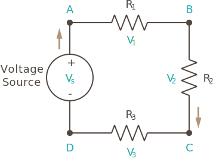
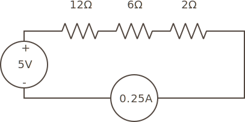
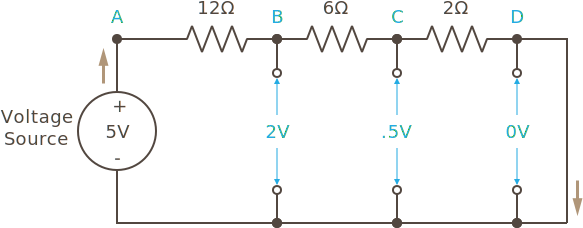

In part 4, we learned from Ohm's law that resistance reduces the amount of current that flows through a circuit, but it turns out, voltage is also reduced.

In fact, _Kirchhoff's voltage law_ states that the sum of all voltage drops around a circuit loop is equal to the sum of all voltage sources. In other words, if we had a circuit loop as in following illustration, with a `5V` voltage source, the total drop in voltage across all the resistors would be `5V`:



Algebraically, we can express this as:

```
Vs = V1 + V2 + V3
```
Where `V1` represents the voltage drop at `R1`, and so forth.

## Deriving from Ohm's Law

We can actually calculate Kirchhoff's voltage law from Ohm's law. 

Recall that in a series resistance, each resistor experiences the same amount of current:



In this case, the total resistance (series resistances are additive), is `20Ω`, therefore the current is:

```
I = 5V / 20Ω = .25A
```

Now, recalling Ohm's law solved for voltage (`V = I * R`), we can calculate the voltage drop for that current at each resistor:

```
R1 Voltage = .25A * 2Ω = 0.5V
R2 Voltage = .25A * 6Ω = 1.5V
R3 Voltage = .25A * 12Ω = 3V
```

If we add each of these voltage drops up:

```
Total voltage drops = 0.5V + 1.5V + 3V = 5V = Voltage Source
```

The total amount of voltage drop is the exact same amount as the voltage source!

## Voltage Reduction

Revisiting the previous circuit, if we put a voltmeter between points B, C, D, and ground, we'd get `2V`, `.5V`, and `0V`, respectively:



This is because the voltage drop is removed from the source voltage to get the output voltage after each resistor:

```
B -> Ground = 5V - 3V = 2V
C -> Ground = 2V - 1.5V = .5V
D -> Ground = .5V - .5V = 0V
```


## [Next - Voltage Division](../Voltage_Division)

<br/>