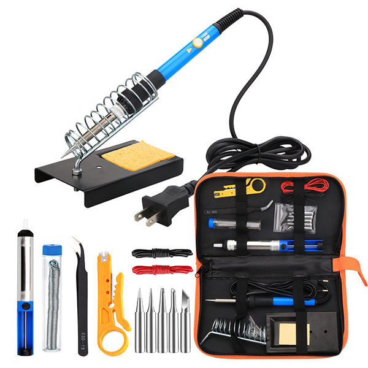
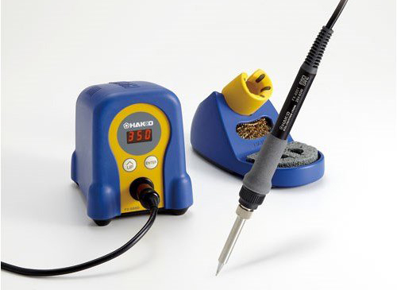

In this lab, we'll build a circuit that powers a 5V luminosity (light level) sensor and uses a voltage divider to level shift the sensor's output from a 5V _voltage domain_ to a 3.3V voltage domain. Along the way, we'll also learn how to do some basic soldering, which will needed to build the prototype circuit.

Voltage dividers are the only practical way of level shifting an analog signal (one in which the signal may have a varying degree of voltage). While this circuit will also work for a digital signal, in which the voltage is either high (in our case `3.3V`), or low (`0V`), there are circuits which can be built out of transistors that are much more efficient.

Additionally, because a voltage divider _lowers_ the signal amplitude, a different circuit is necessary for level shifting from a lower voltage domain to a higher one. Again, we'll examine a circuit for that later.

### Requirements

To do this lab, you'll need the following new items:

| Item                                   | Approximate Cost (USD) |
|----------------------------------------|------------------------|
| [LilyPad 5V Luminosity Sensor](https://www.sparkfun.com/products/8464)  | $4    |
| 22ga Single Strand Wire                | [set]                  |
| Soldering iron                         |
| Lead-Free Solder                       |
| Tip Tinner and Cleaner                 |
| Helping Hands (optional)               |
| 20ga Single Strand Wire (optional)     | $20

Though this lab uses the LilyPad Luminosity sensor, nearly any 5V sensor will do.

Additionally, you'll reuse the following tools and components from earlier labs:

 * Netduino
 * Half size breadboard
 * Resistor Kit
 * Breadboard jumper wires
 * Wire cutter (optional, for trimming resistors)

#### LilyPad 5V Luminosity Sensor

For this lab, we're going to use a sensor from the LilyPad project that operates on a 5V voltage domain. LilyPad is a wearables project that's designed to be able to sewn into garments and textiles. This design is represented in its form factor:


The connection points are rather large, however, and require some soldering to make them useful:
 


#### 22 Gauge Single Strand Wire

We'll solder 22 gauge single strand wire to the sensor so that we can easily connect it the breadboard. The breadboard jumper wires from before will work just fine. If you want to get breadboard compatible wire that you can size to your own liking, I recommend [this kit, which runs USD$21 on Amazon.com](http://amzn.to/2jHgUDv):


#### Soldering Iron

As with multimeters, there is a wide selection of soldering irons from very affordable hobbyist models to more expensive professional models.

#### Affordable Soldering Iron

A decent soldering iron can be had for relatively cheap that will likely get you through this entire tutorial. For instance, this [Abnes model is USD$20 on Amazon](http://amzn.to/2jHdG2H), and there are many more like it:



It comes with a decent holder, some solder, and a few tools.

#### Professional Soldering Station

Soldering is very common task of electronics prototyping, and a good soldering station is really nice to have. For just under [USD$100, Hakko makes a very nice professional soldering station](http://amzn.to/2jFSQ3V), which includes an adjustable temperature soldering iron, a holder, and a nice tip cleaner:



Hakko also makes an extensive range of tips for various soldering needs that fit that soldering iron.

#### Lead-free Tip Tinner & Cleaner

Usually, before you use your new soldering iron for the first time, and from time to time when using it, you'll need to clean and "tin" the tip. When you dip the tip of a hot soldering iron into tip cleaner and tinner, it takes the black oxides off the tip and deposits a thin layer of tin which helps the solder to melt. Tip tinner and cleaner usually comes in a small metal container and runs USD$6-10. Make sure whatever tip tinner you get is lead-free. [Here is a suitable one from Thermaltronics on Amazon for $8](http://amzn.to/2AqLSaM):


#### Lead-free Solder

If your soldering iron doesn't come with solder, you'll need to pick some up. Make sure it's lead-free, rosin-core, and is small enough in diameter to be useful for electronics soldering (plumbing solder is too thick to be useful for electronics work). I recommend 1mm thickness or less for most modern electronic soldering. Lead is toxic even in small amounts, so nearly all electronics these days are produced with lead-free materials. Rosin-core means that in the center of the solder is a small bead of rosin which reduces (changes oxides into their metal state) metal oxides and makes the solder joints much cleaner. [This 0.8mm rosin-core, lead-free solder is a good choice for the soldering we'll do and is USD$10 on Amazon](http://amzn.to/2j8oSGe).

#### Helping Hands

"Helping Hands" is an adjustable item holder that can be really helpful when soldering. It's optional, but is a beneficial add on to your toolset. [This one can be had for USD$6 on Amazon](http://amzn.to/2BE78KF):


## Luminosity Sensor and Analog Level Shifting Circuit

Most complex circuits in use are actually lots of simpler circuits joined together to provide more complex behaviors. In fact, in this lab, we're going to join two very simple circuits; a 5V light sensor circuit, and a voltage divider to reduce the voltage output of the light sensor down to a 3.3V voltage domain:


Before we build our circuit, however, we must first calculate the values of our resistors in the voltage divider, while making sure we account for the resistance of the ADC.

## Calculating Voltage Division with a Third Leg

In order to calculate a level-shifting voltage divider, we need to do three things:

1. Calculate maximum R1 resistance based on how much power the sub-circuit on `Vout` requires.
2. Calculate the total resistance of bottom half of the divider.
3. Subtract the ADC resistance from the bottom half of the divider to get the R2 value.

### Step 1: Calculate maximum R1 resistance, based on ADC power requirements.

We need to calculate what the largest resistor we can use and still have enough power for whatever circuit is on `Vout`, in this case the ADC. 

The Netduino ADC needs `0.3mA` current. Recall, however, that the amount of current available at `Vout` in a voltage divider is controlled by the `R1` resistor, rather than the total resistance.

We can use Ohm's law to calculate the resistance needed at `R1`:

```
Given:
R = V / I

Therefore:
R1 = 3.3V / 0.0003A = 11kΩ
```

The largest resistor that can be placed at R1 is therefore `11kΩ`.

### Step 2: Calculate the Bottom Half of the Voltage Divider

Now that we know the maximum value for R1, the "top half" of the divider, we can calculate the "bottom half" of the divider. Which, in this case, is R2 and the ADC.

Using a little bit of algebra, we can rearrange the voltage divider equation so it's solved for R2:

```
Given:
Vout = Vs * (R2 / (R1 + R2))

Therefore:
R2 = (R1 * Vout) / (Vs - Vout)
```

I used Wolfram Alpha to solve for R2, rather than having to do the algebra by hand. Check out [this link](http://www.wolframalpha.com/input/?i=solve+V+%3D+S+*+(B+%2F+(T+%2B+B))+for+B) to see how I formatted my Wolfram Alpha query so that it rearranged the equation. Note that I had to rename some of the variables because it interprets multi-letter variables as equations.

Using that equation, we can then calculate the bottom half of the divider (note, we're using R2 as the variable here, but R2 means both R2 and the ADC):

```
Given:
R2 = (R1 * Vout) / (Vs - Vout)

Therefore:
R2 = (11,000 * 3.3) / (5 - 3.3)
R2 = (36,300) / (1.7) = 21,353Ω
```

Double checking our work, to verify those resistor values work to satisfy the division:

```
Given:
Vout = Vs * (R2 / (R1 + R2))

Vout = 5V * (21,353 / (11,000 + 21,353))
Vout = 5V * (0.66) = 3.3V
```

Looks good so far.

### Step 3: Remove the ADC Conductance from the Bottom Half to Determine R2 

The last step is to remove the ADC resistance from the value of the bottom half of the divider resistance we calculated in step 2:

```
Given:
R2 = BottomR - ADC
Total Bottom Resistance = 21,353Ω
Total Bottom G = 1 / 21,353Ω = 0.000047
ADC G = 1 / 11,000 = 0.000091

Therefore:
Total G - ADC G = 0.000047 - 0.000091 = -0.000044
```

But wait, that's weird, how can it be a negative amount of resistance? If we look back at our earlier calculations in step 2, we determined that we needed a little more than `21kΩ` of resistance to make division ratio work. However, the ADC only provides `11kΩ` of resistance, and since it's in _parallel_ with R2, there's no way to _add_ resistance; recall that in a parallel resistance circuit, each resistor allows more power through the circuit, which is why we add their conductances up to calculate total resistance. So the total resistance in a parallel resistor circuit will always be less than the smallest resistor.

#### Increasing the Power

To solve this, we need to lower the resistance of the top half of the voltage divider (R1), to let more power through, so that the bottom half of the voltage divider can still block enough percentage of the power to satisfy our `3.3/5` division ratio.

[let's increase the power by 10x and redo our step 2 and 3 calculations:]

[R1 was 11kΩ]


```
Given:
NewR1 = OldR1 / 10

NewR1 = 11kΩ / 10 = 1.1kΩ ~= 1kΩ   //the closest common resistor
```

Redo step 2 to calculate the bottom half of the divider:

```
Given:
R2 = (R1 * Vout) / (Vs - Vout)

Therefore:
R2 = (1,000 * 3.3V) / (5V - 3.3V) = 3,300 / 1.7 = 1,941Ω
```

Redo Step 3:

```
Given:
R2 = BottomR - ADC
Total Bottom Resistance = 1,941Ω
Total Bottom G = 1 / 1,941Ω = 0.00052S
ADC G = 1/11,000 = 0.000091

Therefore:
R2 = Total G - ADC G = 0.00052S - 0.000091S = 0.000424S = 2,357Ω
```

`2.4kΩ` isn't a common resistor value, but `2.2kΩ` is, so we need to know if rounding the resistor down to `2.2kΩ` will still keep our maximum `Vout` at or below `3.3V`. To do that, first we need to calculate the bottom half resistance using the `2.2k` resistor:

```
Given:
G of R2 = 1 / 2,200 = 0.000455S
G of ADC = 0.000091

Therefore:
Bottom Half R = 0.000091 + 0.000455 = 0.000546S = 1,833Ω
```

Then using `1,833Ω` as the bottom half of the divider, we can calculate `Vout`:

```
Given:
Vout = Vs * (R2 / (R1 + R2))

Therefore:
Vout = 5V * (1,833 / (1,000 + 1,833))
Vout = 5V * (0.647) = 3.23V
```

Success! This means that if the sensor outputs its maximum possible voltage of `5V`, then the voltage divider should reduce it to `3.23V`. Therefore, our range will be `0V` to `3.23V`, a _very_ good range to get accurate values.

### The Magic Resistor Values

Now that we've gone through that calculation, we never have to do it for prototype circuits again. Anytime we need to divide `5V` to `3.3V`, we can just use the following resistor values:

* **R1**: 1kΩ
* **R2**: 2.2kΩ

Now that we've got all that out of the way, let's actually build and test the circuit.

## Exercise 1 - Soldering the Sensor


## Exercise 2 - Building the Circuit

## 5V Sensor Lab


### Online Voltage Divider Calculator

There is a fantastic voltage divider calculator online [here](http://www.ohmslawcalculator.com/voltage-divider-calculator)


## [Next - Circuit Software](../Circuit_Software)

<br/>