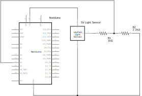
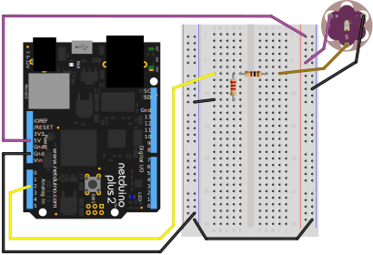

In this lab, we'll build a circuit that powers a 5V luminosity (light level) sensor and uses a voltage divider to level shift the sensor's output from a 5V _voltage domain_ to a 3.3V voltage domain. Along the way, we'll also learn how to do some basic soldering, which will needed to build the prototype circuit.

Voltage dividers are the only practical way of level shifting an analog signal (one in which the signal may have a varying degree of voltage). While this circuit will also work for a digital signal, in which the voltage is either high (in our case `3.3V`), or low (`0V`), there are circuits which can be built out of transistors that are much more efficient.

Additionally, because a voltage divider _lowers_ the signal amplitude, a different circuit is necessary for level shifting from a lower voltage domain to a higher one. Again, we'll examine a circuit for that later.

### Requirements

To do this lab, you'll need the following new items:

| Item                                   | Approximate Cost (USD) |
|----------------------------------------|------------------------|
| [LilyPad 5V Luminosity Sensor](https://www.sparkfun.com/products/8464)  | $4    |
| 22ga Single Strand Wire                | [set]                  |
| Soldering iron                         |
| Lead-Free Solder                       |
| Tip Tinner and Cleaner                 |
| Helping Hands (optional)               |
| 20ga Single Strand Wire (optional)     | $20

Though this lab uses the LilyPad Luminosity sensor, nearly any 5V sensor will do.

Additionally, you'll reuse the following tools and components from earlier labs:

 * Netduino
 * Half size breadboard
 * Resistor Kit
 * Breadboard jumper wires
 * Wire cutter (optional, for trimming resistors)

#### LilyPad 5V Luminosity Sensor

For this lab, we're going to use a sensor from the LilyPad project that operates on a 5V voltage domain. LilyPad is a wearables project that's designed to be able to sewn into garments and textiles. This design is represented in its form factor:


The connection points are rather large, however, and require some soldering to make them useful:
 


#### 22 Gauge Single Strand Wire

We'll solder 22 gauge single strand wire to the sensor so that we can easily connect it the breadboard. The breadboard jumper wires from before will work just fine. If you want to get breadboard compatible wire that you can size to your own liking, I recommend [this kit, which runs USD$21 on Amazon.com](http://amzn.to/2jHgUDv):


#### Soldering Iron

As with multimeters, there is a wide selection of soldering irons from very affordable hobbyist models to more expensive professional models.

#### Affordable Soldering Iron

A decent soldering iron can be had for relatively cheap that will likely get you through this entire tutorial. For instance, this [Abnes model is USD$20 on Amazon](http://amzn.to/2jHdG2H), and there are many more like it:


It comes with a decent holder, some solder, and a few tools.

#### Professional Soldering Station

Soldering is very common task of electronics prototyping, and a good soldering station is really nice to have. For just under [USD$100, Hakko makes a very nice professional soldering station](http://amzn.to/2jFSQ3V), which includes an adjustable temperature soldering iron, a holder, and a nice tip cleaner:


Hakko also makes an extensive range of tips for various soldering needs that fit that soldering iron.

#### Lead-free Tip Tinner & Cleaner

Usually, before you use your new soldering iron for the first time, and from time to time when using it, you'll need to clean and "tin" the tip. When you dip the tip of a hot soldering iron into tip cleaner and tinner, it takes the black oxides off the tip and deposits a thin layer of tin which helps the solder to melt. Tip tinner and cleaner usually comes in a small metal container and runs USD$6-10. Make sure whatever tip tinner you get is lead-free. [Here is a suitable one from Thermaltronics on Amazon for $8](http://amzn.to/2AqLSaM):


#### Lead-free Solder

If your soldering iron doesn't come with solder, you'll need to pick some up. Make sure it's lead-free, rosin-core, and is small enough in diameter to be useful for electronics soldering (plumbing solder is too thick to be useful for electronics work). I recommend 1mm thickness or less for most modern electronic soldering. Lead is toxic even in small amounts, so nearly all electronics these days are produced with lead-free materials. Rosin-core means that in the center of the solder is a small bead of rosin which reduces (changes oxides into their metal state) metal oxides and makes the solder joints much cleaner. [This 0.8mm rosin-core, lead-free solder is a good choice for the soldering we'll do and is USD$10 on Amazon](http://amzn.to/2j8oSGe).

#### Helping Hands

"Helping Hands" is an adjustable item holder that can be really helpful when soldering. It's optional, but is a beneficial add on to your toolset. [This one can be had for USD$6 on Amazon](http://amzn.to/2BE78KF):


## Luminosity Sensor and Analog Level Shifting Circuit

Most complex circuits in use are actually lots of simpler circuits joined together to provide more complex behaviors. In fact, in this lab, we're going to join two very simple circuits; a 5V light sensor circuit, and a voltage divider to reduce the voltage output of the light sensor down to a 3.3V voltage domain:


Before we build our circuit, however, we must first calculate the values of our resistors in the voltage divider, while making sure we account for the resistance of the ADC.

## Calculating Voltage Division with a Third Leg

In order to calculate a level-shifting voltage divider, we need to do three things:

1. Calculate maximum R1 resistance based on how much power the sub-circuit on `Vout` requires
2.
3. Subtract the ADC resistance from `R2` in the solution.

### Step 1: Calculate maximum R1 resistance, based on ADC power requirements.

We need to calculate what the largest resistor we can use and still have enough power for whatever circuit is on `Vout`, in this case the ADC. 

The Netduino ADC needs `0.3mA` current. Recall, however, that the amount of current available at `Vout` in a voltage divider is controlled by the `R1` resistor, rather than the total resistance.

We can use Ohm's law to calculate the resistance needed at `R1`:

```
Given:
R = V / I

Therefore:
R1 = 3.3V / 0.0003A = 11kΩ
```

The largest resistor that can be placed at R1 is therefore `11kΩ`.

### Step 2: Calculate Bottom Half of Divider

[we know that R1 must be `11kΩ`]

[we know that bottom half, R2 + ADC, must be a ratio of that]

```
R2 = R1 * .66


Bottom half (R2 + ADC) = 11,000 
```

```
R2 = (R1 * Vout) / (Vs - Vout) //wolfram alpha, solve [equation] for R2

R2 = (11,000 * 3.3) / (5 - 3.3)
R2 = (36,300) / (1.7) = 21,353Ω
```

verify:

```
Given:
Vout = Vs * (R2 / (R1 + R2))

Vout = 5V * (21,353 / (11,000 + 21,353))
Vout = 5V * (0.66) = 3.3V


```

### Step 4: 

[remove the ADC resistance from the bottom half to get the leftover resistance needed for R2]

```
R2 = BottomR - ADC
Total Bottom Resistance = 21,353Ω
Total Bottom G = 1 / 21,353Ω = 0.000047

ADC G = 1/11,000 = 0.000091

Total G - ADC G = 0.000047 - 0.000091 = -0.000044


```

**[need to explain that in order to make this work, we have to pump more power through it.  we'd need 21k of resistance on the bottom half to make it work to get only 0.3mA through. but the ADC is only 11k, so there's no way to add more. so we need to crank the power 10x]:**

```
Given:
R = V / I

Therefore:
R1 = 3.3V / 0.0003A = 11kΩ

Divide by 10 to 10x the power:
R1 = 1kΩ

Solve for bottom half of the voltage divider:
R2 = (R1 * Vout) / (Vs - Vout)

R2 = (1,000 * 3.3V) / (5V - 3.3V) = 3,300 / 1.7 = 1,941Ω

R2 = BottomR - ADC
Total Bottom Resistance = 1,941Ω
Total Bottom G = 1 / 1,941Ω = 0.00052S

ADC G = 1/11,000 = 0.000091

R2 = Total G - ADC G = 0.00052S - 0.000091S = 0.000424S = 2,357Ω

R2 ~= 2.2kΩ
```

That seems to work.


## 5V Sensor Lab






### Online Voltage Divider Calcuator

There is a fantastic voltage divider calculator online [here](http://www.ohmslawcalculator.com/voltage-divider-calculator)


## [Next - Circuit Software](../Circuit_Software)

<br/>