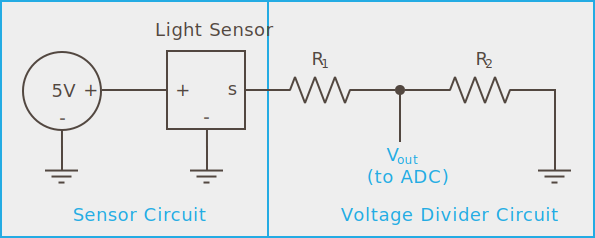

In this lab, we'll build a circuit that powers a 5V luminosity (light level) sensor and uses a voltage divider to level shift the sensor's output from a 5V _voltage domain_ to a 3.3V voltage domain.

[also, some light soldering]

Voltage dividers are the only practical way of level shifting an analog signal (one in which the signal may have a varying degree of voltage). While this circuit will also work for a digital signal, in which the voltage is either high (in our case `3.3V`), or low (`0V`), there are circuits which can be built out of transistors that are much more efficient.

Additionally, because a voltage divider _lowers_ the signal amplitude, a different circuit is necessary for level shifting from a lower voltage domain to a higher one. Again, we'll examine a circuit for that later.

### Requirements

To do this lab, you'll need the following new items:

| Item                                   | Approximate Cost (USD) |
|----------------------------------------|------------------------|
| [LilyPad 5V Luminosity Sensor](https://www.sparkfun.com/products/8464)           | $4                     |
| 22ga Single Strand Wire                | [set]                  |
| Soldering iron                         |

Though this lab uses the LilyPad Luminosity sensor, nearly any 5V sensor will do.

Additionally, you'll reuse the following tools and components from earlier labs:

 * Netduino
 * Half size breadboard
 * Resistor Kit
 * Breadboard jumper wires
 * Wire cutter (optional, for trimming resistors)


## Luminosity Sensor and Analog Level Shifting Circuit

Most complex circuits in use are actually lots of simpler circuits joined together to provide more complex behaviors. In fact, in this lab, we're going to join two very simple circuits; a 5V light sensor circuit, and a voltage divider to reduce the voltage output of the light sensor down to a 3.3V voltage domain:




## Calculating Voltage Division with a Third Leg

Before we build our circuit, however, we must first calculate the values of our resistors in the voltage divider, while making sure we account for the resistance of the ADC.

[Following what we've learned from blah:]

1. Calculate R1 resistance based on how much power Vout needs.
2. Figure out the necessary division ratio, e.g. `5/3.3` for `5V` to `3.3V`.
3. Solve individual resistors by multiplying ratio by total `R`.
4. Subtract the ADC resistance from `R2` in the solution.

### Step 1: Calculate R1 resistance, based on power requirements.

The Netduino ADC needs `0.3mA` current. Recall, however, that the amount of current available at `Vout` in a voltage divider is controlled by the `R1` resistor, rather than the total resistance.

So to start, we need to use Ohm's law to calculate the resistance needed at `R1`:

```
Given:
R = V / I

Therefore:
R1 = 3.3V / 0.0003A = 11kΩ
```


### Step 2: 

[we know that R1 must be `11kΩ`]

[we know that bottom half, R2 + ADC, must be a ratio of that]

```
R2 = R1 * .66


Bottom half (R2 + ADC) = 11,000 
```

```
R2 = (R1 * Vout) / (Vs - Vout)

R2 = (11,000 * 3.3) / (5 - 3.3)
R2 = (36,300) / (1.7) = 21,353Ω
```

verify:

```
Given:
Vout = Vs * (R2 / (R1 + R2))

Vout = 5V * (21,353 / (11,000 + 21,353))
Vout = 5V * (0.66) = 3.3V


```

### Step 4: 

[remove the ADC resistance from the bottom half to get the leftover resistance needed for R2]

```
R2 = BottomR - ADC
Total Bottom Resistance = 21,353Ω
Total Bottom G = 1 / 21,353Ω = 0.000047

ADC G = 1/11,000 = 0.000091

Total G - ADC G = 0.000047 - 0.000091 = -0.000044


```

**[need to explain that in order to make this work, we have to pump more power through it.  we'd need 21k of resistance on the bottom half to make it work to get only 0.3mA through. but the ADC is only 11k, so there's no way to add more. so we need to crank the power 10x]:**

```
Given:
R = V / I

Therefore:
R1 = 3.3V / 0.0003A = 11kΩ

Divide by 10 to 10x the power:
R1 = 1kΩ

Solve for bottom half of the voltage divider:
R2 = (R1 * Vout) / (Vs - Vout)

R2 = (1,000 * 3.3V) / (5V - 3.3V) = 3,300 / 1.7 = 1,941Ω

R2 = BottomR - ADC
Total Bottom Resistance = 1,941Ω
Total Bottom G = 1 / 1,941Ω = 0.00052S

ADC G = 1/11,000 = 0.000091

R2 = Total G - ADC G = 0.00052S - 0.000091S = 0.000424S = 2,357Ω

R2 ~= 2.2kΩ
```

That seems to work.


## 5V Sensor Lab


### Online Voltage Divider Calcuator

There is a fantastic voltage divider calculator online [here](http://www.ohmslawcalculator.com/voltage-divider-calculator)


## [Next - Circuit Software](../Circuit_Software)

<br/>