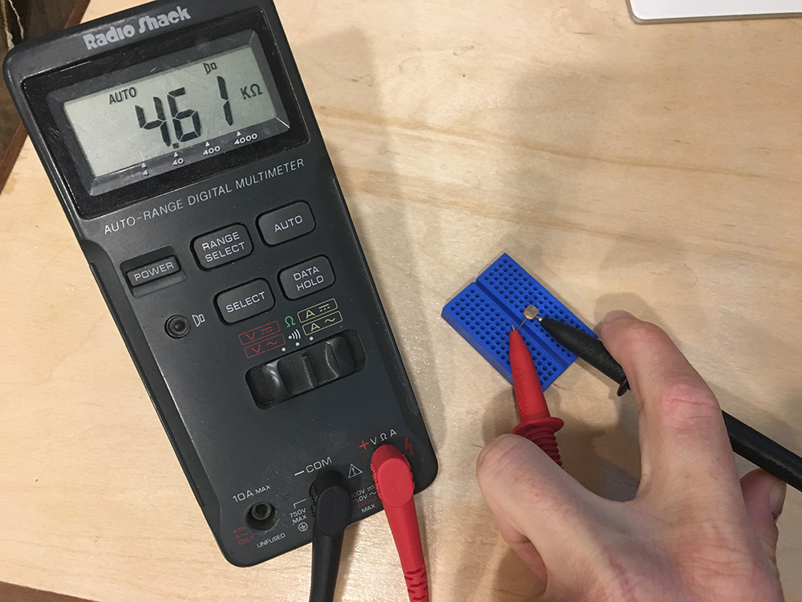
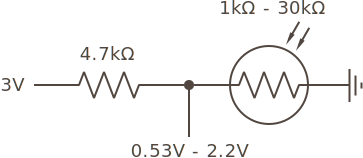

There is a class of sensors, called resistive sensors, that have a variable resistance based on various input such as light or heat. [Photoresistors](https://www.wikipedia.com/en/Photoresistor), for instance, provide less resistance the more light that they receive. Similarly, [thermistors](https://en.wikipedia.org/wiki/Thermistor) change their resistance (either more resistance or less resistance, depending on the type), as their temperature changes.

Resistance can't be measured directly with a Netduino, but voltage can be measured by the Analog to Digital Converter (ADC) via the analog input pins. By placing a resistive sensor in a voltage divider with another resistor of known value, we can measure the voltage output and use Ohm's law to calculate the resistance of the resistive sensor. 

The following circuit schematic is the exact same as our voltage divider from before, except now, `R2` is a resistive sensor, in this case, it's a photoresistor:


## Photoresistor Lab

In this section, we're going to build a sample circuit that uses a photoresistor to measure the amount of light available.

### Component Sourcing [TODO: move this way earlier]

To build a photoresistor sensor circuit, we need to start with a photoresistor. Photoresistors usually look something like the following, and can usually be [sourced for less than USD$1](http://www.mouser.com/ProductDetail/Adafruit/161/?qs=%2fha2pyFadugRELlGV3EJvhiJsyG6%2fjztqGMot59Rgn9%2fJAtRYbFvdw%3d%3d):


There are several major component supply websites that serve the majority of the world. The most common ones we use are:

 * [Mouser](https://www.mouser.com)
 * [Digikey](https://www.digikey.com)
 * [Arrow](https://www.arrow.com)
 * [SparkFun](https://www.sparkfun.com)
 * [Adafruit](https://www.adafruit.com)
 * [Alibaba](https://www.alibaba.com)

### Datasheets

Components usually have a [_datasheet_](http://www.mouser.com/ds/2/737/photocells-932884.pdf) that describes their characteristics and they will often give sample circuits that describe how to wire them up. When building circuits, a lot of time is actually spent looking at datasheets to understand the behavior of various components and how to connect them together. Manufacturers want people to use their components, so it's in their best interest to provide good documentation and schematics to make them easier to use. Datasheets are usually easy to find, simply searching on Google for the part number + "datasheet" will often turn up a PDF datasheet.

In the case of my photoresistor, I found it in a pile of components, so I'm not sure if it conforms to the values in the above datasheet, since I'm not sure it's the same component. That's not a problem, however, with a simple resistive sensor like this, however, because I can just measure the resistance with a multimeter under varying conditions to determine its characteristics. To test it, we just need a [multimeter](https://en.wikipedia.org/wiki/Multimeter). 


### Measuring Resistance

To measure the resistance of a photoresistor, set the multimeter to its resistance setting, which is usually denoted by the ohm (`Ω`) symbol, and put the multimeter leads on each of the photoresistor leads. It might be helpful to put the photoresistor in a breadboard to keep it still:



If using a breadboard, make sure each leg of the photoresistor is on opposite sides of the center well, so the leads aren't connected (each 5-wide hole strip is connected together to make prototyping without soldering possible).

I measured the resistance of my photoresistor in varying light conditions and came up with the following range:

```
~30kΩ in dark
~1kΩ in sunlight
```

The datasheet for the Adafruit photoresistor gave a range of `200kΩ - 10kΩ`, so I'm glad I measured mine.

### Calculating the Fixed Resistor Value

Netduino has an onboard Analog to Digital Converter (ADC) that reads voltage values from `0V` - `3.3V` in 1,024 steps, which means it will give a value from `0` to `1023` that represents the voltage. For the best resolution therefore, we want the total resistance when it's very bright to be near the ADC max of `3.3V`. And when it's low, it should be near `0V`. This ensures that we are using the biggest range possible.

The easiest way to do this is to choose a resistor that splits the difference between the high and low resistance values of the resistive sensor, combined with the ADC resistance:

```
Given:
ADC Conductance = 1 / 11kΩ = (0.0001S)
Photoresistor high (dark) resistance = 30kΩ
Photoresistor moderate (room light) resistance = 5kΩ
Photoresistor low (bright) resistance = 1kΩ

Therefore:
Photoresistor high conductance = 1 / 30,000Ω = 0.00003S
Photoresistor moderate conductance = 1 / 5,000Ω = 0.0002S
Photoresistor low conductance = 1 / 1,000Ω = 0.001S

Total voltage divider bottom half (ADC + Photoresistor) resistance:
High (dark) = 0.0001S + 0.00003S = 0.00013S = 7,692Ω
Moderate = 0.0001S + 0.0002S = 0.0003S = 3,333Ω
Low (bright) = 0.0001S + 0.001S = 0.0011S = 909Ω
```

Therefore, we would need an R1 that has a value halfway between `909Ω` and `7,692Ω`:

```
(909Ω + 7,692Ω) / 2 = 4,300Ω = 4.3k
```

`4.3kΩ` isn't a very common resistor value, but `4.7kΩ` is, so using the voltage divider equation from before (`Vout = Vs * (R2 / (R1 + R2))`), and using the total parallel resistance of `R2` + `ADC` as the value for `R2`, we can calculate the expected spread of values:

```
Example calculation:
Vout = Vs * ((R2 + ADC) / (R1 + R2 + ADC)) )
Very Bright Vout = 5V * (909Ω / 5,609Ω) = 5V * 0.162Ω = 0.81V
```

| Light Level | R1 Value  | Sensor Resistance (R2) | R2 + ADC Resistance | Total R (R1 + R2 + ADC) | Vin   | Vout  |
|-------------|-----------|------------------------|---------------------|---------|-------|-------|
| Very Bright | 4.7kΩ     | 1kΩ                    | 909Ω                | 5,609Ω  | 5V    | 0.81V |
| Moderate    | 4.7kΩ     | 5kΩ                    | 3,333Ω              | 8,033Ω  | 5V    | 2.07V |
| Dark        | 4.7kΩ     | 30kΩ                   | 7,692Ω              | 12,392Ω | 5V    | 3.1V  |


The circuit would look something like this:



Our measured voltage spread should then be somewhere between `0.8V` and `3.1V`, which would give good resolution for reading the value.

### Converting Voltage to Digital Value and Back

Given that voltage is reported by the ADC as a digital value from `0` to `1,023`, we can then calculate the expected value output from the ADC as a percentage of the maximum voltage, multiplied by `1,023`:

```
Given:
Digital value = (Vout / 3.3V) * 1,023

Therefore:
Bright value = (0.8V / 3.3V) * 1,023 = 248
Dark value = (3.1V / 3.3V) * 1,023 = 961
```

Therefore, if the photoresistor were in bright light, the voltage divider should output around `0.81V`, which would read somewhere around `248`. We can then convert that back to voltage by reversing the process and multiplying the ratio of value over max steps (`1,023`) and multiplying by `3.3V`:

```
Vout = (Digital Value / 1,023) * 3.3V
Bright Vout = 248 / 1,023 * 3.3V = 0.8V
```

# Practical Circuit

To build this circuit on a breadboard, wire it similar to the following:


The following code illustrates creating a new `AnalogInput` on pin 3, and reading the voltage to get the value of the light hitting the photoresistor:

[TODO: modify this to calculate the Vout, and use a switch statement to output "Bright/Dark/Moderate."]

```csharp
using System;
using System.Threading;
using Microsoft.SPOT;
using SecretLabs.NETMF.Hardware;
using SecretLabs.NETMF.Hardware.Netduino;

namespace Photoresistor_Reading
{
    public class Program
    {
        public static void Main()
        {
            var photoresistor = new AnalogInput(Pins.GPIO_PIN_A3);

            while (true)
            {
                Debug.Print("Photoresistor reading: " + photoresistor.Read().ToString());
                Thread.Sleep(250);
            }
        }
    }
}
```
In a later part this tutorial, we'll examine reading analog signals and digital communication in a more depth.


## [Next - Lab: Level Shifting with a Voltage Divider](../Level_Shifting_Lab)

<br/>