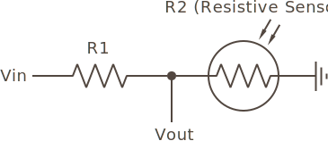
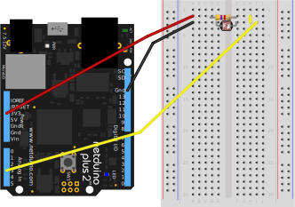

In this lab we're going to build a simple and practical circuit to read a resistive sensor. Our sensor will be a photoresistor which will measure the amount of light available, but the steps and process are the same no matter what kind of resistive sensor is used.

### Requirements

To do this lab, you'll need the following new items:

| Item                                   | Approximate Cost (USD) |
|----------------------------------------|------------------------|
| Photoresistor                          | <$1                    |
| Netduino                               | $25 - $70              |

Additionally, you'll reuse the following tools and components from earlier labs:

 * Multimeter
 * Half size breadboard
 * Resistor Kit
 * Breadboard jumper wires
 * Wire cutter (optional, for trimming resistors)

#### Component Sourcing

To build a photoresistor sensor circuit, we need to start with a photoresistor. Photoresistors usually look something like the following, and can usually be [sourced for less than USD$1](http://www.mouser.com/ProductDetail/Adafruit/161/?qs=%2fha2pyFadugRELlGV3EJvhiJsyG6%2fjztqGMot59Rgn9%2fJAtRYbFvdw%3d%3d):


There are several major component supply websites that serve the majority of the world. The most common ones we use are:

 * [Mouser](https://www.mouser.com)
 * [Digikey](https://www.digikey.com)
 * [Arrow](https://www.arrow.com)
 * [SparkFun](https://www.sparkfun.com)
 * [Adafruit](https://www.adafruit.com)
 * [Alibaba](https://www.alibaba.com)

#### Datasheets

Components usually have a [_datasheet_](http://www.mouser.com/ds/2/737/photocells-932884.pdf) that describes their characteristics and they will often give sample circuits that describe how to wire them up. When building circuits, a lot of time is actually spent looking at datasheets to understand the behavior of various components and how to connect them together. Manufacturers want people to use their components, so it's in their best interest to provide good documentation and schematics to make them easier to use. Datasheets are usually easy to find, simply searching on Google for the part number + "datasheet" will often turn up a PDF datasheet.

In the case of my photoresistor, I found it in a pile of components, so I'm not sure if it conforms to the values in the above datasheet, since I'm not sure it's the same component. That's not a problem, however, with a simple resistive sensor like this because I can just measure the resistance with a multimeter under varying conditions to determine its characteristics. 

## Resistive Sensors

There is a class of sensors, called resistive sensors, that have a variable resistance based on various input such as light or heat. [Photoresistors](https://www.wikipedia.com/en/Photoresistor), for instance, provide less resistance the more light that they receive. Similarly, [thermistors](https://en.wikipedia.org/wiki/Thermistor) change their resistance (either more resistance or less resistance, depending on the type), as their temperature changes.

Resistance can't be measured directly with a Netduino, but voltage can be measured by the Analog to Digital Converter (ADC) via the analog input pins. By placing a resistive sensor in a voltage divider with another resistor of known value, we can measure the voltage output and use Ohm's law to calculate the resistance of the resistive sensor. 

The following circuit schematic is the exact same as our voltage divider from before, except now, `R2` is a resistive sensor, in this case, it's a photoresistor:



## Exercise 1 - Reading a Resistive Sensor


### Step 1: Measure the photoresistor resistance in various light conditions.

To measure the resistance of a photoresistor, set the multimeter to its resistance measurement setting, which is usually denoted by the ohm (`Ω`) symbol, and put the multimeter leads on each of the photoresistor leads. It might be helpful to put the photoresistor in a breadboard to keep it still:


If using a breadboard, make sure each leg of the photoresistor is on opposite sides of the center well (or on different rows), so the legs aren't connected.

I measured the resistance of my photoresistor in varying light conditions and came up with the following values:

```
~250kΩ in dark
~6kΩ moderate room light
~1kΩ in sunlight
```

The datasheet for the Adafruit photoresistor gave a range of `200kΩ - 10kΩ`, so I'm glad I measured mine.

#### Lab Process & Questions:

Using a multimeter in resistance measuring mode, measure your photoresistor under varying conditions. What resistance does it supply in the following conditions? Write them down:

 * Bright sunlight
 * A moderately lit room
 * When the sensor's light collector is covered by your finger (a dark condition)

### Step 2: Calculate the fixed resistor (`R1`) value.

Netduino has an onboard Analog to Digital Converter (ADC) that reads voltage values from `0V` - `3.3V` in 1,024 steps, which means it will give a value from `0` to `1023` that represents the voltage. For the best resolution therefore, we want the total resistance when it's very bright to be near the ADC max of `3.3V`. And when it's low, it should be near `0V`. This ensures that we are using the biggest range possible.

#### Calculating the High and Low Resistance Values of the Bottom Half of the Voltage Divider

The easiest way to do this is to choose a resistor that splits the difference between the high and low resistance values of the bottom half of the voltage divider which we can calculate by adding the conductance (G) of the sensor and the conductance of the ADC:

```
Given:
ADC Conductance = 1 / 11kΩ = (0.0001S)
Photoresistor high (dark) R = 250kΩ
Photoresistor low (bright) R = 1kΩ

Therefore:
Photoresistor high G = 1 / 250,000Ω = 0.000004S
Photoresistor low G = 1 / 1,000Ω = 0.001S

Total voltage divider bottom half (ADC + Photoresistor) resistance:
High (dark) = 0.0001S + 0.000004S = 0.000104S = 9,615Ω ~= 10kΩ
Low (bright) = 0.0001S + 0.001S = 0.0011S = 909Ω ~= 1kΩ
```

These are approximate measurements, so I've rounded to the nearest 1k.

<!--
moderate calculation
```
Photoresistor moderate (room light) resistance = 6kΩ
Photoresistor moderate conductance = 1 / 6,000Ω = 0.000167S
Moderate R2 + ADC = 0.0001S + 0.000167S = 0.000267S = 3,750Ω ~= 4kΩ
```
-->

#### Choosing an `R1` that Splits the Difference

Therefore, I would need an R1 that has a value halfway between `1kΩ` and `10kΩ`:

```
Halfway = (1,000Ω - 10,000Ω) / 2 = 4,500Ω = 4.3kΩ
```

`4.5kΩ` isn't a very common resistor value, but `4.7kΩ` is, so I'll start with that and calculate my expected `Vout` based on that.


#### Calculating Expected `Vout`

Using the voltage divider equation from before (`Vout = Vs * (R2 / (R1 + R2))`), and using the total parallel resistance of `R2` & `ADC` as the new value for `R2`, we can calculate the expected spread of values. For example, the following calculation is for **very bright** resistance:

```
Example calculation:
Vout = Vs * ((R2 & ADC) / (R1 + R2 & ADC)) )
Very Bright Vout = 5V * (1,000Ω / (4,700Ω + 1,000Ω)) = 3.3V * 0.175 = 0.58V
```

Using that formula, I created the following table of values:

| Light Level | R1 Value  | Sensor Resistance (R2) | R2 & ADC Resistance | Total R | Vin   | Vout  |
|-------------|-----------|------------------------|---------------------|---------|-------|-------|
| Very Bright | 4.7kΩ     | 1kΩ                    | 1kΩ                 | 5.7kΩ   | 3.3V  | 0.58V |
| Moderate    | 4.7kΩ     | 6kΩ                    | 4kΩ                 | 8.7kΩ   | 3.3V  | 1.52V |
| Dark        | 4.7kΩ     | 250kΩ                  | 10kΩ                | 14.7kΩ  | 3.3V  | 2.24V |


The circuit therefore would look something like this:


My measured voltage spread with a `4.7kΩ` resistor should then be somewhere between `0.5V` and `2.3V`, which provides a good resolution for reading the value.

#### Lab Process & Questions:

Using the resistance values you measured with your photoresistor, and the example calculations above:

 * Calculate the expected high and low values of the bottom half of your voltage divider.
   * What is the expected high resistance value?
   * What is the expected low resistance value?
   * What is the expected moderate resistance value?
 * Calculate the halfway point between the high and low resistance values, and find a suitable `R1` that's close to that halfway point. 
   * What is the halfway point?
   * What is the closest common resistor?
 * Create a table of expected values that match your photoresistor and `R1` choice

### Step 3: Convert expected voltages to digital values and back.

In order to write our code and validate our readings, we need to know what the expected voltage readings will be when they are read.

Given that voltage is reported by the ADC as a digital value from `0` to `1,023`, we can calculate the expected value output from the ADC as a percentage of the maximum voltage, multiplied by `1,023`:

```
Given:
Digital Value = (Vout / 3.3V) * 1,023

Therefore:
Bright value = (0.5V / 3.3V) * 1,023 = 155
Dark value = (2.3V / 3.3V) * 1,023 = 713
```

Therefore, if my photoresistor were in bright light, the voltage divider should output around `0.5V`, which would read somewhere around `155`. We can then convert that back to voltage by reversing the process and multiplying the ratio of value over max steps (`1,023`) and multiplying by `3.3V`:

```
Vout = (Digital Value / 1,023) * 3.3V
Bright Vout = 155 / 1,023 * 3.3V = 0.5V
```

Using the expected high and low `Vout` values from your calculations in step 2, calculate the digital values that correspond to them, and write them down:

 * Bright Digital Value = ?
 * Moderate Digital Value = ?
 * Dark Digital Value = ?

### Step 4: Build the circuit.

To build this circuit on a breadboard, wire it similar to the following:



### Step 5: Deploy Photoresistor_Lab app to the Netduino.

If you haven't setup your development environment yet, follow the [Getting Started Guide](/Netduino/Getting_Started/).

Clone the [Netduino_Samples](https://github.com/WildernessLabs/Netduino_Samples) git repo to your local drive, and open the [Photoresistor_Lab](https://github.com/WildernessLabs/Netduino_Samples/tree/master/Electronics_Tutorial/Photoresistor_Lab) app and deploy to your Netduino.

The _Photoresistor\_Lab_ code is copied below; it illustrates creating a new `AnalogInput` on pin 3, and reading the voltage to get the value of the light hitting the photoresistor:

```csharp
using System;
using System.Threading;
using Microsoft.SPOT;
using SecretLabs.NETMF.Hardware;
using SecretLabs.NETMF.Hardware.Netduino;

namespace Photoresistor_Lab
{
    public class Program
    {
        public static void Main()
        {
            var photoresistor = new AnalogInput(Pins.GPIO_PIN_A3);
            int ambientLight = 0;
            float sensorVoltage = 0;

            while (true)
            {
                // read the analog input
                ambientLight = photoresistor.Read();

                // convert the digital value back to voltage
                sensorVoltage = AnalogValueToVoltage(ambientLight);

                // output
                Debug.Print("Light Level = Raw: " + ambientLight.ToString() + 
                            ", Voltage: " + AnalogValueToVoltage(ambientLight).ToString());

                // wait 1/4 second
                Thread.Sleep(250);
            }
        }

        /// <summary>
        /// Converts an analog input value voltage.
        /// </summary>
        public static float AnalogValueToVoltage (int analogValue)
        {
            return ((float)analogValue / 1023f) * 3.3f;
        }
    }
}
```

In a later part of this tutorial, we'll examine reading analog signals and digital communication in a more depth.


## [Next - Lab: Level Shifting with a Voltage Divider](../Level_Shifting_Lab)

<br/>