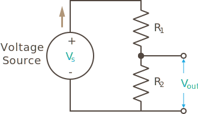

Examining Ohm's law in the context of Kirchhoff's voltage law revealed an interesting fact about the voltage drop after each resistor in a series; **the ratio of resistances determines how much the voltage is reduced at each interval**. Consider the following schematic which illustrates a _voltage divider_ circuit:



## Voltage Divider Equation

In a voltage divider circuit like this, because there are only two resistors, and we know that the current drop is proportionate to the resistance provided, we can greatly simplify our equation from before by calculating the proportion or resistance of `R2` (instead of `R1`), which is `(R2 / Total Resistance)`, and then multiplying by the voltage source to get the leftover voltage:

```
Vout = Vs * (R2 / (R1 + R2))
```


### Example

Let's say that the voltage source is `5V` and the two resistors are `8Ω` and `12Ω`, respectively.

Therefore, we can calculate the voltage of `Vout` as:

```
Given:
Vout = Vs * (R2 / (R1 + R2))

Therefore:
Vout = 5V * (12Ω / (8Ω + 12Ω)) = 5V * .6 = 3V
```

So the voltage out would be `3V`.

<!-- is this necessary? -->
We can also verify that using the more wieldy equation from before:

```
Given:
Vn = Vs - (Vs * (∑(R...Rn) / Total R))

Therefore:
V1 = 5V - (5V * (8Ω / 20Ω)) = 5V - 2V = 3V
```

## Current

The voltage drop in a circuit is determined by the ratio of resistances, not the overall resistance. This means, that if we took the exact same circuit as before, but this time used resistors that were 10x more resistive, we'd still get the same exact voltage drop:

```
Given: 
R1 = 8Ω * 10
R2 = 12Ω * 10

Therefore:
Vout = 5V * (80Ω / 200Ω) = 5V * .6 = 3V
```

Even though the resistances were multiplied by 10, the voltage is the same. However, if we change the overall resistance, then the amount of current that passes through the circuit changes. When we calculate the current using Ohm's law `(I = V/R)` of the two different overall resistances, we see that just as there was a 10x difference in resistance, there is also a 10x difference in power passing through the voltage divider:

```
Given:
I = V / R

Therefore:
I = 5V / 20Ω = .25A = 250mA      // smaller resistors, more current
I = 5V / 200Ω = 0.025A = 25mA    // larger resistors, less current
```

### Current at Vout

We can also calculate the maximum amount of current available to a load hooked to `Vout` in those two divider circuits by calculating it at the first resistor:

```
Given:
I = V / R

Therefore:
I @ R1 = 5V / 8Ω = 0.625A
I @ R1 = 5V / 80Ω = 0.0625A
``` 

A load attached to `Vout` could potentially draw up to `625mA` of current from the divider circuit that had smaller resistors, and `62.5mA` from the divider circuit with larger resistors.

### Power Draw

Consider the two voltage divider circuits described above:

| Voltage Divider # | R1   | R2   | ∑(R1 + R2) | Total Current Draw | Current @ Vout |
|-------------------|------|------|------------|--------------------|----------------|
| 1                 | 8Ω   | 12Ω  | 20Ω        | 250mA              | 625mA          |
| 2                 | 80Ω  | 120Ω | 200Ω       | 25mA               | 62.5mA         |

If these were hooked to a `5V` battery that had `1000mAh` of charge, we can calculate the amount of time (in theory, with a perfect battery) that it would take to drain that battery for each circuit:

```
Circuit 1 (total R: 20Ω) Battery Time = 1000mAh / 250mA = 4 hours.
Circuit 2 (total R: 200Ω) Battery Time = 1000mAh / 25mA = 40 hours.
```

As we can see, the voltage divider with more resistance is much more power efficient than the voltage divider with less resistance because it lets less current through. We might then be tempted to think that we should always use high resistance in a voltage divider, but in reality, things are a little more complicated. In order to understand why, we must consider the circuit as a whole.

## [Next - Practical Considerations and Use of Voltage Dividers](../Voltage_Divider_Practicals)


<br/>