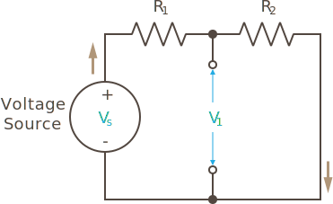

Examining Ohm's law in the context of Kirchhoff's voltage law reveals an interesting fact about the voltage drop after each resistor in a series, in that the ratio of resistances determines how much the voltage is reduced at each interval. Consider the following schematic which illustrates a _voltage divider_ circuit:



Because there are only two resistors here, we can simply our voltage calculation from before:

```
V1 = Vs - (Vs * (∑(R...Rn) / Total R))
```

To:

```
V1 = Vs - (Vs * (R1 / Total R))
```

Let's say that the voltage source is `5V` and the two resistors are `8Ω` and `12Ω`, respectively.

Therefore, the voltage at `V1` would be:

```
V1 = 5V - (5V * (8Ω / 20Ω)) = 5V - 2V = 3V
```

So the voltage at `V1` would be `3V`.

### Current

The voltage drop in a circuit is determined by the ratio of resistances, not the overall resistance. This means, that if we took the exact same circuit as before, but this time used resistors that were 10x more resistive, we'd still get the same exact voltage drop:

```
V1 = 5V - (5V * (80Ω / 200Ω)) = 5V - 2V = 3V
```

However, if we change the overall resistance, then the amount of current that passes through the circuit changes. When we calculate the current using Ohm's law `(I = V/R)` of the two different overall resistances, we see that just as there was a 10x difference in resistance, there is also a 10x difference in power:

```
I = 5V / 20Ω = .25A = 250mA
I = 5V / 200Ω = 0.025A = 25mA
```


### Current

[resistance of the resistors determines how much current]

[use the largest resistance while still providing the necessary current, so as to be power efficient]


## [Next - Voltage Divider Circuit](../Voltage_Divider)

<br/>