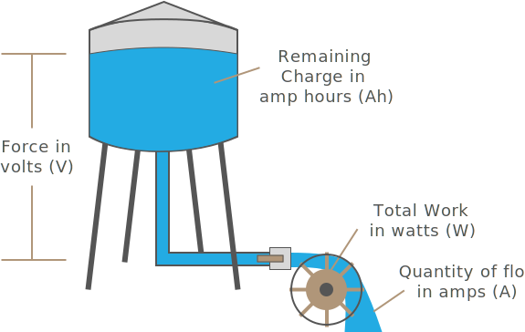
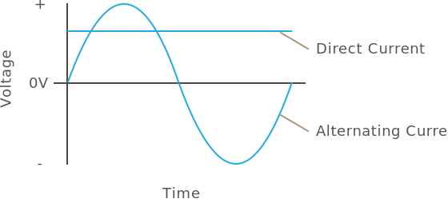
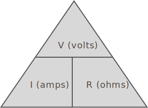

### [Part 1 - Physics of Electricity](Part1/Atoms)

Part 1 explores the fundamental physics that give electricity its behavior. As a bonus, after reading this, you'll know how magnets work!

### [Part 2 - Quantifying Electricity; Amps, Volts, and Watts](Part2/Amount_and_Force)

Part 2 builds on the physical fundamentals and explores the ability of electricity to do work and introduces amperage, voltage, and wattage.

### [Part 3 - Current Types; AC & DC](Part3/Current_Types)

Part 3 introduces the two fundamental current types, direct current (DC), and alternating current. It explores the difference between the two, and what they're used for.

### [Part 4 - Resistance & Ohm's Law](Part4/Resistance)

Part 4 expands the relationship between amperage and voltage, and adds another piece to the fundamental laws of electricity; resistance. In doing so, it explores one of the most important laws in electricity, Ohm's law, and explains how to use it.

### [Part 5 - Kirchhoff's Law and Voltage](Part5/Kirchhoffs_First_Law)
