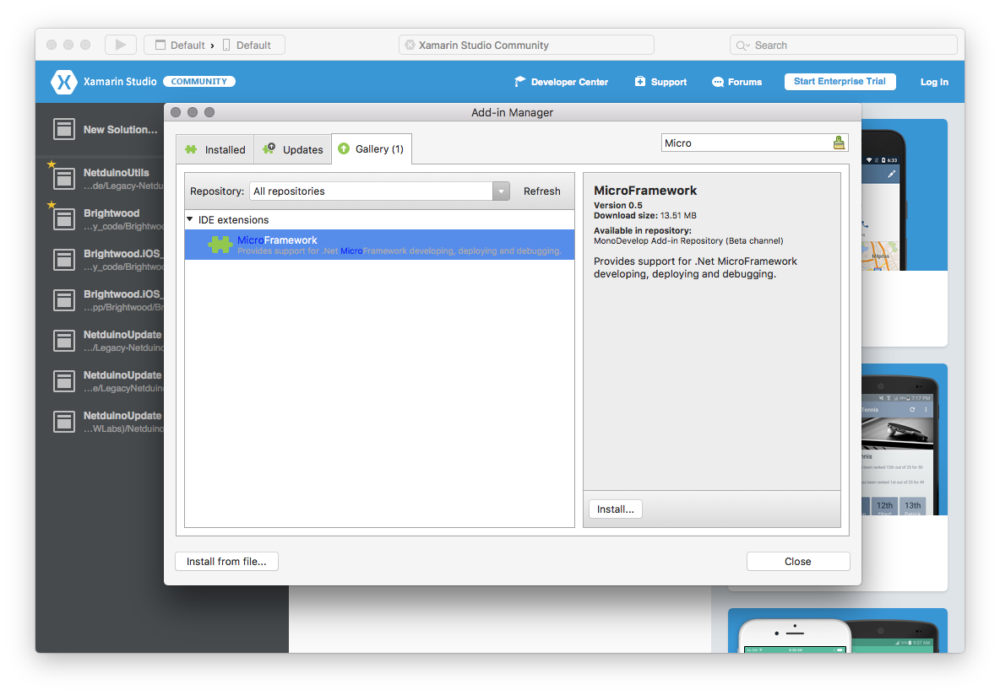

# Getting Started with Netduino
Instructions for Netduino 2, 3, and Go! boards.

# Installation
First, configure your development environment by installing the necessary software.

## Windows
Download and run the following:

1. [.NET Micro Framework (NETMF) SDK (v4.3.2. QFE2)](http://static.netduino.com/downloads/netmfsdk/v4.3.2-QFE2/MicroFrameworkSDK.MSI)
2. NETMF Plugin for Visual Studio (VS) 2015 or [VS 2013](http://static.netduino.com/downloads/netmfsdk/v4.3.2-QFE2/netmfvs2013.vsix)
3. Netduino SDK v5

## Mac
Download and install the following:

 1. Xamarin Studio 6 (also works with v5)
 2. Netduino SDK v5 (for Mac)

Launch Xamarin Studio and install the NETMF plug-in:

1. Open the *Xamarin Studio* menu and select *Add-ins...*.
2. Select the *Gallery* Tab.
3. In the *search* box, type `MicroFramework`:

4. Click *install* and follow the directions.
5. Restart Xamarin Studio.

#  Configure the Board Firmware
Once your development environment is configured, make sure your board has the latest firmware on it. The firmware includes a customized .NETMF runtime specific to the board hardware. Firmware update instructions are [here](../About/Updating_Firmware).

# Create your First App

1. Open either Visual Studio (windows) or Xamarin Studio (mac)
2. Create a new Netduino application
3. Add the following references
  * `Microsoft.SPOT.Hardware`
  * `Microsoft.SPOT.Native`
  * `SecretLabs.NETMF.Hardware.Netduino`
4. And the following code:

```CSharp
using System;
using Microsoft.SPOT;
using Microsoft.SPOT.Hardware;
using SecretLabs.NETMF.Hardware.Netduino;
using System.Threading;

namespace Blinky
{
	public class Program
	{
		public static void Main()
		{
			// write your code here
			OutputPort led = new OutputPort(Pins.ONBOARD_LED, false);
			while (true)
			{
				led.Write(true); // turn on the LED
				Thread.Sleep(250); // sleep for 250ms
				led.Write(false); // turn off the LED
				Thread.Sleep(250); // sleep for 250ms
			}
		} 
	}
}
```
