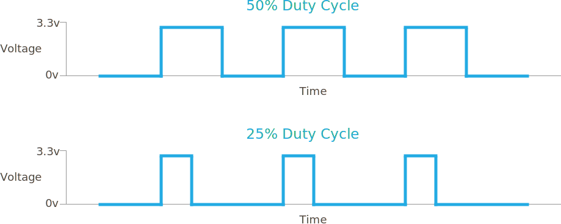

Although PWM is a modulation technique that can be used for communication, Netduino users are most likely to encounter this in two scenarios:

- Controlling the amount of power being supplied to a device
- Servo control

A PWM signal generated by a Netduino is a square wave.  The two key parameters under the control of the developer are the _frequency_ and the _duty cycle_.

In the above diagram, the time where the signal is high is the same as the time where the signal is low.  The percentage of time the signal is on (high) is called the duty cycle.  So, in the above, the signal is high 50% of the one cycle and so the duty cycle is 50%.

In the above diagram, the frequency is the same in both cases (note how the rising edges of the signal are aligned to the same point in time).  However, the lower signal is high for only 25% of the time compared to 50% for the upper trace.

So the frequency is the same but the duty cycle is different.

[increase frequency resolution, but still same duty cycle]

PWM signals can be generated by hardware and software.  The most efficient and reliable is hardware generated PWM.

# Netduino PWM Pins

There are 6 hardware PWM pins on the Netduino:

Note that the onboard LED can also be configured as a PWM channel.

# Practical Examples

As noted, there are two main uses for PWM that are most frequently encountered:

- Power Control
- Servo Control

## Power Control

The output voltage on a Netduino digital output pin is 3.3V.  Creating a digital output pin (_OuputPort_) and turning the pin on will show 3.3V on a multimeter.

_Show photograph of scope plus multimeter_

Changing the output port to a _PWM_ port and setting the duty cycle to 50% will change the reading on the multimeter.  The effect will depend on not just the duty cycle but also the frequency of the PWM signal.  The following two examples show a PWM signal with a duty cycle of 50%.  The first has a frequency of ??? Hz:

_Show video of multimeter with low frequency PWM with 50% duty cycle_

Raising the frequency of the PWM signal to ??? Hz produces a more stable voltage:

_Show video of PWM with higher frequency_

One of the most visible uses of PWM is to [control the brightness of an LED](../../../../../Hardware/Circuits/LEDs/Driving_w_PWM).  A low duty cycle results in a dim LED, a higher duty cycle produces a brighter LED.

## Servo Control

The position of a servo is determined by the length of a PWM pulse.  The pulses are usually expected within a define timeframe.

- Discuss pulse frequency
- Discuss pulse width vs position of the servo

# Advanced PWM

[maybe talk about how you can do crazy shit like sine-wave generation. At high enough resolutions, it's quite good.]

# Further Reading

[PWM on Wikipedia](https://en.wikipedia.org/wiki/Pulse-width_modulation)

