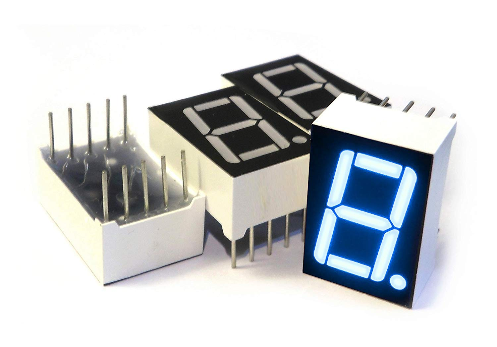
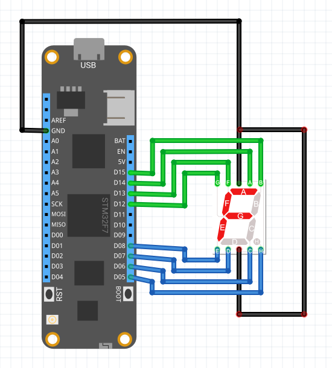

A seven-segment display is a form of electronic display device for displaying decimal numerals that is an alternative to the more complex dot matrix displays. These displays are widely used in digital clocks, electronic meters, basic calculators, and other electronic devices that display numerical information.



### Purchasing

You can get 7 Segment displays from the following suppliers:

* [ebay](https://www.ebay.ca/i/382536833454?chn=ps&norover=1&mkevt=1&mkrid=706-89093-2056-0&mkcid=2&itemid=382536833454&targetid=607627058052&device=c&mktype=pla&googleloc=9060815&poi=&campaignid=1669215008&mkgroupid=63013116685&rlsatarget=pla-607627058052&abcId=1063836&merchantid=117591375&gclid=Cj0KCQjw_5rtBRDxARIsAJfxvYBVzC0Y5B2nPdn-LTI1cS-4XEHNhwh7q3XmXmod-9JrF7td50NABUwaAseaEALw_wcB)
* [Digi-Key](https://www.digikey.ca/product-detail/en/kingbright-company-llc/SA05-11SRWA/754-1677-5-ND/3084460?utm_adgroup=&mkwid=sEc2Kbmrm&pcrid=311487093563&pkw=&pmt=&pdv=c&productid=3084460&slid=&gclid=Cj0KCQjw_5rtBRDxARIsAJfxvYA-QhkE8ReFOaIaxWxF3q54830jvZKy1GHBbQu0E68FXQ5fudSMumAaAvw_EALw_wcB)
* [Elmwood Electronics](https://elmwoodelectronics.ca/products/8546?variant=28162038787&currency=CAD&utm_campaign=gs-2019-02-19&utm_source=google&utm_medium=smart_campaign&gclid=Cj0KCQjw_5rtBRDxARIsAJfxvYCC-J_psvSkkcZ5TwJHb_jiCvhzJg8Qie0PYdPdpWE8i96i65x-A9oaAqrUEALw_wcB)

### Code Example

The following example shows how to initialize a SevenSegment display and iterates through all possible characters:

```csharp
using System;
using System.Threading;
using Meadow;
using Meadow.Devices;
using Meadow.Foundation.Displays.LED;

namespace SevenSegment_Sample
{
    public class Program
    {
        static IApp _app; 
        public static void Main()
        {
            _app = new MeadowApp();
            Thread.Sleep(Timeout.Infinite);
        }
    }
    
    public class MeadowApp : AppBase<F7Micro, App>
    {
        public MeadowApp ()
        {
            SevenSegment sevenSegment = new SevenSegment
            (
                portA: Device.CreateDigitalOutputPort(Device.Pins.D14),
                portB: Device.CreateDigitalOutputPort(Device.Pins.D15),
                portC: Device.CreateDigitalOutputPort(Device.Pins.D06),
                portD: Device.CreateDigitalOutputPort(Device.Pins.D07),
                portE: Device.CreateDigitalOutputPort(Device.Pins.D08),
                portF: Device.CreateDigitalOutputPort(Device.Pins.D13),
                portG: Device.CreateDigitalOutputPort(Device.Pins.D12),
                portDecimal: Device.CreateDigitalOutputPort(Device.Pins.D05),
                isCommonCathode: false
            );

            bool showDecimal = false;

            while (true)
            {
                foreach (CharacterType character in Enum.GetValues(typeof(CharacterType)))
                {
                    if (character != CharacterType.count)
                    {
                        Console.WriteLine("Character: {0}", character.ToString());
                        sevenSegment.SetDisplay(character, showDecimal);
                    }

                    Thread.Sleep(1000);
                }

                showDecimal = !showDecimal;
            }            
        }
    }
}
```

### Circuit Example

To wire a TEA5767 to your Meadow board, connect the following:

| SevenSegment | Meadow Pin |
|--------------|------------|
| portA        | D14        |
| portB        | D15        |
| PortC        | D06        |
| PortD        | D07        |
| PortE        | D08        |
| PortF        | D13        |
| PortG        | D12        |
| portDecimal  | D05        |
| Common Anode | GND        |

It should look like the following diagram:


