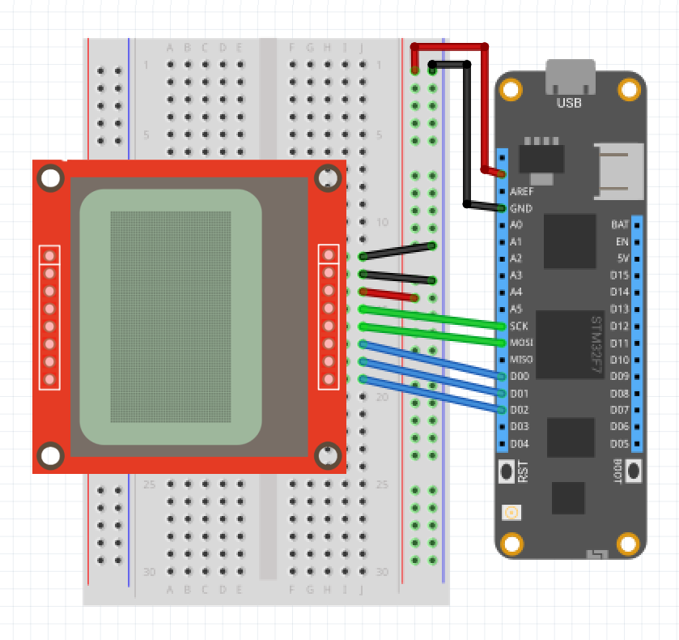

| PCD8544       |             |
|---------------|-------------|
| Status        | Working     |
| Source code   | [GitHub](https://github.com/WildernessLabs/Meadow.Foundation/tree/master/Source/Meadow.Foundation.Peripherals/Displays.PCD8544) |
| NuGet package |  |

The **PCD8544** display, also known as a Nokia 5110 LCD, is a single color 84x84 LCD display. Data is sent to the display via SPI. The also typically also include an led backlight controlled via a single pin. 

These displays have excellent visibility in daylight, even without the backlight, making them a good choice for builds with low-power restrictions and require visibility is bright light or daylight.

### Purchasing

* [NOKIA 5110 SPI LCD graphic display 84x48](https://www.ebay.com/sch/i.html?LH_CAds=&_ex_kw=&_fpos=&_fspt=1&_mPrRngCbx=1&_nkw=Nokia+5110+arduino&_sacat=&_sadis=&_sop=12&_udhi=&_udlo=&_fosrp=1)

### Code Example

The following example shows how to initialize a TEA5767 and look for radio stations:

```csharp
public class MeadowApp : App<F7Micro, MeadowApp>
{
    Pcd8544 display;
    GraphicsLibrary graphics;

    public MeadowApp()
    {
        Console.WriteLine("Initializing...");

        var config = new Meadow.Hardware.SpiClockConfiguration(
            Pcd8544.DEFAULT_SPEED, 
            Meadow.Hardware.SpiClockConfiguration.Mode.Mode0);

        display = new Pcd8544
        (
            device: Device,
            spiBus: Device.CreateSpiBus(
                Device.Pins.SCK, 
                Device.Pins.MOSI, 
                Device.Pins.MISO, 
                config),
            chipSelectPin: Device.Pins.D01,
            dcPin: Device.Pins.D00,
            resetPin: Device.Pins.D02
        );

        graphics = new GraphicsLibrary(display);
        graphics.Rotation = GraphicsLibrary.RotationType._180Degrees;

        TestPcd8544();
    }

    void TestPcd8544() 
    {
        Console.WriteLine("TestPcd8544...");

        // Drawing with Display Graphics Library
        graphics.Clear(true);
        graphics.CurrentFont = new Font8x12();
        graphics.DrawText(0, 0, "PCD8544");
        graphics.DrawRectangle(5, 14, 30, 10, true);

        graphics.Show();
    }
}
```

[Sample projects available on GitHub](https://github.com/WildernessLabs/Meadow.Foundation/tree/master/Source/Meadow.Foundation.Peripherals/Displays.Pcd8544/Samples/) 

### Wiring Example

 To wire a PCD8544 to your Meadow board, connect the following:

| PCD8544 | Meadow Pin |
|---------|------------|
| GND     | GND        |
| LIGHT   | GND        |
| VCC     | 3V3        |
| CLK     | SCK        |
| DIN     | MOSI       |
| DC      | D00        |
| CE      | D01        |
| RST     | D02        |


