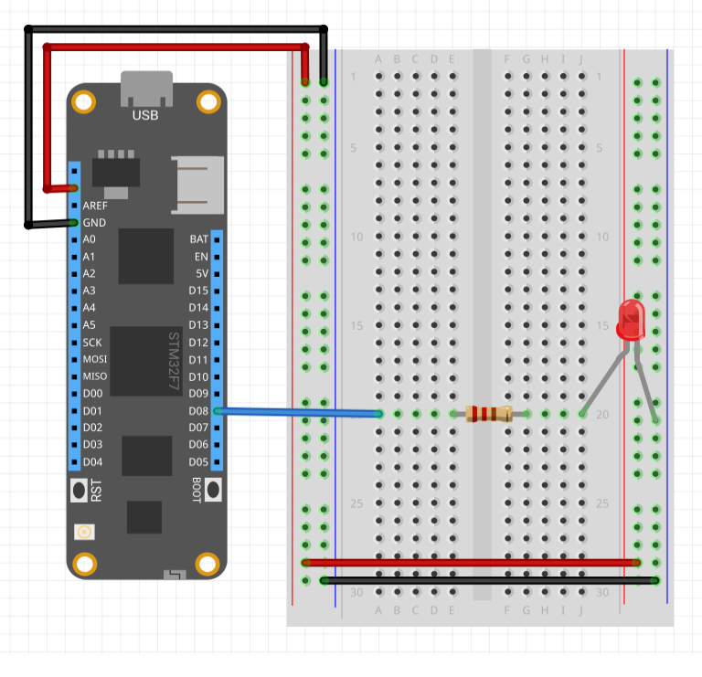

An LED is a diode (a component that attempts to let current flow only one way through it) that emits light when voltage is applied to it. Because it is a diode, it only works when a voltage is applied one way. For this reason, LEDs usually have one lead longer (the Cathode) than the other (the Anode). The cathode (longer leg) indicates that it should be hooked to the positive (+) side of a circuit.

Unlike the `PwmLed`, in which you can pass the forward voltage (voltage drop) of the led to limit its current, to use `Led` it is required to limit the current to the LED using a resistor.

---
uid: Meadow.Foundation.LEDs.Led
example: [*content]
---

The following example shows how to turn on and off the LED using the `IsOn` property, and uses a `StartBlink(onDuration, offDuration)` API method to make the LED blink staying on for 500ms (0.5s) and off for 1000ms (1s):

```csharp
using System.Threading;
using Meadow;
using Meadow.Foundation.LEDs;

namespace LedSample
{
    public class Program
    {
        static IApp _app; 
        public static void Main()
        {
            _app = new App();
        }
    }
    
    public class App : AppBase<F7Micro, App>
    {
        public App ()
        {
            // create a new Led on pin 8
            var led = new Led(Device.Pins.D08);

            while(true)
            {
                led.IsOn = true;    // Led ON
                Thread.Sleep(3000); // 3 seconds
                led.IsOn = false;   // Led OFF
                Thread.Sleep(2000); // 2 seconds
                led.IsOn = true;    // Led ON
                Thread.Sleep(1000); // 1 second

                led.StartBlink(500, 1000);
                Thread.Sleep(5000); // 5 seconds
                led.Stop();
            }
        }
    }
}
```

##### Example Circuit

