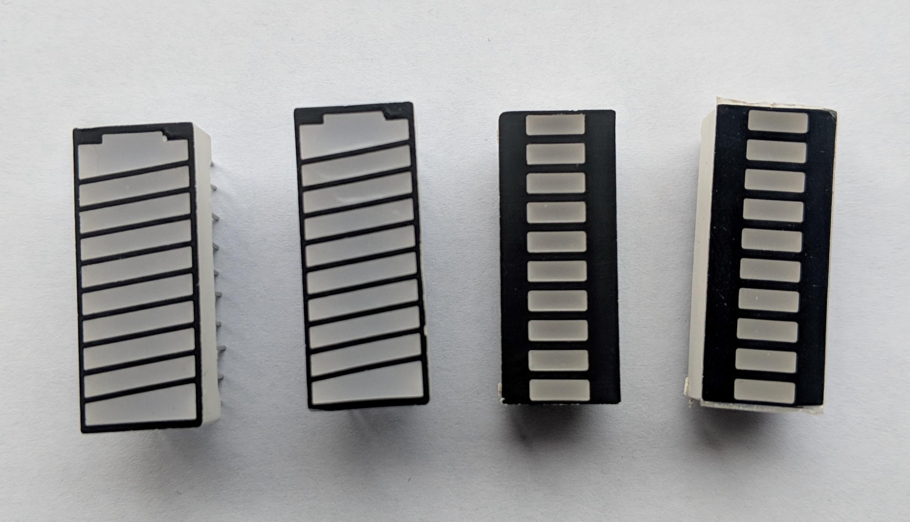
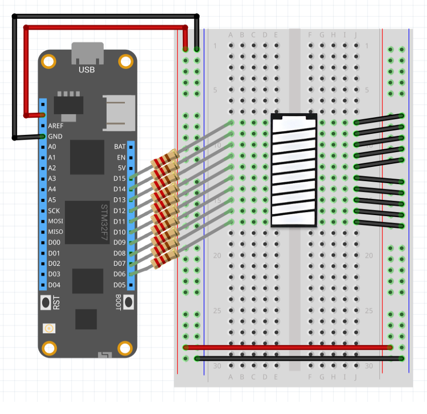

An LED Bar Graph is basically an LED array. Using an LED bar it’s as easy as connecting 10 individual LEDs with 10 output pins. Generally its used as a Battery level Indicator, Audio equipments, and Industrial Control panels. There are many other applications of LED bar graphs.



LED bars come in various sizes and single or multicolored. Using `LedBarGraph`, when creating an object, all it needs is to pass in an array of `IDigitalPin`.

Use `SetLed` method to turn on or off LEDs individually, or assign a value on the `Percentage` property to represent it visually on the graph bar, like a battery indicator, temperature, humidity, etc.  

---
uid: Meadow.Foundation.Leds.LedBarGraph
example: [*content]
---

The following example shows how to use the property **Percentage** to slowly fill and empty a 10 LED battery level graph:

```csharp
using Meadow;
using Meadow.Devices;
using Meadow.Foundation.LEDs;
using Meadow.Hardware;
using System.Threading;

namespace SegmentedLedBar_Sample
{
    public class Program
    {
        static IApp _app; 
        public static void Main()
        {
            _app = new App();
        }
    }
    
    public class App : AppBase<F7Micro, App>
    {
        DigitalOutputPort _blueLED;
        LedBarGraph _ledBarGraph;

        public App ()
        {
            _blueLED = new DigitalOutputPort(Device.Pins.OnboardLEDBlue, true);

            var pins = new IDigitalPin[10];
            pins[0] = Device.Pins.D06;
            pins[1] = Device.Pins.D07;
            pins[2] = Device.Pins.D08;
            pins[3] = Device.Pins.D09;
            pins[4] = Device.Pins.D10;
            pins[5] = Device.Pins.D11;
            pins[6] = Device.Pins.D12;
            pins[7] = Device.Pins.D13;
            pins[8] = Device.Pins.D14;
            pins[9] = Device.Pins.D15;

            _ledBarGraph = new LedBarGraph(pins);

            Run();
        }

        void Run()
        {
            while (true)
            {
                float percentage = 0;

                while (percentage < 1)
                {
                    _ledBarGraph.Percentage = percentage;
                    percentage += 0.1f;
                    Thread.Sleep(200);                    
                }

                percentage = 1.0f;

                while (percentage > 0)
                {
                    _ledBarGraph.Percentage = percentage;
                    percentage -= 0.1f;
                    Thread.Sleep(200);                    
                }
            }
        }
    }
}
```

##### Example Circuit

