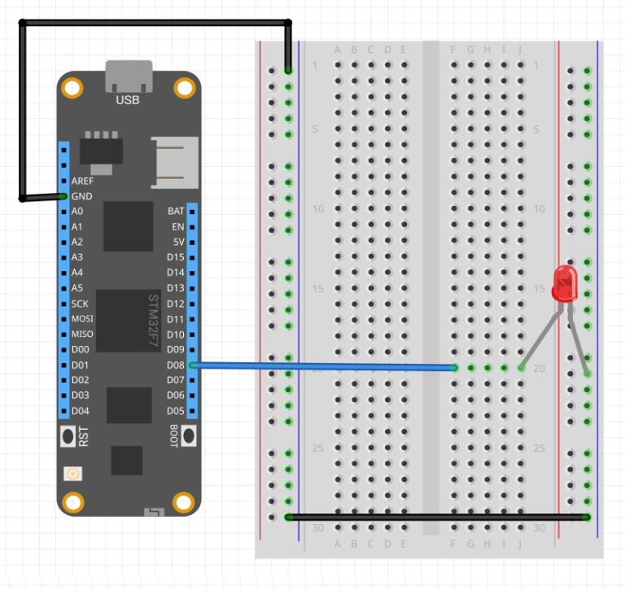

| PwmLed      |             |
|-------------|-------------|
| Status      | Working     |
| Source code | [GitHub](https://github.com/WildernessLabs/Meadow.Foundation/tree/master/Source/Meadow.Foundation.Core/Leds/)  |
| | |

**PwmLed* represents an LED whose voltage (and brightness) is controlled by the duty-cycle of a PWM signal. It can be used both with Leds that have been current limited with in-series resistors, or Leds without resistors.

Controlling an LED via a PWM signal is more power efficient than using a current-limiting resistor. It also provides more control, allowing multiple grades of brightness. 

To use PwmLed without a resistor, pass in the forward voltage (voltage drop) of the LED to the `forwardVoltage` constructor parameter, and the class will limit its output to the maximum forward voltage rating of the LED.

To use with an LED that has a resistor in series, pass `0.0` or `TypicalForwardVoltage.ResistorLimited` for the `forwardVoltage` parameter.

### Code Example

The following example alternates between blinking and pulsing an LED:

```csharp
public class MeadowApp : App<F7Micro, MeadowApp>
{
    public MeadowApp()
    {
        // create a new PwmLed on pin 8
        var pwmLed = new PwmLed(
            Device.CreatePwmPort(Device.Pins.D08),
            TypicalForwardVoltage.Green
        );

        // alternate between blinking and pulsing the LED 
        while (true)
        {
            pwmLed.StartBlink();
            Thread.Sleep(5000); // 5 seconds

            pwmLed.StartPulse(lowBrightness: 0.2F);
            Thread.Sleep(10000); // 10 seconds
        }
    }
}
```

### Wiring Example


