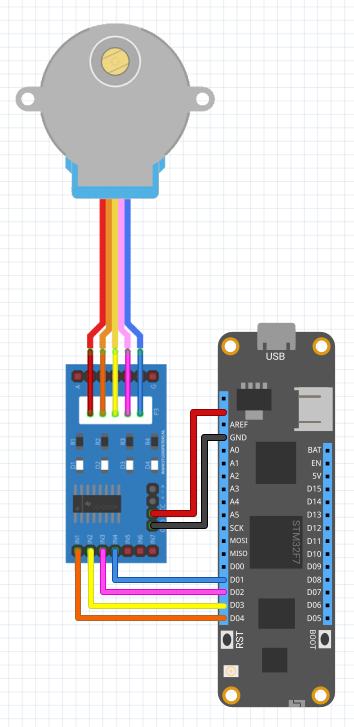

An h-bridge motor controller enables a control signal to drive a much larger load in either polarity, allowing the Netduino to drive DC motors in forward or reverse from an external power supply. Using pulse-width-modulation (PWM) as the control signal, provides not just forward or reverse control, but variable speeds in either direction.

### Sourcing

This generic driver works with standard h-bridges ICs such as the Texas Instruments [L2N93E](https://octopart.com/search?q=L293NE) or [SN754410](https://octopart.com/search?q=SN754410) chips.

It should also work with heavier duty [L298N](https://www.amazon.com/s/ref=nb_sb_noss_2?url=search-alias%3Daps&field-keywords=l298n) drivers.

### Code Example

The following code creates an h-bridge controller with the PWM controllers on pins 3 and 5, and the enable pin on pin 4. It then sets the motor speed to 100% forward, stops the motor for half a second, and then sets the motor speed to 100% reverse.

```csharp
using System.Threading;
using Meadow;
using Meadow.Foundation.Motors;

namespace Uln2003_Sample
{
    public class Program
    {
        static IApp _app; 
        public static void Main()
        {
            _app = new App();
        }
    }
    
    public class MeadowApp : AppBase<F7Micro, App>
    {
        public MeadowApp ()
        {

        }
    }
}
```

### Circuit Example

The following breadboard diagram illustrates connecting two motors to an h-bridge chip that uses a external power supply to drive the motors:

