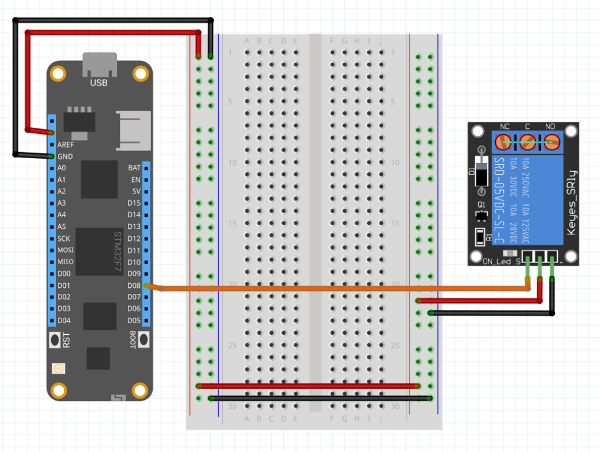

A relay is an electrically operated or electromechanical switch composed of an electromagnet, an armature, a spring and a set of electrical contacts. The electromagnetic switch is operated by a small electric current that turns a larger current on or off by either releasing or retracting the armature contact, thereby cutting or completing the circuit. Relays are necessary when there must be electrical isolation between controlled and control circuits, or when multiple circuits need to be controlled by a single signal.

---
uid: Meadow.Foundation.Relays.Relay
example: [*content]
---

The following code illustrates explicitly turning a relay on or off, as well as toggling it’s on state.

```csharp
using System;
using System.Threading;
using Meadow;
using Meadow.Foundation.Relays;

namespace Relay
{
    public class Program
    {
        public static void Main()
        {
            var relay = new Relay(Device.Pins.D08);

            while (true)
            {
                Debug.Print("turning on");
                relay.IsOn = true;

                Thread.Sleep(500);

                Debug.Print("toggling to off");
                relay.Toggle();

                Thread.Sleep(250);

                Debug.Print("Toggling to on.");
                relay.Toggle();

                Thread.Sleep(250);

                Debug.Print("Turning off");
                relay.IsOn = false;

                Thread.Sleep(500);
            }
        }
    }
}
```

### Example Wiring

