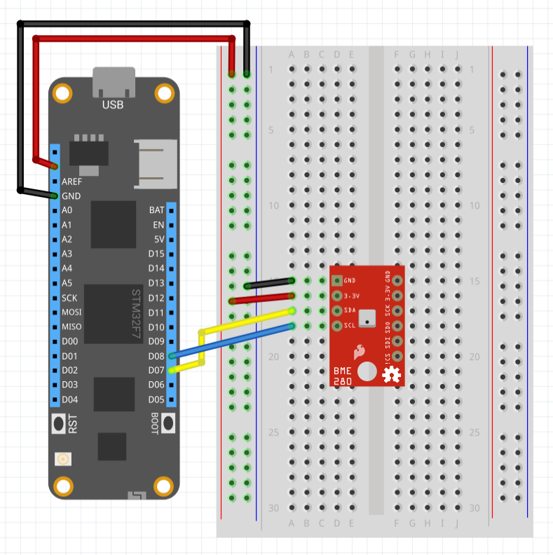

The BME280 is a combined temperature, pressure and humidity sensor.

## Purchasing

The BME280 sensor is available as a breakout board from the following suppliers:

* [SparkFun BME280](https://www.sparkfun.com/products/13676)
* [Adafruit BME280](https://www.adafruit.com/product/2652)

---
uid: Meadow.Foundation.Sensors.Atmospheric.BME280
example: [*content]
---

The BME280 can operating in polling and interrupt mode.  By default, this sensor operates in interrupt mode.

### Interrupt Mode

When the driver is operating in interrupt mode, the driver will periodically check the sensor reading.  An interrupt will be generated if the difference between the last reported reading and the current reading is greater than a threshold value.

The sensor operates in interrupt mode by default.

The following application will generate interrupts when changes to any one of the temperature, humidity or pressure readings exceed their threshold values:

```csharp
using System.Threading;
using Meadow;
using Meadow.Foundation.Sensors.Atmospheric;

namespace BME280_Sample
{
    public class Program
    {
        static IApp _app; 
        public static void Main()
        {
            _app = new App();
        }
    }
    
    public class App : AppBase<F7Micro, App>
    {
        public App ()
        {
            // BME280 temperature, humidity and pressure object.  This object should
            // raise an interrupt when the changes in the sensor readings exceed the
            // following:
            //
            // Temperature: +/- 1 C
            // Humidity: +/- 1 %
            // Pressure: +/- 10 kPa (the default value for this threshold)
            BME280 sensor = new BME280(temperatureChangeNotificationThreshold: 0.1F,
                humidityChangeNotificationThreshold: 1.0f);
            
            // Attach interrupt handlers to the temperature, humidity and pressure sensor.
            sensor.HumidityChanged += (s, e) =>
            {
                Console.WriteLine("Current humidity: " + e.CurrentValue.ToString("f2"));
            };
            sensor.PressureChanged += (s, e) =>
            {
                Console.WriteLine("Current pressure: " + (e.CurrentValue / 100).ToString("f2"));
            };
            sensor.TemperatureChanged += (s, e) =>
            {
                Console.WriteLine("Current temperature: " + e.CurrentValue.ToString("f2"));
            };
        }
    }
}
```

### Polling Mode

In polling mode, it is the responsibility of the main application to check the sensor readings ona periodic basis.  The following application creates an instance of the `BME280` class using the I2C interface.  The temperature, pressure and humidity are read every second and the readings displayed using the debugger.

The sensor is put into polling mode by setting the `updateInterval` to `0` in the constructor.

```csharp
using System.Threading;
using Meadow;
using Meadow.Foundation.Sensors.Atmospheric;

namespace BME280_Sample
{
    public class Program
    {
        static IApp _app; 
        public static void Main()
        {
            _app = new App();
        }
    }
    
    public class App : AppBase<F7Micro, App>
    {
        public App ()
        {
            // Create a new BME280 object and put the sensor into polling
            // mode (update interval set to 0ms).
            BME280 sensor = new BME280(updateInterval: 0);

            string message;
            while (true)
            {
                // Make the sensor take new readings.
                sensor.Update();

                // Prepare a message for the user and output to the debug console.
                message = "Temperature: " + sensor.Temperature.ToString("F1") + " C\n";
                message += "Humidity: " + sensor.Humidity.ToString("F1") + " %\n";
                message += "Pressure: " + (sensor.Pressure / 100).ToString("F0") + " hPa\n\n";
                Console.WriteLine(message);

                // Sleep for 1000ms before repeating the process.
                Thread.Sleep(1000);
            }
        }
    }
}
```

##### Example Circuit

The BME280 can be connected using I2C or SPI.  Only 4 wires are required when using I2C:

* 3.3V
* Ground
* SDA
* SCL



It should be noted that the Sparkfun board is supplied with pull-up resistors enabled by default.  The Adafruit board does not have any pull-up resistors onboard.  It is therefore necessary to add two pull-up resistors (`4.7 K` should be adequate for a single device) between 3.3V and SDA and 3.3V and SCL.