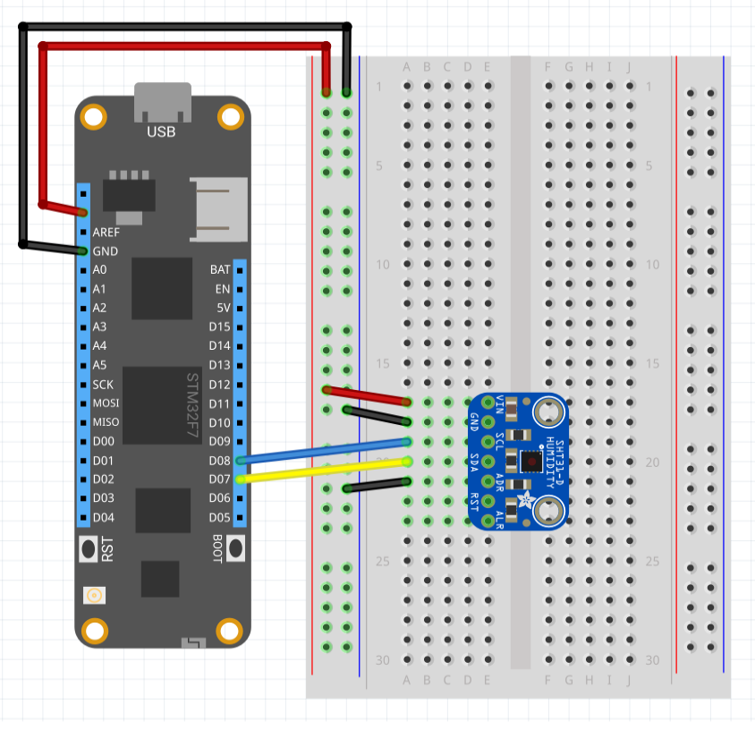

The SHT31D is a temperature and humidity sensor with a built in I2C interface.  The sensor has a typical accuracy of +/- 2% relative humidity and +/- 0.3C.

## Purchasing

The SHT31D temperature and humidity is available on a breakout board from Adafruit:

* [SHT31D Temperature and Humidity Sensor](https://www.adafruit.com/product/2857)

The SHT31D can operate in interrupt or polling mode.  The default mode is interrupt mode.

#### Interrupt Mode

The application below generates and interrupt when the temperature or humidity changes by more than 0.1 &deg;C.  The sensor is checked every 100 milliseconds.

```csharp
public class MeadowApp : App<F7Micro, MeadowApp>
{
    public MeadowApp()
    {
        // Create a new SHT31D object that will generate interrupts when
        // the temperature changes by more than +/- 0.1C or the humidity
        // changes by more than 1%.
        SHT31D sht31d = new SHT31D(temperatureChangeNotificationThreshold: 0.1F,
            humidityChangeNotificationThreshold: 1.0F);

        // Hook up the two interrupt handlers to display the changes in
        // temperature and humidity.
        sht31d.HumidityChanged += (s, e) =>
        {
            Console.WriteLine("Current humidity: " + e.CurrentValue.ToString("f2"));
        };

        sht31d.TemperatureChanged += (s, e) =>
        {
            Console.WriteLine("Current temperature: " + e.CurrentValue.ToString("f2"));
        };

        // Main program loop can now go to sleep as the work
        // is being performed by the interrupt handlers.
        Thread.Sleep(Timeout.Infinite);
    }
}
```

#### Polling Mode

The application below polls the sensor every 1000 milliseconds and displays the temperature and humidity on the debug console:

```csharp
public class MeadowApp : App<F7Micro, MeadowApp>
{
    public MeadowApp()
    {
        SHT31D sht31d = new SHT31D(updateInterval: 0);

        Console.WriteLine("SHT31D Temperature / Humidity Test");

        while (true)
        {
            sht31d.Update();
            Console.WriteLine("Temperature: " + sht31d.Temperature.ToString("f2") + ", Humidity: " + sht31d.Humidity.ToString("f2"));
            Thread.Sleep(1000);
        }
    }
}
```

### Wiring Example

The SHT31D breakout board from Adafruit is supplied with pull-up resistors installed on the `SCL` and `SDA` lines.

The `ADR` line is tied low giving and I2C address of 0x44.  This address line can also be tied high and in this case the I2C address is 0x45.

