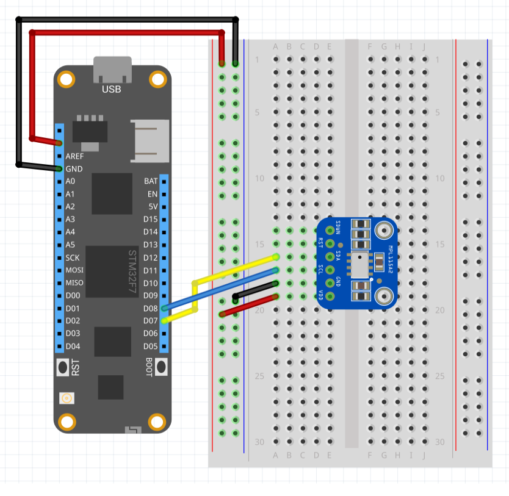

The MPL115A2 is a low cost device for reading barometric pressure.

* I2C digital interface (address: `0x60`)
* Resolution: 1.5 hPa
* Range: 100-1150 hPa up to 10Km

## Purchasing

The MPL115A2 sensor is available on a breakout board from Adafruit

* [Adafruit MPL115A2 Breakout Board](https://www.adafruit.com/product/992)

---
uid: Meadow.Foundation.Sensors.Barometric.MPL115A2
example: [*content]
---

The application below connects the MPL115A2 to two interrupt handlers.  These interrupt handlers (events) will display the `Temperature` and `Pressure` properties when the handlers are triggered.  The sensor is checked every 500 milliseconds.

```csharp
public class MeadowApp : App<F7Micro, MeadowApp>
{
    public MeadowApp()
    {
        //
        //  Create a new MPL object and set the temperature change threshold to 0.1C
        //  and leave the pressure threshold set to the default 10 kPa.  Have the
        //  sensor check the current readings every 0.5 seconds (500 milliseconds)
        //
        var mpl115a2 = new MPL115A2(updateInterval: 500, temperatureChangeNotificationThreshold: 0.1F);

        Console.WriteLine("MPL115A2 Interrupt Example");
        //
        //  Attach interrupt handlers to the temperature and pressure sensor.
        //
        mpl115a2.PressureChanged += (s, e) =>
        {
            Console.WriteLine("Pressure: " + e.CurrentValue.ToString("f2"));
        };

        mpl115a2.TemperatureChanged += (s, e) =>
        {
            Console.WriteLine("Temperature: " + e.CurrentValue.ToString("f2") + "C");
        };
    }
}
```

The following application reads the `Temperature` and `Pressure` from the MPL115A2 every second and displays the readings in the `Debug` output:

```csharp
public class MeadowApp : App<F7Micro, MeadowApp>
{
    public MeadowApp()
    {
        var mpl115a2 = new MPL115A2(updateInterval: 0);

        Console.WriteLine("MPL115A2 Polling Example");

        while (true)
        {
            //
            //  Have the sensor make new readings.
            //
            mpl115a2.Update();
            //
            //  Display the values in the debug console.
            //
            Console.WriteLine("Pressure: " + mpl115a2.Pressure.ToString("f2") + " kPa, Temperature: " +
                        mpl115a2.Temperature.ToString("f2") + "C");
            //
            //  Sleep for a while (1 second) before taking the next readins.
            //
            Thread.Sleep(1000);
        }
    }
}
```

### Example Wiring

The simplest method of connecting the MPL115A2 to Meadow requires only four connections:



In this diagram, the shutdown (`SDWN`) and reset (`RST`) pins have been left floating.  Both of these pins are active low and can be tied to V<sub>cc</sub> in normal operation.

Note that the Adafruit breakout board has `10K` pull-up resistors on the `SDA` and `SCK` lines.