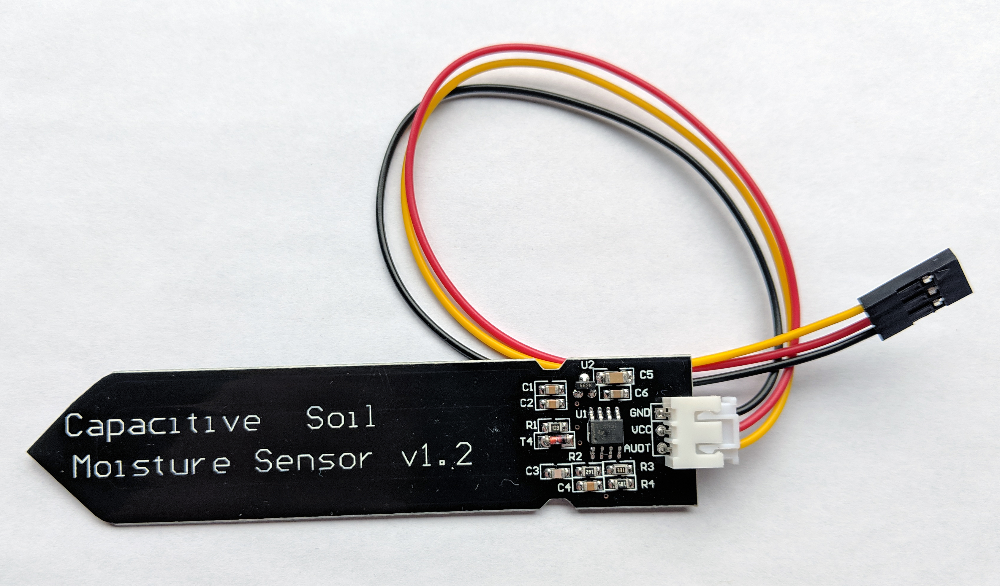
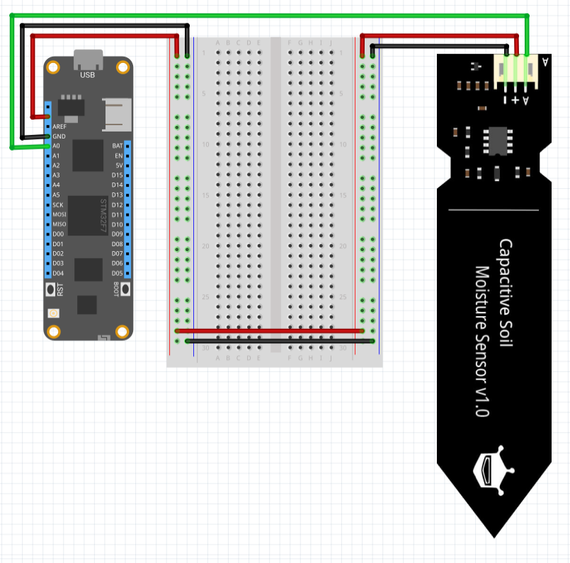

Capacitive Soil Moisture sensor is a simple breakout for measuring the moisture in soil and similar materials. This sensor measures moisture levels by capacitive sensing, rather then resistive sensing like other types of moisture sensor such as the FC-28.



Capacitive sensing means measuring the dielectrum that is formed by the soil and the water is the most important factor that forms the dielectrum. Even though this kind of sensor might be a little pricier, it is made of corrosion resistant material giving it a longer service of life than a resistive sensor.

The following example shows how read the soil moisture every second:

```csharp
public class MeadowApp : App<F7Micro, MeadowApp>
{
    Capacitive _Capacitive;

    public MeadowApp()
    {
        // create a new Capacitive sensor object connected to analog pin A01
        _Capacitive = new Capacitive(Device.Pins.A01);

        Run();
    }

    async Task Run()
    {
        while (true)
        {
            float moisture = await _Capacitive.Read();
            Console.WriteLine($"Moisture: {0}", moisture);
            Thread.Sleep(1000);
        }
    }
}
```

### Example Wiring

