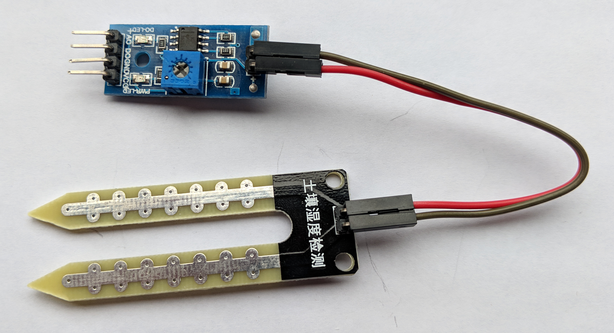
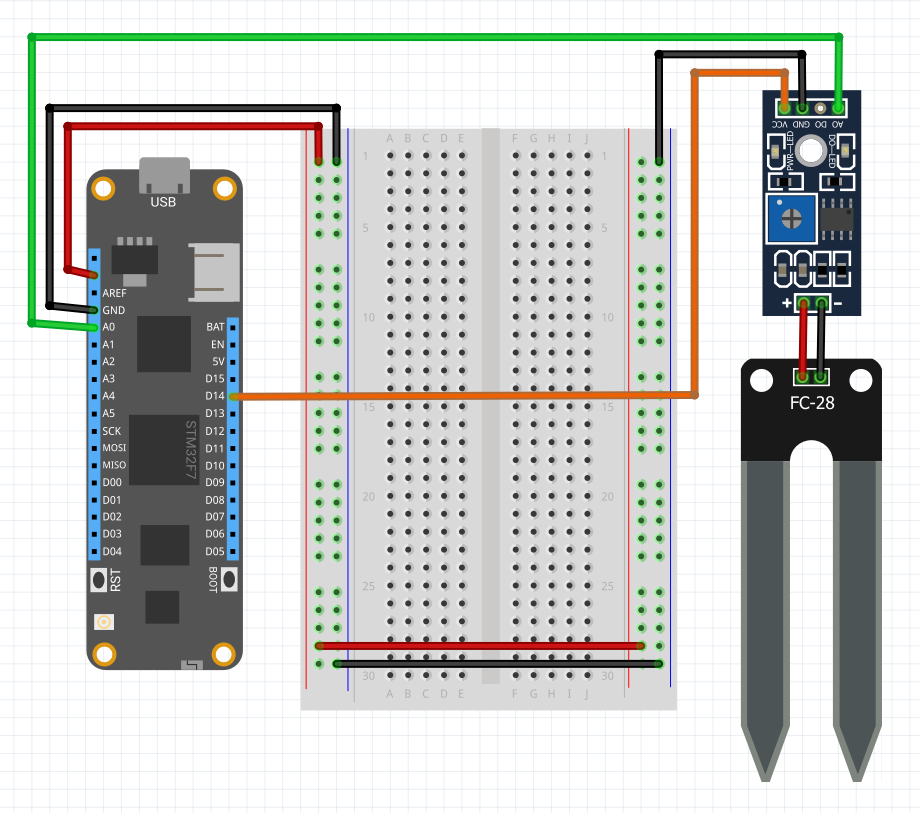

| FC-28         |             |
|---------------|-------------|
| Status        | Working     |
| Source code   | [GitHub](https://github.com/WildernessLabs/Meadow.Foundation/tree/master/Source/Meadow.Foundation.Peripherals/Sensors.Moisture.FC28) |
| NuGet package |  |
| | |

**FC-28** Soil Moisture Sensor is a simple breakout for measuring the moisture in soil and similar materials. The sensor has two probes and measures the resistance between them, which means this sensor is of type Resistive. Since water is conductive, as moisture in the soil increases, the resistance decreases allowing the sensor to determine soil humidity. 



The biggest issue of this sensor is the corrosion of the probes, not just because it is in contact with the soil but also because there is a DC current flowing which causes electrolysis of the sensors. A work-around to prolong the life of the probes is to not constantly have the sensor powered on, but activate it every time the sensor will perform a read using a digital output port connected to the VCC pin. The code and circuit example shows you how to use it.

The following example shows how read the soil moisture every second:

```csharp
public class MeadowApp : App<F7Micro, MeadowApp>
{
    FC28 _FC28;

    public MeadowApp()
    {
        // create a new FC-28 object connected to analog pin A01 and digital pin 14
        _FC28 = new FC28(Device.Pins.A01, Device.Pins.D14);

        Run();
    }

    async Task Run()
    {
        while (true)
        {
            float moisture = await _FC28.Read();
            Console.WriteLine($"Moisture: {0}", moisture);
            Thread.Sleep(1000);
        }
    }
}
```

### Wiring Example

