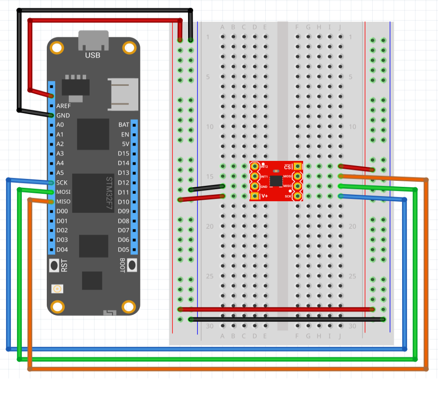

ADXL362 is an ultralow power, 3-axis MEMS accelerometer that consumes less than 2 μA at a 100 Hz output data rate and 270 nA when in motion triggered wake-up mode. 

## Purchasing

The ADXL362 is available on a small breakout board:

* [Sparkfun ADXL362 Breakout Board](https://www.sparkfun.com/products/11446)

---
uid: Meadow.Foundation.Sensors.Motion.ADXL362
example: [*content]
---

The ADXL362 can operating in interrupt and polling mode.  Polling applications are responsible for determining when a sensor is read.  Interrupt applications will be notified when the sensor reading changes by + / - a threshold value.

### Interrupt Example

The application below demonstrates how to connect an interrupt handler to the ADXL362 sensor and display changes only when the acceleration changes in the x, y or z axis by more than the acceleration threshold (default is 5 units):

```csharp
using System.Threading;
using Meadow;
using Meadow.Foundation.Sensors.Motion;

namespace ADXL362_Sample
{
    public class Program
    {
        static IApp _app; 
        public static void Main()
        {
            _app = new App();
        }
    }
    
    public class App : AppBase<F7Micro, App>
    {
        public App ()
        {
            Console.WriteLine("\n\n");
            Console.WriteLine("ADXL362 Interrupt Example.");
            Console.WriteLine("--------------------------");
            
            var adxl362 = new ADXL362();
            Console.WriteLine("Device ID: " + adxl362.DeviceID);
            
            // Attach an interrupt handler.            
            adxl362.AccelerationChanged += (s, e) =>
            {
                Console.WriteLine(
                    "X: " + e.CurrentValue.X.ToString() +
                    ", Y: " + e.CurrentValue.Y.ToString() +
                    ", Z: " + e.CurrentValue.Z.ToString());
            };

            // Interrupts are attached so power on the sensor.
            adxl362.SetPowerState(false, false, true, false, ADXL362.Frequency.EightHz);
            
            // Put Meadow to sleep as the interrupt handler will deal 
            // with changes in acceleration.
            Thread.Sleep(Timeout.Infinite);
        }
    }
}
```

### Polling Example

The sensor is put into polling mode by setting the `updateInterval` in the constructor to 0 milliseconds.  The following application will read the sensor and output to the debug console every 500 milliseconds:

```csharp
using System.Threading;
using Meadow;
using Meadow.Foundation.Sensors.Motion;

namespace ADXL362_Sample
{
    public class Program
    {
        static IApp _app; 
        public static void Main()
        {
            _app = new App();
        }
    }
    
    public class App : AppBase<F7Micro, App>
    {
        public App ()
        {
            Console.WriteLine("\n\n");
            Console.WriteLine("ADXL362 Polling Example.");
            Console.WriteLine("------------------------");
            
            ADXL362 adxl362 = new ADXL362(updateInterval: 0);
            Console.WriteLine("Device ID: " + adxl362.DeviceID);
            
            adxl362.SetPowerState(false, false, true, false, ADXL362.Frequency.EightHz);
            while (true)
            {
                adxl362.Update();
                Console.WriteLine(
                    "X: " + adxl362.X.ToString() + 
                    ", Y: " + adxl362.Y.ToString() + 
                    ", Z: " + adxl362.Z.ToString());
                Thread.Sleep(500);
            }
        }
    }
}
```

##### Example Circuit

