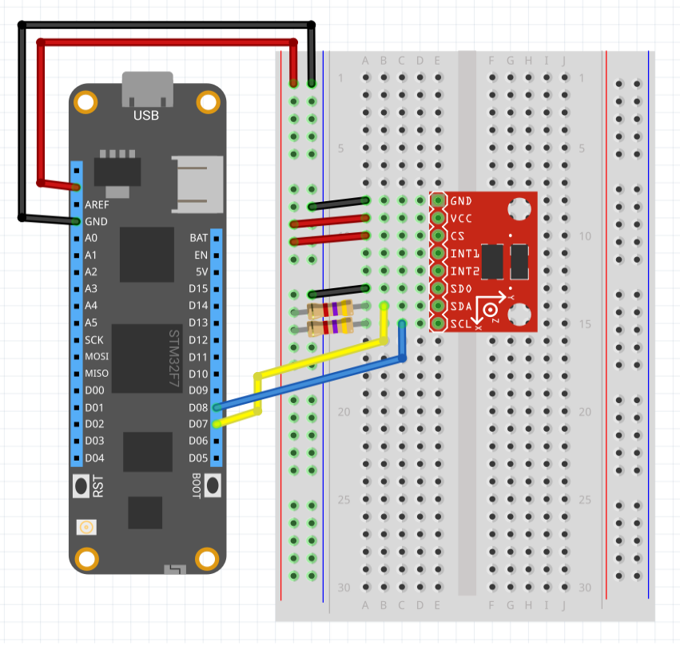

The ADXL345 is a small, low power, triple axis acceleration sensor capable of measuring up to +/-16g with a resolution of 13-bits.

## Purchasing

The ADXL345 is available on a small breakout board:

* [Sparkfun ADXL345 Breakout Board](https://www.sparkfun.com/products/9836)

---
uid: Meadow.Foundation.Sensors.Motion.ADXL345
example: [*content]
---

The ADXL345 can operating in interrupt and polling mode.  Polling applications are responsible for determining when a sensor is read.  Interrupt applications will be notified when the sensor reading changes by + / - a threshold value.

### Interrupt Example

The application below demonstrates how to connect an interrupt handler to the ADXL345 sensor and display changes only when the acceleration changes in the x, y or z axis by more than the acceleration threshold (default is 5 units):

```csharp
using System.Threading;
using Meadow;
using Meadow.Foundation.Sensors.Motion;

namespace Adxl345_Sample
{
    public class Program
    {
        static IApp _app; 
        public static void Main()
        {
            _app = new App();
        }
    }
    
    public class MeadowApp : App<F7Micro, MeadowApp>
    {
        public App ()
        {

        }
    }
}
```

### Polling Example

The sensor is put into polling mode by setting the `updateInterval` in the constructor to 0 milliseconds.  The following application will read the sensor and output to the debug console every 500 milliseconds:

```csharp
using System.Threading;
using Meadow;
using Meadow.Foundation.Sensors.Motion;

namespace Adxl345_Sample
{
    public class Program
    {
        static IApp _app; 
        public static void Main()
        {
            _app = new App();
        }
    }
    
    public class MeadowApp : App<F7Micro, MeadowApp>
    {
        public App ()
        {

        }
    }
}
```

### Example Circuit

