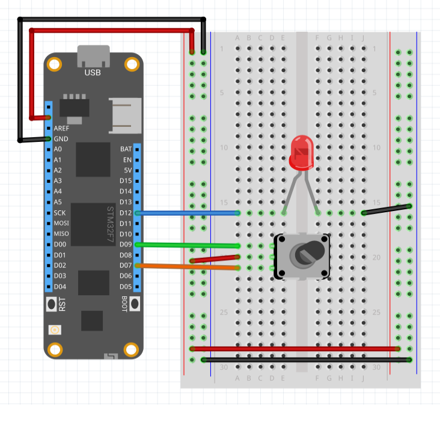

Rotary encoders are similar in form factor to potentiometers, but instead of modifying a voltage output, they send a digital signal encoded using Gray Code when rotated that can be decoded to ascertain the direction of turn.


Rotary encoders have several advantages over potentiometers as input devices, namely:

* They’re more power efficient; they only use power when actuated.
* They’re not rotation-bound; they spin infinitely in either direction.
* Many rotary encoders also have a built-in pushbutton.

Rotary encoders are used almost exclusively on things like volume knobs on stereos.

And because they’re not rotation bound, they are especially useful in the case in which a device might have multiple inputs to control the same parameter. For instance, a stereo’s volume might be controlled via a knob and a remote control. If a potentiometer were used for the volume knob, then the actual volume could get out of synch with the apparent value on the potentiometer when the volume was changed via the remote.

For this reason, rotary encoders are particularly useful in connected things, in which parameters might be controlled remotely.

###Two-bit Gray Code

This rotary encoder driver works with most rotary encoders which return a two-bit Gray Code which is the minimum number of bits necessary to describe direction. Most common rotary encoders use two-bit Gray Code, so this driver should work with most common rotary encoders.

---
uid: Meadow.Foundation.Sensors.Rotary.RotaryEncoder
example: [*content]
---

The following example uses a rotary encoder to adjust the brightness of a PwmLed.

```csharp
using System.Threading;
using Meadow;
using Meadow.Foundation.LEDs;
using Meadow.Foundation.Sensors.Rotary;

namespace RotaryEncoder_Sample
{
    public class Program
    {
        static IApp _app; 
        public static void Main()
        {
            _app = new App();
        }
    }
    
    public class MeadowApp : App<F7Micro, MeadowApp>
    {
        protected RotaryEncoder _rotary = null;
        protected PwmLed _led = null;
        // how much to change the brightness per rotation step. 
        // 0.05 = 20 clicks to 100%
        protected float _brightnessStepChange = 0.05F; 

        public App()
        {
            // instantiate our peripherals
            _rotary = new RotaryEncoder(Device.Pins.D07, Device.Pins.D09);
            _rotary.Rotated += RotaryRotated;

            _led = new PwmLed(Device.Pins.D12, TypicalForwardVoltage.Red);
        }

        protected void RotaryRotated(object sender, RotaryTurnedEventArgs e)
        {
            // if clockwise, turn it up! clamp to 1, so we don't go over.
            if (e.Direction == RotationDirection.Clockwise)
            {
                if(_led.Brightness >= 1) 
                {
                    return;
                } 
                else 
                {
                    _led.SetBrightness((_led.Brightness + 
                        _brightnessStepChange).Clamp(0,1));
                }
            } 
            else // otherwise, turn it down. clamp to 0 so we don't go below. 
            { 
                if (_led.Brightness <= 0) 
                {
                    return;
                } 
                else 
                {
                    _led.SetBrightness((_led.Brightness - 
                        _brightnessStepChange).Clamp(0,1));
                }
            }
        }
    }
}
```

##### Example Circuit

Note, depending on your encoder, it may have a common/ground (gnd) or (-) leg in addition to the positive (+) leg. If it does, make sure to wire it to ground.

The a-phase pin may be labeled (A), (CLK) or other. If the Rotated event is indicating the wrong direction, simply switch the a-phase and b-phase pins.

