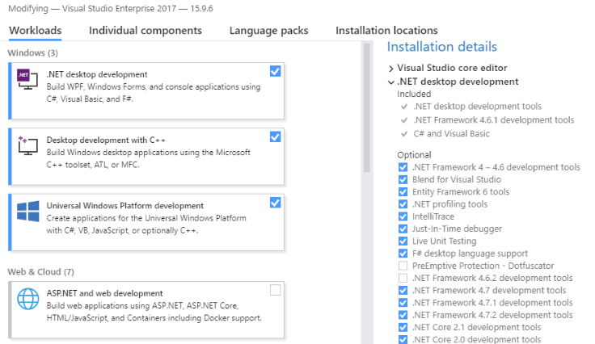

# Hello, World

Meadow applications are just familiar .NET Framework 4.7.2 console applications. To access the GPIO and Meadow-specific features, your project references the **Meadow.Core** library.

Let's create a new Meadow app!

## Prerequisites

You'll need Visual Studio: [available here](https://visualstudio.microsoft.com/downloads/)

You can use any edition including Enterprise, Professional, or the free Community edition.  

### Windows

Install Visual Studio 2017. Visual Studio 2019 beta *should* work but isn't officially supported yet. 

You'll need to ensure the **.NET Framework 4.7.2 development tools** are installed. To verify, run the Visual Studio Installer and click **Modify**. Under **Installation details**, expand **.NET desktop development** and ensure that **.NET Framework 4.7.2 development tools** is checked.



### macOS

Install the latest version of Visual Studio for Mac.

## Part 1: Creating a new Meadow Project

### Windows

 1. Open Visual Studio.
 * Create a new Project: *File -> New -> Project...*.
 * Choose the **Console App (.NET Framework)** C# template.
 * Choose an app name, a location, and set the framework to **4.7.2**, and press **OK**.

### macOS

 1. Open Visual Studio.
 * Create a new Project: *File -> New Solution..*.
 * In the **Other** section, select *.NET -> Console Project*, make sure it's using C#, and press **Next**.
 * Choose an app name and location.
 * Press **Create**.

#### Set the .NET version (macOS only)

 1. Control-click or right-click on the project in the Solution Explorer.
 * Select **Options**.
 * Go to *Build -> General*.
 * Set the *Target framework:* to *.NET Framework 4.7.2*.
 * Press **OK**.

## Add the Meadow NuGet package

### Windows

 1. Right-click on the project in the Solution Explorer.
 * Select *Manage Nuget Packages...*.
 * In the **Browse** tab, search for **Meadow**.
 * Click the **Install** button to add the Nuget package to your project.

### macOS

 1. Control-click or right-click on the project in the Solution Explorer.
 * Select *Add -> Add Nuget Packages...*.
 * Search for **Meadow**.
 * Check the package in the search results and press **Add Package**.

## Set the App assembly name

Currently, Meadow is configured to run a .NET console app named **App.exe**. You can either manually rename your application after its compiled or change the assembly name in Visual Studio.

### Windows

 1. Right-click on the project in the Solution Explorer.
 * Select **Options**.
 * Open the **Application** section.
 * Change the **Assembly name** to **App**.

### macOS

 1. Control-click or right-click on the project in the Solution Explorer.
 * Select **Options**.
 * Go to *Build -> Output*.
 * Change the **Assembly name** to **App**.

## Part 2: Hello, World

Now that your project is setup, we'll create an application that will control the onboard RGB led and write text to the console.

## Add the App class

Wilderness Labs recommends placing your logic in an application class that's instantiated in the `Program` class when the app starts.

 1. Create a new `public` class named `App`.
 * Add `using` statements to `Meadow`, `Meadow.Devices`, and `Meadow.Hardware`.
 * Change the class signature to derive from `AppBase<F7Micro, App>`.
 * Add a `void` returning method named `InitializeHardware`.
 * Call `InitializeHardware` from the constructor:

  ```csharp
  using Meadow;
  using Meadow.Devices;
  using Meadow.Hardware;

  namespace HelloLED
  {
      public class App : AppBase<F7Micro, App>
      {
          public App()
          {
              InitializeHardware();
          }

          void InitializeHardware()
          {
          }
      }
  }
  ```

## Control the Onboard LED

Now we'll add fields to control the onboard LED and toggle its red, green, and blue components off and on periodically.

 1. Add three (3) fields of type `DigitalOutputPort` named `redLed`, `greenLed`, and `blueLed`.
 * In the `InitializeHardware method, instantiate each output port using `Device.Pins` to reference the onboard internal pins to control each color of the led:
  
  ```csharp
  IDigitalOutputPort redLed;
  IDigitalOutputPort greenLed;
  IDigitalOutputPort blueLed;
  ...

  void InitializeHardware()
  {
      redLed = Device.CreateDigitalOutputPort(Device.Pins.OnboardLEDRed);
      blueLed = Device.CreateDigitalOutputPort(Device.Pins.OnboardLEDBlue);
      greenLed = Device.CreateDigitalOutputPort(Device.Pins.OnboardLEDGreen);
  }
  ```

Now we'll add a method to toggle the LEDs. We do this by controlling the `DigitalOutputPort`'s boolean `State` property. Within the while loop, we'll write the current state to the Console and toggle the LEDs in sequence. 

We'll need two (2) additional `using` statements, add `System` and `System.Threading` if they're not there already.

Add the code below:

```csharp
using System;
using System.Threading;
...

public void ToggleLeds()
{
    bool state = false;
    int sleepTime = 150; //in ms

    while(true)
    {
        state = !state;

        Console.WriteLine($"State: {state}");

        blueLed.State = state;
        Thread.Sleep(sleepTime);
        redLed.State = state;
        Thread.Sleep(sleepTime);
        greenLed.State = state;
        Thread.Sleep(sleepTime);
    }
}
```

Finally, call `ToggleLeds` from the constructor after `InitializeHardware`:

```csharp
public App()
{
    InitializeHardware();
    ToggleLeds();
}
```

## Instantiate the App class

The last thing we need to do is create an instance of the `App` class when the application starts.

 1. Open Program.cs.
 * A `using` statement for `Meadow`.
 * Create a static field of type `IApp` named **app**.
 * In the constructor, instantiate an `App` instance and assign it to **app**:

  ```csharp
  using Meadow;

  namespace HelloLED
  {
      class Program
      {
          static IApp app;
          static void Main(string[] args)
          {
              app = new App();
          }
      }
  }
  ```

## Compile and run the application

You're now ready to build and deploy your Meadow app. 

 1. Build the application.
 * Using Finder or the File Explorer, navigate to the folder that contains your application.
 * Open the **bin->Debug** folder, you should see **App.exe** and some **\*.dll** files; you'll need both to deploy your app to Meadow.
 * Follow the [Deployment instructions here](../Deployment/) to deploy your app.


## [Next - Meadow Basics](/Guides/Meadow_Basics/)