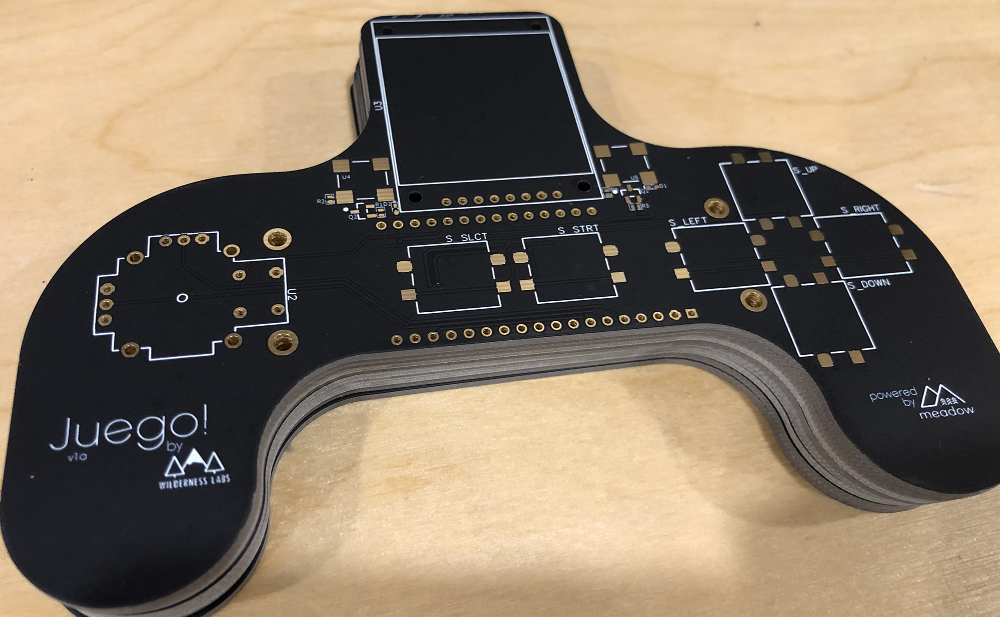

PCB design is done almost exclusively with computer software today and is also known as Electronic Design Automation (EDA), and typically consists of two parts:

* Schematic Design (AKA _Schematic Capture)
* PCB Layout

[take the images below and make a side by side (crop them):]

Creating PCBs is a core skill of designing hardware, and although it can be intimidating when starting out, designing PCBs for most IoT solutions is a fairly simple process, and the modern PCB supply chain means you can churn a design and have a professionally printed board in your hands within a week or so.

## Compared to Breadboarding

In comparison to breadboard prototyping, PCBs _massively_ simplify routing. In fact, many modern IoT projects become impractical to route on a breadboard. PCBs also provide much better electrical connections, which can often cause debugging headaches that take a long time to solve.

## PCB Fabrication

Because of the ease at which PCBs can be created, as well as their relative low cost, we often find ourselves skipping the breadboarding phase and churning a PCB.

In the [PCB Fabrication Guide](/Hardware/Design/PCB_Design_and_Assembly/PCB_Fabrication) we'll cover how to take your PCB designs and turn them into PCBs.

## PCB Assembly (PCBA) in a Home Lab

While production-scale PCB assembly is done with solder paste _stencil printers_, _pick-and-place_ machines, _reflow ovens_, and other specialized equipment, assembling prototype PCBs at home can be done with very simple and cheap tools. In fact, the minimum tooling required to do modern PCB assembly only includes:

 * Solder Paste in a Syringe
 * Tweezers
 * A Hot Plate

In the [PCB Assembly Guide](/Hardware/Design/PCB_Design_and_Assembly/PCB_Assembly) we'll cover everything you need to know to do PCBA at home.

## Choosing an EDA Tool

Unfortunately, while there are a [lot of EDA tools to choose from](https://en.wikipedia.org/wiki/Comparison_of_EDA_software), as software, they tend to still be a little primitive in their user experience (UX).

Internally, we use two tools; [EasyEDA](https://easyeda.com/) and [KiCAD](https://kicad.org/). KiCAD is a little more advanced, creates slightly nicer schematics, but has a very idiosyncratic and dated UX that can be frustrating.

EasyEDA is much more beginner and user-friendly, so these guides use that as an example, but the concepts generally apply across most EDA tools.

For KiCAD-specific tutorials, we recommend [BaldEngineer.com](https://www.baldengineer.com/?s=kicad&submit=Search), and [SparkFun](https://learn.sparkfun.com/tutorials/beginners-guide-to-kicad).

## [Next: Breadboarding](/Hardware/Design/PCB_Design_and_Assembly/Breadboarding)

## Important PCB Concepts [maybe move these]

### Through Hole (PTH) vs. Surface Mount (SMT/SMD)

[move this]

