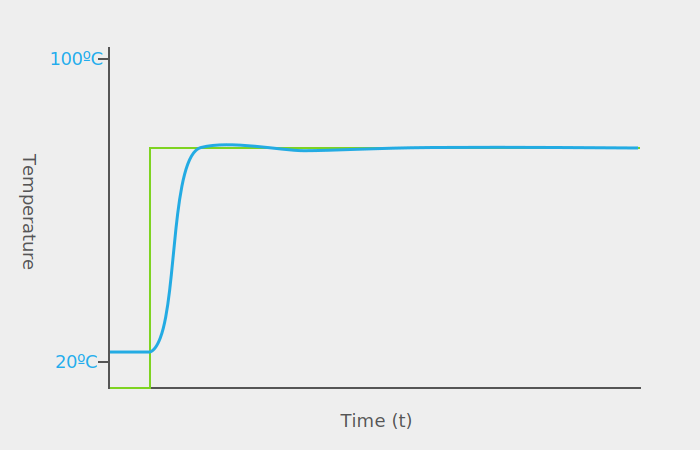
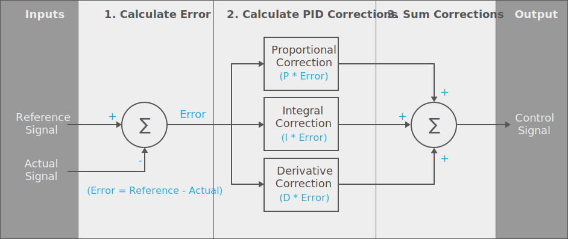

# Intro

Of all the various algorithms used in controlling systems; probably the most common, the most versatile, and most useful algorithm is the _Proportional_, _Integral_, _Derivative_ (PID) method. PID is a mathematical tool for efficiently affecting change in a system to get it to a particular target state, and keeping it there, harmoniously. 

It's the algorithm that keeps drones balanced in the air, your car at the right speed when cruise control is on, and ships on the right heading with variable winds. It's also the algorithm that can efficiently heat a cup of coffee to the perfect temperature and keep it there.

Consider the following graph of heating a cup of coffee from room temp to 75ºC. The green line represents the ideal, that is, we decide that our coffee which sits at 22ºC (72ºF) is too cold to drink, and so we want it instantly heated to 75º. This "ideal value" is also known as the _reference_ or _target_ signal. And the blue line represents an efficient realization of the reference signal in the real world; in which it takes time to heat the coffee to that temp:

In this idealized example, the coffee is quickly brought up _just past_ the target temperature, and then stabilized. 

The PID algorithm is a tool to heat the coffee just as illustrated above: _efficiently_.  That is, with only a small amount of error, defined as the area between the reference temperature and the actual temperature. 

## PID Controller in Netduino.Foundation

[Netduino.Foundation has a [PID controller](Link) integrated into the core, so you don't have to write the algorithm yourself, but in order to use it, it's helpful to understand how it works]

## Simple Control

To understand why PID is so useful, we must examine what happens without it. 

Probably the easiest and most intuitive way to heat up a cup of coffee sitting on a hotplate is to create a loop that continuously monitors the temp of the coffee, and if the temperature is too low, start another loop that turns on the hot plate, waits until the coffee reaches the desired temperature, and then turns the hot plate off. That loop then finishes and when the master loop detects that the coffee has gone below the target temperature, it stars the heat up loop again.

This is a very simple algorithm, but it leads to a lot of error. Consider the following graph, which is the likely outcome of that the aforementioned loop, in which the brown line represents the actual temperature:

While the actual temperature of the coffee will eventually get close to the target temperature, most of the time there will be a lot of error, due to the _oscillation_ of the actual temperature. Each time a control signal is changed, for instance, when the hotplate is turned off, there is some lag as all of the components of the system recover from the inertia of the previous control signal. 

In order to correct for this, at a minimum, the algorithm needs to take into account the _rate of change_ of the temperature and predict control changes _before_ the target is reached. Enter, the PID algorithm.

## PID Controller Algorithm

The PID algorithm can be described, visually, in the following block diagram:

The inputs include the _reference signal_ which represents the ideal target state, i.e.: 75ºC, and the _actual signal_ which is the actual measured state, i.e.: current temp of coffee is 25ºC, and the output is the _control signal_, which is used to control the agent of change in the system, such as the hot plate.

In the case of heating up a cup of coffee, the idea here is that when given the target temperature of the coffee, as well as the current actual temperature of the coffee, the algorithm calculates the amount of power to give the hotplate to the appropriate temperature, efficiently. The PID algorithm is then called repeatedly, usually in a loop, to provide continuous control adjustments based on the input.

### Closed Loop Gain Controller

This type of control system is sometimes called a _closed loop gain_, because the control output is fed back into the system and the controller is then given the response to its previous control signal and can react appropriately to the change and further refine the output:

In this context, [_gain_](https://en.wikipedia.org/wiki/Gain_(electronics)) is the output signal and can be either positive or negative. 

#### Hysteresis

Additionally, this control algorithm relies on the history of the 

[gah, reword this. hysteresis is the dependence of the system on its history, and causes a lag between control and actual]
The lag between the 
This type of system causes a condition called [_hysteresis_](https://en.wikipedia.org/wiki/Hysteresis), in which the change 

### Calculation Steps

The actual algorithm has three steps to it:

 1. Calculate the current error, which is the difference between the desired target, _reference_ state and the current _actual_ state.
 2. Calculate the corrections needed to change the system state to the desired state, by multiplying the current error by the Proportional, Integral, and Derivative corrective action calculations.
 3. Add together all three corrective actions into a single change quantity.

The output might then be a value such as `0.75`, which specifies that the hotplate needs to be set to 75% power, in order to arrive at the desired temperature, based on the current conditions

[break it down into its components]

#### Proportional

#### Integral

[area under the function]

#### Derivative

[rate of change]
[used to predict behavior]

# Variations on PID

## PI Controllers

## PD Controllers

# Netduino.Foundation PID Controller

