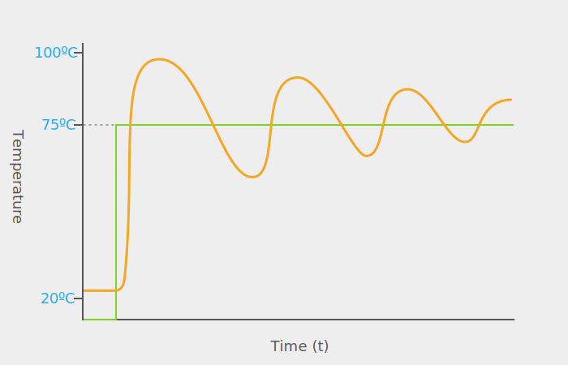
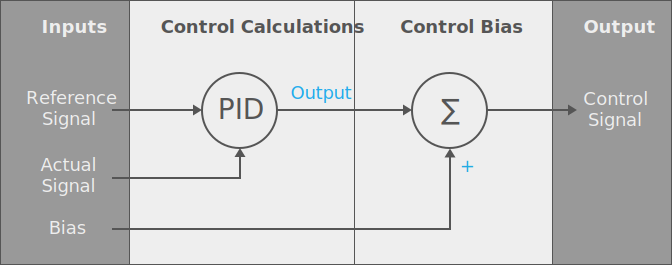
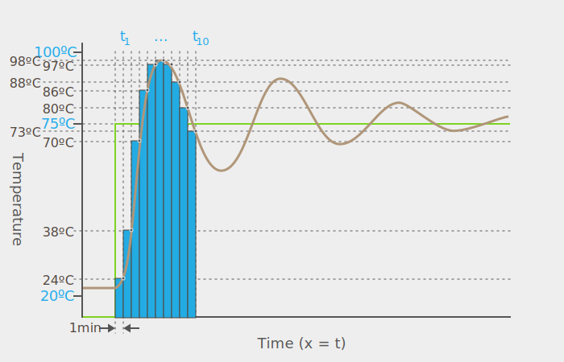
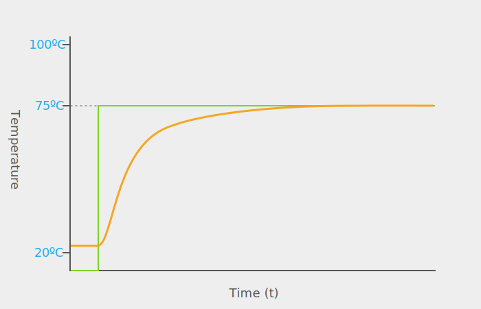

# Intro

Of all the various algorithms used in controlling systems; probably the most common, the most versatile, and most useful algorithm is the _Proportional_, _Integral_, _Derivative_ (PID) method. PID is a mathematical tool for efficiently affecting change in a system to get it to a particular target state, and keeping it there, harmoniously. 

It's the algorithm that keeps drones balanced in the air, your car at the right speed when cruise control is on, and ships on the right heading with variable winds. It's also the algorithm that can efficiently heat a cup of coffee to the perfect temperature and keep it there.

Consider the following graph of heating a cup of coffee from room temp to 75ºC. The green line represents the ideal, that is, we decide that our coffee which sits at 22ºC (72ºF) is too cold to drink, and so we want it instantly heated to 75º. This "ideal value" is also known as the _reference_, _target_, or _setpoint_ (SP) signal. And the blue line represents an efficient realization of the reference signal in the real world; in which it takes time to heat the coffee to that temp:


In this idealized example, the coffee is quickly brought up _just past_ the target temperature, and then stabilized. 

The PID algorithm is a tool to heat the coffee just as illustrated above: _efficiently_.  That is, with only a small amount of error, defined as the area between the reference temperature and the actual temperature. 

# PID Controllers in Netduino.Foundation

Netduino.Foundation has two [PID controllers](http://Netduino.Foundation/API/Controllers/PID/) integrated into the core library. Getting up and running with those controllers is fairly trivial, but this article provides a more in-depth discussion to provide a deeper understanding of how the algorithm works, so as to provide a better framework for tuning it, or implementing your own, custom controller.

# Simple Control

To understand why PID is so useful, we must examine what happens without it. 

Probably the easiest and most intuitive way to heat up a cup of coffee sitting on a hotplate is to create a loop that continuously monitors the temp of the coffee, and if the temperature is too low, start another loop that turns on the hot plate, waits until the coffee reaches the desired temperature, and then turns the hot plate off. That loop then finishes and when the master loop detects that the coffee has gone below the target temperature, it starts the heat up loop again.

This is a very simple algorithm, but it leads to a lot of error. Consider the following graph, which is the likely outcome of that the aforementioned loop, in which the orange line represents the actual temperature:



While the actual temperature of the coffee will eventually get close to the target temperature, most of the time there will be a lot of error, due to the _oscillation_ of the system. Each time a control signal is changed, for instance, when the hotplate is turned off, there is some lag as all of the components of the system recover from the inertia of the previous control signal.

This type of oscillation an inefficient control is the reason that sophisticated control algorithms like PID exist. 

# Control Theory: _Closed Loop Gain Controllers_

PID (and other control algorithms) are part of a control system that is called a _closed loop gain_, because the control output is fed back into the system and the controller is then given the response to its previous control signal and can react appropriately to the change and further refine the output:


In this context, [_gain_](https://en.wikipedia.org/wiki/Gain_(electronics)) is the output signal and can be either positive or negative. 

## Inputs

The inputs include:

 * **Reference Signal** - Represents the ideal target state and is sometimes called the _set point_ (SP). For instance, `75ºC`; the desired temp of coffee.
 * **Actual Signal** - Represents the actual measured state (sometimes called the _process variable_ (PV)).  For instance, `25ºC`; the current temp of coffee.

## Output

The output is the _control signal_, or _control variable_ (CV), which is used to control the agent of change in the system, such as how much power to give the hot plate.

In the case of heating up a cup of coffee, the idea here is that when given the target temperature of the coffee, as well as the current actual temperature of the coffee, the algorithm calculates the amount of power to give the hotplate to the appropriate temperature, efficiently. The PID algorithm is then called repeatedly, usually in a loop, to provide continuous control adjustments based on the input.

## Bias

Additionally, sometimes a _bias_ is added to the control output which can be needed to maintain system stability when the error is zero. 



For example, in the coffee example, when the coffee gets up to temp, in order to keep it at temp, we probably need to keep the hot plate on at some percent of maximum to maintain the coffee temp. Without a bias, the system may continue to oscillate after it gets to zero.


# PID Controller Algorithm

The PID algorithm was created specifically as a tool to provide an automated control framework to efficiently effect change within a system to get it to reach a target state. In the example above, it was heating a cup of coffee, but it could also be keeping a boat straight on course while external factors such as wind and current tries to pull it off heading, or keeping a drone level while air turbulence tries to throw it off balance.

And while PID is referred to as a single algorithm, in fact, there are specialized variants that tackle various kinds of problems. Together these form a family of solutions that are all generally based on the same mathematic principles. 

## Ideal vs. Standard

In this guide, we're going to examine the _ideal_ PID algorithm, and the more common _standard_ algorithm. The ideal algorithm is the canonical textbook algorithm and is the basis for nearly all PID controller algorithm derivatives, however, the standard algorithm is much more versatile, common, and perhaps intuitive.

## Terms

In nearly all cases, PID is based on three mathematical terms:

 * **Proportional** - Describes how far away from the target state the system is, and how much force to apply to change it.
 * **Integral** - Describes the cumulative error, which is how much the change being applied is actually changing the system.
 * **Derivative** - Describes the rate of change, and can be useful in predicting how the system will change in the future.

## Equation and Algorithm 

The ideal PID algorithm can be described mathematically as the following:


It looks pretty complicated, but is actually quite simple, and is probably better understood visually, in the following block diagram:


### Calculation Steps

The actual algorithm has three steps to it:

 1. **Calculate the Error** - The current error is the difference between the desired target, _reference_ state and the current _actual_ state.
 2. **Calculate the PID Corrections** - The corrections needed to change the system state to the desired state are calculated by multiplying the current error by the _Proportional_, _Integral_, and _Derivative_ corrective action calculations. While they are based on calculus, each of these calculations are trivial and examined below.
 3. **Sum the Corrections** - Add together all three corrective actions into a single change quantity.

The output might then be a value such as `0.75`, which specifies that the hotplate needs to be set to `75%` power, in order to arrive at the desired temperature, based on the current conditions.

#### Other Output Values

If the controller were used in an system that kept a boat on a heading, or a car between lines, then the output might mean something else. For example, it might be between something like `-0.5` and `0.5`, in which a negative value meant a left heading, and a positive value meant a right heading.

## Individual Correction Gain Constants and Tuning

Each correction action is usually defined by a property on the controller and is specific to the particular system (more specifically, the system's response to change) and is called the _gain constant_. For instance, on the [Netduino.Foundation IPIDController](http://Netduino.Foundation/API/Controllers/PID/IPIDController/) the Proportional correction factor is exposed as the `ProportionalGain` property, and the Integral and Derivative correction factors are exposed as the `IntegralGain` and `DerivativeGain` properties. 

This allows for the PID controller instance to be tuned to the particular system that it's used on. For instance, systems that require big control inputs to change, might have a high `ProportionalGain` value.

In order to understand how to use these factors, it's important to understand what each one is and what its effect is on the control output.

### Error

The error is simply the difference between the target value value and the actual value. For instance, if the target value is `75ºC`, and the coffee is currently at `50ºC`, then the error is `25`.

### Proportional Corrective Action

The proportional calculation is the simplest of all; it simply multiplies the error factor by a specified proportion multiplier. For instance, if the error is `25`, and the `ProportionGain` is set to `0.8`, then the output gain would be adjusted by `25 * 0.8`, or `20`. 

#### Effect of the Proportional Correction

Changing the 	`ProportionalGain` generally affects how strongly the controller responds to error. A higher `ProportionalGain` means that the controller will send a larger power change in response to a system change away from target. Systems that are resistant to change and therefore need stronger inputs will require a higher value, but systems that change easily may require subtle changes and will do better with smaller values.

The following graph illustrates the reaction of a sample system to various `ProportionGain` (K). A higher gain means that the system gets to the target state faster, but has much more error. Whereas a lower gain means less error, but it takes longer to affect change:

[](https://commons.wikimedia.org/wiki/File%3APID_varyingP.jpg)

When tuning the `ProportionalGain`, a good starting place for the value is `1`.

### Offset Error

For some systems, using only proportional corrective action is fine. However, proportional only controllers can lead to an error condition known as _offset_. Offset happens when the specified proportional gain constant isn't enough to counteract whatever external force is being applied to the system.

**TODO**

For example, [need a good example]

[balance point illustration]

[remains until the bias is manually changed]

[changing the bias = reset]

For this reason, the integral corrective action is needed to 

### Integral Corrective Action

In calculus, the _integral_ is defined as the area under the graph of a function between two particular _x_ coordinates. For example, it could be the blue area in the following graph of our coffee :


If we knew the exact definition of the brown curve, as a mathematical function, we could use some calculus to tell us exactly what the derivative was between any two given _x_ (time) coordinates. 

However, in real life systems, we almost never know that, so we sample the actual value (_y_) of the thing we're trying to control (coffee temp) at regular intervals, and approximate the area by multiplying `y` by the time interval (`x`), which provides the bounds of a rectangle. For example, if we sampled our coffee temp every minute, the area graph might look like the following:



If the readings were: `{ 24º, 38º, 70º, 86º, 97º, 98º, 97º, 88º, 80º, 73º }`, we would add each one, multiplied by the time interval (`1minute`) to get the signal integral:

```
Given T1 ... T10:
(24*1)+(38*1)+(70*1)+(86*1)+(97*1)+(98*1)+(97*1)+(88*1)+(80*1)+(73*1) = 751

Therefore:
∑(T1 ... T10) = 751
```

The resolution of the integral gets better as the number of data points increases, which is accomplished by reducing the interval time.

#### Effect of the Integral Correction

While the proportional action will attempt to correct based on any instantaneous error, by using an integral calculation, the PID controller can adjust for error _over time_. It tracks the accumulated error offset and attempts to either increase or decrease the rate of change.

This is important because the integral action will break out of the offset error via incremental steps beyond any proportional change limits. This means that in time it will even drive the error to zero on its, but it can be slow; which is why it's most effectively used in conjunction with the proportional action. The following graph illustrates a sample system response to an integral-only algorithm:



### Autoreset

The integral action is also known as _autoreset_, because it doesn't require a manual bias change to deal with the offset error.

The following diagram illustrates what can happen in a sample system at various integral gain constants when the proportional and derivative gains are constant:

[](https://commons.wikimedia.org/wiki/File%3AChange_with_Ki.png)

Too much integral gain can cause oscillation via overcorrection, whereas too little integral gain will cause a slow approach to error.

### Derivative Correction Action

The Derivative action calculates the _rate of change_, which is defined as the slope of the line and uses that to predict how quickly the system will change. This sounds fantastic in theory, but is actually only used in about a quarter or less of all PID controllers. One of the reasons is that because it relies on the slope of the line, any noise in the sensor reading will cause wild fluctuations. However, in systems where the sensor readings are very clean, the derivative corrective action can be very effective. One way to smooth out sensor noise is to [average or _oversample_](http://developer.wildernesslabs.co/Hardware/Tutorials/Electronics/Part5/Resistive_Sensor_Lab/#oversamplingaveraging-results) the results.

Derivative action is most often used in motor/servo control, and will often replace the usage of the integral action, since the exact characteristics of the bias of the system are known.

## Standard PID Algorithm

The "ideal" PID algorithm concisely describes the fundamental approach to PID, but it's actually a less common approach than the _standard_ algorithm, which changes it slightly to assign semantic meaning to the integral and derivative constants. 

In the standard form, instead of adding the PID corrections together, the integral and derivative corrections are defined by constants that are related to time of change and are computed and then their corrections are summed and that output is then scaled (multiplied) by the proportional error constant:


Again, a visual representation of this algorithm might be more enlightening:


### Integral and Derivative Gain Components in Relation to Time

In the ideal algorithm, the integral and derivative gain constants have no intrinsic meaning; they are simply values that have a mathematical relation to whatever unit of time used to calculate the cumulative error or rate of change.

The standard algorithm, by contrast, assigns meaning to both of those gain values in terms of how much time it would take for those values to have the same effect as the proportional action. This is often described in _minutes per repeat_. In this form, a higher value gain would actually mean less effect, since 4 minutes to repeat is slower than say 2 minutes to repeat. For this reason, many high-quality PID controllers invert this to _repeats per minute_, which is the inverse or `1 / minutesPerRepeat`, which provides a more intuitive gain tuning parameter, since the large the value, the greater the effect on change would be.

## Standard PID Calculation Code Example

The following code comes from the Netduino.Foundation [`StandardPIDController`](http://Netduino.Foundation/API/Controllers/PID/StandardPIDController/) class, and illustrates the algorithm as expressed in code:

```csharp
public override float CalculateControlOutput()
{
    // init vars
    float control = 0.0f;
    var now = DateTime.Now;

    // time delta (how long since last calculation)
    var dt = now - _lastUpdateTime;
    var seconds = (float)(dt.Ticks / 10000 / 1000);

    // if no time has passed, don't make any changes.
    if (dt.Ticks <= 0.0) return _lastControlOutputValue;

    // copy vars
    var input = ActualInput;
    var target = TargetInput;

    // calculate the error (how far we are from target)
    var error = target - input;

    // calculate the integral
    _integral += error * seconds; // add to the integral history
    var integral = (1 / (IntegralComponent * 60)) * _integral; // calculate the integral action

    // calculate the derivative (rate of change, slope of line) term
    var diff = error - _lastError / seconds;
    var derivative = (DerivativeComponent * 60) * diff;

    // add the appropriate corrections
    control = ProportionalComponent * (error + integral + derivative);

    // clamp
    if (control > OutputMax) control = OutputMax;
    if (control < OutputMin) control = OutputMin;

    if (OutputTuningInformation)
    {
        Debug.Print("SP+PV+PID+O," + target.ToString() + "," + input.ToString() + "," +
            ProportionalComponent.ToString() + "," + integral.ToString() + "," +
            derivative.ToString() + "," + control.ToString());
    }

    // persist our state variables
    _lastControlOutputValue = control;
    _lastError = error;
    _lastUpdateTime = now;

    return control;
}

```

## Other Variations on PID

PID is a powerful algorithm, but it doesn't need to be used in its entirety to be effective. In fact, most uses of PID only use the PI component. 

### PI Controllers

Because the Derivative is so adversely affected by input signal noise, in most real world systems, it's omitted entirely. For many needs a PI controller (Proportional and Integral only), will suffice. 

### PD Controllers

PD controllers, those that use the Proportional and Derivative corrective actions only, are less common, but are sometimes used to control servos when very precise movements are needed. Servos can provide very precise data on their rotation, so in conjunction with Proportional power control, a PD controller can drive a servos into not incredibly precise alignment, but do so very quickly.


# PID Tuning (Coming Soon)


