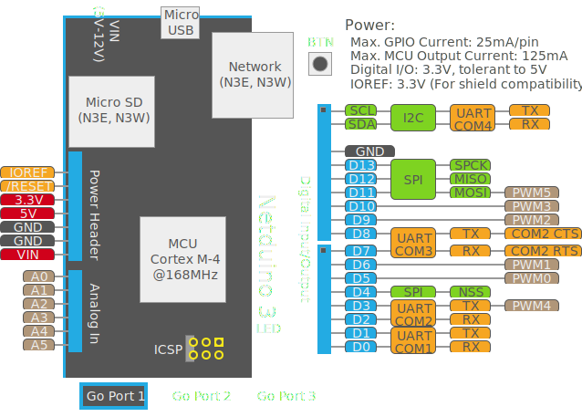

An LEDs current can be limited with a [Pulse Width Modulation](/Netduino/Input_Output/Digital/PWM/) signal. Netduino includes 6 hardware PWM generators, availalbe on digital pins 3, 5, 6, 9, 10, and 11:



PWM can be configured by either setting the duty cycle, as a percentage of on time, or by manually configuring the period and duration.

The following code sets pin 3 to duty cycle of 50%, and the onboard LED to a duty cycle of 33% (by manually setting the period and duration and cycles between the two:

```csharp
using System;
using Microsoft.SPOT;
using SecretLabs.NETMF.Hardware;
using SecretLabs.NETMF.Hardware.Netduino;
using Microsoft.SPOT.Hardware;
using System.Threading;

namespace DrivingLED_w_PWM
{
	/// <summary>
	/// This program illustrates how to drive an LED with a Pulse-Width Modulation
	/// Signal.
	/// </summary>
	public class Program
	{
		public static void Main()
		{
			// Create a PWM signal on Pin 3 @ 1000Hz and a 50% duty cycle
			PWM dutyCyclePwm = new PWM(PWMChannels.PWM_PIN_D3, 1000, .5, false);
			// note that only certain pins support PWM. the PWMChannels enumeration
			// lists the ones that do.

			// Create a PWM signal on the onboard LED by specifying the period and duration 
			// in milliseconds. this will be a 33% duty cycle (on 1/3rd of the time)
			PWM periodDurationPwm = new PWM (PWMChannels.PWM_ONBOARD_LED, 
				3, 1, PWM.ScaleFactor.Milliseconds, false);

			// alternate between the 50% duty cycle and the 33% duty cycle every second
			while (true) {
				dutyCyclePwm.Start ();
				Thread.Sleep (1000);
				dutyCyclePwm.Stop ();

				periodDurationPwm.Start ();
				Thread.Sleep (1000);
				periodDurationPwm.Stop ();
			}
		}
	}
}
```