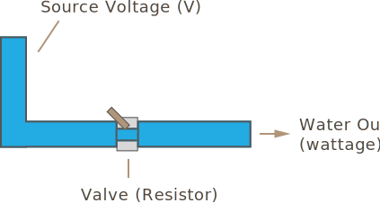

Going back to the water analogy, we can think of resistance as the valve at the bottom of the water tank:



Given a constant water pressure (voltage), if we put in a valve that was half the size of the pipe, we would expect that the amount of water that flows through would also be divided, proportionally, in half.

This relationship holds true for electricity as well, and is codified in [_Ohm's Law_](https://en.wikipedia.org/wiki/Ohm%27s_law); as more resistance is added to a constant voltage circuit, fewer electrons can make it through. The equation for this relationship can be expressed as:

```
Amperage = Voltage / Resistance
```

For historical reasons, amperage is often labeled `I` (for intensity), and sometimes voltage is labeled `E` (for electromotive force).  The most common labeling for Ohm's law is usually:

```
I = V/R
```

But you may also see:

```
I = E/R
```

## Ohm's Test Circuit

Consider the following circuit diagram that includes a voltage source and a resistor:


If the voltage source is `1.5V`, and the resistance is `50ohms`, we can calculate the amount of amps that can make it through the circuit as:

```
Amps = I = V / R = 1.5V / 50Ω = 0.03A
```

From that, we can also calculate the wattage/power as `(watts = amps * volts)`:

```
Wattage = 1.5V * 0.03A = 0.045W
```

### Rule of Significant Digits

Doing this math brings up an important point, which is the _rule of significant digits_, which prevents us from stating a computational answer that has more precision than actually intended.

After completing any calculation, it's necessary to round to the least number of digits in the input numbers.

So for the above calculation, we had inputs of `1.5V` and `0.03A` and an output of `0.045W`. The input numbers both had two significant digits, so we can only have a result of two significant digits, which means we need to round `0.045W` to `0.05W`. We can ignore the zero left of the decimal when counting significant digits because it's just a convenience marker to make it clear there is a decimal.


### Other Forms of Ohm's Law

Using algebra, we can solve the equation of Ohm's law for resistance, or voltage:

#### Solved for Resistance (R)

```
R = V / I
ohms = volts / amps
```

#### Solved for Voltage (V)

```
V = I * R
volts = amps * ohms
```

### Ohm's Law Pyramid

The _Ohm's Law triangle_, also known as the _power triangle_ is helpful in remembering the various solutions of Ohm's law:


It roughly represents the mathematical relationship of Ohm's law; it's divided vertically by a line that indicates division (below `V`), and horizontally, with a line that stands for multiplication (between `I` and `R`).

So to read it, choose any given unit as the solution, and then use the division/multiplication rules of the lines.

Therefore, starting with a solution for `V`, we have:

```
V = I * R
volts = amps * ohms
```

Solving for `I`:

```
I = V / R
amps = volts / ohms
```

And finally, solving for `R`:

```
R = V / I
ohms = volts / amps
```

### Online Ohm's Law Calculator

There is a fantastic Ohm's law calculator online [here](http://www.ohmslawcalculator.com/ohms-law-calculator).

## [Next - Calculating Simple Resistance](../Calculating_Resistance)

<br/>