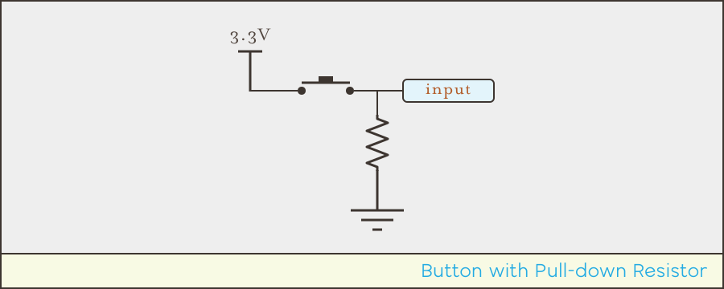

# Pull-up & Pull-Down Resistors

Resistors are used in one of the single-most important and common utility configurations in circuit design; as _pull-up_ and _pull-down_ resistors. Pull-up and pull-down resistors provide a default value (`HIGH` or `LOW`) in a circuit where otherwise, the circuit might have an indeterminate value part of the time.

## _Floating_ Circuits

To understand the usefulness of this, consider the following button circuit:

Note that the symbol in the center of the circuit represents a common pushbutton:

In this case, when the button is in its default state; not pressed, the value at the input port, 1, is in a _floating_ state, in which it's neither connected to ground or high, and can actually be indeterminate. In fact, a floating wire (or wire trace on a PCB), acts like an antenna and can pick up interference, giving it a fluctuating voltage signal.

There may not be much power/current in the floating termination, but many modern circuit components react to voltage changes, as opposed to current.

## Pull-Down Resistors

However, a _pull-down_ resistor can be used, which connects the floating wire to `GND`:

This provides a known, default value of `LOW` when the button isn't pressed.

### Logic

When then button is pressed, the input at `1` will see a `HIGH` signal, even though some current will flow to ground.

## Pull-Up Resistors

A _pull-up_ resistor is much like a pull-down resistor, but provides a default `HIGH` value, and can be used when the logic is inverted; as in the following circuit, where the button connects to ground when pressed:

Just as with a pull-down resistor, when the button is pressed, it shorts to ground, so the input at `1` will see a `LOW` signal, because any voltage at `1` will _sink_ to ground.

## Strong vs. Weak Pulling Resistors

Typically, in modern, power-efficient circuits where the switching components react to voltage, rather than current, the resistance used in pull ups and pull downs is very high, `10kΩ` or more, up to millions of Ohms, which allows only a small amount of current to leak.

A lower amount of resistance will exert a stronger "pull" one way or the other, and a higher amount of resistance will exert a weaker pull. For this reason, high value pulling resistors are known as _weak_ pull-downs or pull-ups, and lower value resistors are known as _strong_ pull-ups or pull-downs.

Because of the physical nature of electricity, stronger pull-ups and pull-downs will react also faster than weaker ones.

We'll examine these considerations more deeply later.

## Internal Pull-Ups and Pull-Downs

This is such a common design that many microcontrollers have configurable pull-up and/or pull-down resistors available on inputs. In fact, all the digital inputs on the F7 Meadow board have both pull-ups and pull-downs.

## Bias Resistors

As we'll examine later, many times a design actually requires a pull-down or pull-up resistor in order to _bias_, or set a default (AKA preferential) controlling input level in a circuit. This is extremely common when using transistors (electrical switches), to make sure they are either fully `ON` or `OFF`.

# [Next - Review](../Review)

