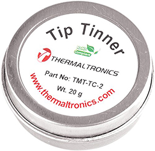
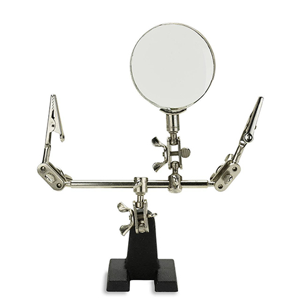
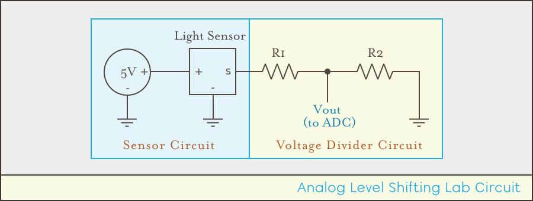
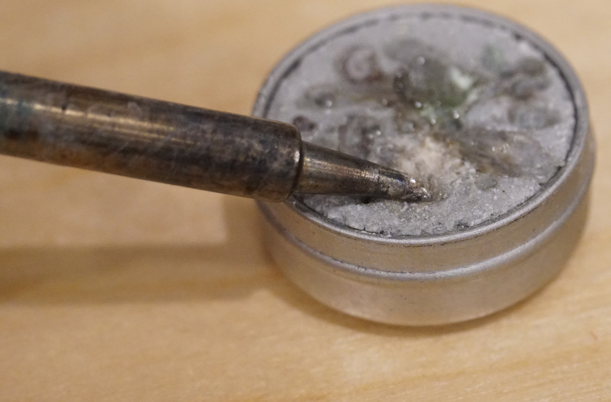
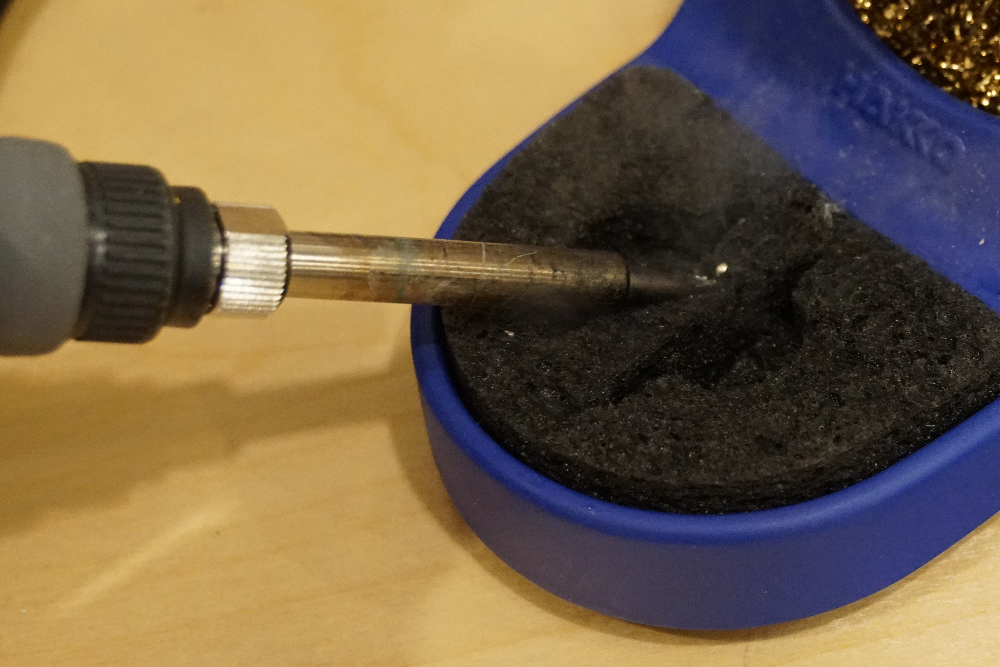
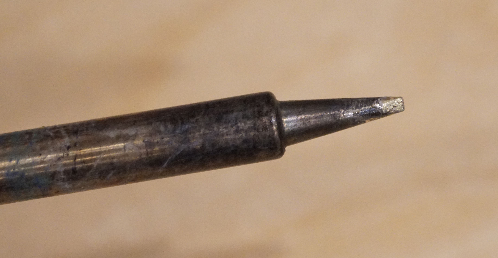
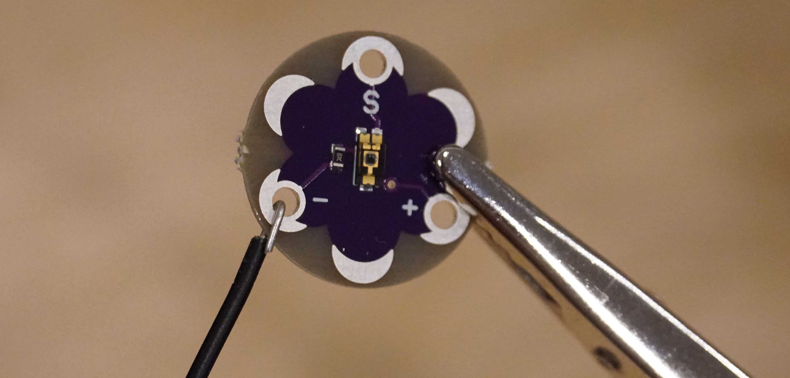

## Lab Overview

In this lab, we'll build a circuit that powers a `5V` luminosity (light level) sensor and uses a voltage divider to level shift the sensor's output from a `5V` _voltage domain_ to a `3.3V` voltage domain. Along the way, we'll also learn how to do some basic soldering, which will needed to build the prototype circuit.

Voltage dividers are the only practical way of level shifting an analog signal (one in which the signal may have a varying degree of voltage). While this circuit will also work for a digital signal, in which the voltage is either high (in our case `3.3V`), or low (`0V`), there are circuits which can be built out of transistors that are much more efficient.

Additionally, because a voltage divider _lowers_ the signal amplitude, a different circuit is necessary for level shifting from a lower voltage domain to a higher one. Again, we'll examine a circuit for that later.

### Requirements

To do this lab, you'll need the following new items:

| Item                                     | Approximate Cost (USD) |
| ---------------------------------------- | ---------------------- |
| LilyPad 5V Luminosity Sensor             | $4                     |
| Soldering iron                           | $20 - $100             |
| Lead-Free Solder                         | $10                    |
| Tip Tinner and Cleaner                   | $8                     |
| Helping Hands (optional, but highly recommended) | $6                     |
| 22ga Single Strand Wire (optional)       | $20                    |
| Baseboard (optional, but highly recommended) | 3D Printable or $20    |

Though this lab uses the LilyPad Luminosity sensor, nearly any 5V sensor will do.

Additionally, you'll reuse the following tools and components from earlier labs:

 * Netduino
 * Half size breadboard
 * Resistor Kit
 * Breadboard jumper wires
 * Wire cutter (optional, for trimming resistors)

#### LilyPad 5V Luminosity Sensor

For this lab, we're going to use a [light sensor from the LilyPad project](https://www.sparkfun.com/products/8464) that operates on a 5V voltage domain. 

LilyPad is a wearables project that's designed to be able to sewn into garments and textiles. This design intention is represented in its form factor:

{:standalone}

The connection points are rather large, however, and require some soldering to make them useful:

{:standalone}

We'll walk through making these solder joints later in the lab.

##### Sensor Output

According to the [SparkFun](https://www.sparkfun.com/products/8464) page, the sensor should have the following outputs: 

| Luminance    | 5V Voltage Output   |
| ------------ | ------------------- |
| Bright Light | > `2V` (up to `5V`) |
| Room Light   | `1V - 2V`           |
| Darkness     | < `1V`              |

However, I have a few of these sensors, and when I measured the output, I got considerably different readings from the published spec. I also got pretty different readings from several of the sensors. So after soldering the wires onto the sensor, you'll want to measure your sensor output to get a sense of what to expect. 

#### 22 Gauge Single Strand Wire

We'll solder 22 gauge single strand wire to the sensor so that we can easily connect it the breadboard. The breadboard jumper wires from before will work just fine. If you want to get breadboard compatible wire that you can size to your own liking, I recommend [this kit, which runs USD$21 on Amazon.com](http://amzn.to/2jHgUDv):

{:standalone}

#### Soldering Iron

As with multimeters, there is a wide selection of soldering irons from very affordable hobbyist models to more expensive professional models.

#### Affordable Soldering Iron

A decent soldering iron can be had for relatively cheap that will likely get you through this entire tutorial. For instance, this [Abnes model is USD$20 on Amazon](http://amzn.to/2jHdG2H), and there are many more like it:

{:standalone}

It comes with a decent holder, some solder, and a few tools.

#### Professional Soldering Station

Soldering is very common task of electronics prototyping, and a good soldering station is really nice to have. For just under [USD$100, Hakko makes a very nice professional soldering station](http://amzn.to/2jFSQ3V), which includes an adjustable temperature soldering iron, a holder, and a nice tip cleaner:

{:standalone}

Hakko also makes an extensive range of tips for various soldering needs that fit that soldering iron.

#### Lead-free Tip Tinner & Cleaner

Usually, before you use your new soldering iron for the first time, and from time to time when using it, you'll need to clean and "tin" the tip. When you dip the tip of a hot soldering iron into tip cleaner and tinner, it takes the black oxides off the tip and deposits a thin layer of tin which helps the solder to melt. Tip tinner and cleaner usually comes in a small metal container and runs USD$6-10. Make sure whatever tip tinner you get is lead-free. [Here is a suitable one from Thermaltronics on Amazon for $8](http://amzn.to/2AqLSaM):

{:standalone}

#### Lead-free Solder

If your soldering iron doesn't come with solder, you'll need to pick some up. Make sure it's lead-free, rosin-core, and is small enough in diameter to be useful for electronics soldering (plumbing solder is too thick to be useful for electronics work). I recommend 1mm thickness or less for most modern electronic soldering. Lead is toxic even in small amounts, so nearly all electronics these days are produced with lead-free materials. Rosin-core means that in the center of the solder is a small bead of rosin which reduces (changes oxides into their metal state) metal oxides and makes the solder joints much cleaner. [This 0.8mm rosin-core, lead-free solder is a good choice for the soldering we'll do and is USD$10 on Amazon](http://amzn.to/2j8oSGe).

#### Helping Hands

"Helping Hands" is an adjustable item holder that can be really helpful when soldering. It's optional, but is a beneficial add on to your toolset. [This one can be had for USD$6 on Amazon](http://amzn.to/2BE78KF):

{:standalone}

## Luminosity Sensor and Analog Level Shifting Circuit

Most complex circuits in use are actually lots of simpler circuits joined together to provide more complex behaviors. In fact, in this lab, we're going to join two very simple circuits; a 5V light sensor circuit, and a voltage divider to reduce the voltage output of the light sensor down to a 3.3V voltage domain:

{:standalone}

Before we build our circuit, however, we must first calculate the values of our resistors in the voltage divider, while making sure we account for the resistance of the ADC.

## Calculating Voltage Division with a Third Leg

In order to calculate a level-shifting voltage divider, we need to do three things:

1. Calculate maximum R1 resistance based on how much power the sub-circuit on `Vout` requires.
2. Calculate the total resistance of bottom half of the divider.
3. Subtract the ADC resistance from the bottom half of the divider to get the R2 value.

### Step 1: Calculate maximum R1 resistance, based on ADC power requirements.

We need to calculate what the largest resistor we can use and still have enough power for whatever circuit is on `Vout`, in this case the ADC. 

The Netduino ADC needs `0.3mA` current. Recall, however, that the amount of current available at `Vout` in a voltage divider is controlled by the `R1` resistor, rather than the total resistance.

We can use Ohm's law to calculate the resistance needed at `R1`:

```
Given:
R = V / I

Therefore:
R1 = 3.3V / 0.0003A = 11kΩ
```

The largest resistor that can be placed at R1 is therefore `11kΩ`.

### Step 2: Calculate the Bottom Half of the Voltage Divider

Now that we know the maximum value for R1, the "top half" of the divider, we can calculate the "bottom half" of the divider. Which, in this case, is R2 and the ADC.

Using a little bit of algebra, we can rearrange the voltage divider equation so it's solved for R2:

```
Given:
Vout = Vs * (R2 / (R1 + R2))

Therefore:
R2 = (R1 * Vout) / (Vs - Vout)
```

<!--

```
Vo = Vs * R2 / (R1 + R2)

multiply both sides by (R1 + R2)
Vo (R1 + R2) = Vs * R2 

expand the left side
Vo * R1 + Vo * R2 = Vs * R2

Subtract Vo*R2 from both sides
Vo * R1 = Vs * R2 - Vo * R2

factor out R2 from the right side
Vo * R1 = R2 * (Vs - Vo)

divide both sides by (Vs - Vo) 
R1 * Vo / ( Vs - Vo) = R2
```
-->

I used Wolfram Alpha to solve for R2, rather than having to do the algebra by hand. Check out [this link](http://www.wolframalpha.com/input/?i=solve+V+%3D+S+*+(B+%2F+(T+%2B+B))+for+B) to see how I formatted my Wolfram Alpha query so that it rearranged the equation. Note that I had to rename some of the variables because it interprets multi-letter variables as equations.

Using that equation, we can then calculate the bottom half of the divider (note, we're using R2 as the variable here, but R2 means both R2 and the ADC):

```
Given:
R2 = (R1 * Vout) / (Vs - Vout)

Therefore:
R2 = (11,000 * 3.3) / (5 - 3.3)
R2 = (36,300) / (1.7) = 21,353Ω
```

Double checking our work, to verify those resistor values work to satisfy the division:

```
Given:
Vout = Vs * (R2 / (R1 + R2))

Vout = 5V * (21,353 / (11,000 + 21,353))
Vout = 5V * (0.66) = 3.3V
```

Looks good so far.

### Step 3: Remove the ADC Conductance from the Bottom Half to Determine R2 

The last step is to remove the ADC resistance from the value of the bottom half of the divider resistance we calculated in step 2:

```
Given:
R2 = BottomR - ADC
Total Bottom Resistance = 21,353Ω
Total Bottom G = 1 / 21,353Ω = 0.000047
ADC G = 1 / 11,000 = 0.000091

Therefore:
Total G - ADC G = 0.000047 - 0.000091 = -0.000044
```

But wait, that's weird, how can it be a negative amount of resistance? If we look back at our earlier calculations in step 2, we determined that we needed a little more than `21kΩ` of resistance to make division ratio work. However, the ADC only provides `11kΩ` of resistance, and since it's in _parallel_ with R2, there's no way to _add_ resistance; recall that in a parallel resistance circuit, each resistor allows more power through the circuit, which is why we add their conductances up to calculate total resistance. So the total resistance in a parallel resistor circuit will always be less than the smallest resistor.

#### Increasing the Power

To solve this, we need to lower the resistance of the top half of the voltage divider (R1), to let more power through, so that the bottom half of the voltage divider can still block enough percentage of the power to satisfy our `3.3/5` division ratio. Let's increase the power by 10x, which will provide better accuracy anyway, and redo the the calculations:

```
Given:
NewR1 = OldR1 / 10

NewR1 = 11kΩ / 10 = 1.1kΩ ~= 1kΩ   //the closest common resistor
```

Redo step 2 to calculate the bottom half of the divider:

```
Given:
R2 = (R1 * Vout) / (Vs - Vout)

Therefore:
R2 = (1,000 * 3.3V) / (5V - 3.3V) = 3,300 / 1.7 = 1,941Ω
```

Redo Step 3:

```
Given:
R2 = BottomR - ADC
Total Bottom Resistance = 1,941Ω
Total Bottom G = 1 / 1,941Ω = 0.00052S
ADC G = 1/11,000 = 0.000091

Therefore:
R2 = Total G - ADC G = 0.00052S - 0.000091S = 0.000424S = 2,357Ω
```

`2.4kΩ` isn't a common resistor value, but `2.2kΩ` is, so we need to know if rounding the resistor down to `2.2kΩ` will still keep our maximum `Vout` at or below `3.3V`. To do that, first we need to calculate the bottom half resistance using the `2.2k` resistor:

```
Given:
G of R2 = 1 / 2,200 = 0.000455S
G of ADC = 0.000091

Therefore:
Bottom Half R = 0.000091 + 0.000455 = 0.000546S = 1,833Ω
```

Then using `1,833Ω` as the bottom half of the divider, we can calculate `Vout`:

```
Given:
Vout = Vs * (R2 / (R1 + R2))

Therefore:
Vout = 5V * (1,833 / (1,000 + 1,833))
Vout = 5V * (0.647) = 3.23V
```

Success! This means that if the sensor outputs its maximum possible voltage of `5V`, then the voltage divider should reduce it to `3.23V`. Therefore, our range will be `0V` to `3.23V`, a _very_ good range to get accurate values.

### The Magic Resistor Values

Now that we've gone through that calculation, we never have to do it for prototype circuits again. Nearly anytime we need to divide `5V` to `3.3V` to level shift an analog sensor, we can just use the following resistor values:

* **R1**: 1kΩ
* **R2**: 2.2kΩ

Now that we've got all that out of the way, let's actually build and test the circuit.

## Exercise 1 - Soldering the Sensor

Soldering is similar to welding; it's the process of melting and depositing metal onto to make an electrical connection, known as a solder joint. Soldering is an invaluable skill when building circuits because it's a common task. 

### Step 1: Clean and Tin your Soldering Iron

If your soldering iron is brand new, you may be able to skip this step if it comes pre-tinned. If you don't know if it's pre-tinned, then I recommend tinning it anyway, it won't hurt it.

To clean and tin your iron do follow these steps:

 1. Add water to your sponge.
 2. Turn your soldering iron to around 400ºC/750ºF (if it has a temperature adjustment), and wait for it to heat up.
 3. Lightly drag your tip across the tip tinner/cleaner:

    {:standalone}

 4. Brush off the excess tin onto the wet sponge.

    {:standalone}

When it's done, you should have a nice shiny coat of tin on the tip:

{:standalone}

### Step 2: Prepare Solder Joint Connection

Next, prepare your solder joint connection by stripping off a bit of the plastic insulation from your jumper wire (if it's not already stripped), place it through the hole, and bend the wire over:

{:standalone}

If you have a "Helping Hands," clip it in place to hold it while you solder.

You can use whatever color of wire you want for the sensor output pad (`S`), but it's generally a good idea to use black or blue for the negative (`-`), and red for the positive (`+`) pad.

### Step 3: Solder the Joints

To solder the joint, place the hot (~400ºC/750ºF) iron tip on the metal pad to heat it up and count to 5 or so. Then, touch some solder to the tip to get it flowing, and move the solder around a bit until it flows into and fills the hole:

{:standalone}

Repeat step 2 and 3 for the other two joints.

### Step 4: Inspect Joints

Finally, do a quick inspection of the solder joints; make sure the wires don't move in the joints, and the hole is completely filled. 

## Exercise 2 - Building and Testing the Circuit

Now that the sensor has wires soldered to it, we can use it to build the actual level shifting circuit.

### Breadboard Overlay

The printable breadboard overlay for this lab can be found [here](Level_Shifting_Lab_BB_Overlay.pdf).

### Schematic

Recall from the last lab that complex items and sub circuits are shown on schematics as a box with leads. In the case of the LilyPad sensor, it has three leads, 5V in is labeled `+`, ground/common is labeled `-`, and the analog sensor output signal comes from the `S` pin:

{:standalone}

The breadboard layout for the schematic might look something like this:

{:standalone}

### Step 1: Assemble the Divider Circuit

Before we add the sensor, let's test just the divider circuit to see how well it's dividing `5V` down to a `3.3V` domain. To do this, first, assemble the circuit without the sensor in place, providing supplying `5V` directly to the divider, as illustrated in the diagram below: 

{:standalone}

Make sure that you're using the `5V` power pin, not the `3.3V`, and both ground rails are connected to `GND` on the Netduino.

### Step 2: Deploy the App and Test the Circuit

The level shifting lab app can be found [here, in the Netduino_Samples repo](https://github.com/WildernessLabs/Netduino_Samples/tree/master/Electronics_Tutorial/LilyPad_5V_Sensor_Level_Shifting). Download it, and deploy it to your Netduino. The `main.cs` code is pasted below for reference. Note that it's almost identical to the **Photoresistor_Lab** app from the last lab. The only thing that's changed is the light/dark threshold values and the conditional has been reversed because the LilyPad sensor supplies more voltage the brighter it is, as opposed to the photoresistor circuit, which supplied less voltage the brighter it got:

```csharp
using System;
using System.Threading;
using Microsoft.SPOT;
using SecretLabs.NETMF.Hardware;
using SecretLabs.NETMF.Hardware.Netduino;

namespace LilyPad_Lab
{
    public class Program
    {
        public static void Main()
        {
            var photoresistor = new AnalogInput(Pins.GPIO_PIN_A3);
            int ambientLight = 0;
            int averageAmbientLight = 0;
            float sensorVoltage = 0;

            float lightThresholdVoltage = 1.0f;
            float darkThresholdVoltage = 0.003f;

            // setup an array to hold our samples
            int numberOfSamplesToAverage = 3;
            int[] previousSamples = new int[numberOfSamplesToAverage];
            for (int i = 0; i < numberOfSamplesToAverage; i++) {
                previousSamples[i] = 0;
            }

            while (true)
            {
                // read the analog input
                ambientLight = photoresistor.Read();

                // average (oversample) the last two readings
                averageAmbientLight = AverageAndStore(ref previousSamples, ambientLight);

                // convert the digital value back to voltage
                // sensorVoltage = AnalogValueToVoltage(ambientLight);
                sensorVoltage = AnalogValueToVoltage(averageAmbientLight);

                // output
                Debug.Print("Light Level = Raw: " + ambientLight.ToString() + 
                            ", Average: " + averageAmbientLight.ToString() + 
                            ", Voltage: " + AnalogValueToVoltage(averageAmbientLight).ToString());

                if (sensorVoltage > lightThresholdVoltage) {
                    Debug.Print("Very bright.");
                } else if (sensorVoltage < darkThresholdVoltage ) {
                    Debug.Print("Dark.");
                } else {
                    Debug.Print("Moderately Bright.");
                }

                // wait 1/4 second
                Thread.Sleep(250);
            }
        }

        /// <summary>
        /// Converts an analog input value voltage.
        /// </summary>
        public static float AnalogValueToVoltage (int analogValue)
        {
            return ((float)analogValue / 1023f) * 3.3f;
        }

        /// <summary>
        /// Averages the new value in with an existing sample set of any size. Adds the new value
        /// to the sample set and returns the average.
        /// </summary>
        /// <returns>The and store.</returns>
        /// <param name="sampleSet">existing sample set.</param>
        /// <param name="newValue">New value.</param>
        public static int AverageAndStore(ref int[] sampleSet, int newValue)
        {
            int sum = 0;
            int average = 0;

            // sum up all the values
            for (int i = 0; i < sampleSet.Length; i++) {
                sum += sampleSet[i];
            }
            sum += newValue;

            // calculate the average
            average = sum / (sampleSet.Length + 1);

            // swap the values a slot
            for (int i = 0; i < sampleSet.Length - 1; i++) {
                sampleSet[i] = sampleSet[(i + 1)];
            }
            sampleSet[sampleSet.Length - 1] = newValue;

            return average;
        }
    }
}
```

#### Output 

When you run this, if your voltage divider is working properly, the output should read something like the following Visual Studio **output window** after the first few samples:

```
Light Level = Raw: 1023, Average: 1023, Voltage: 3.29999995
```

`1023` is the maximum value of the analog input, so we know that the divider is outputting `3.3V` or higher. You can further test this by unplugging the wire that runs into the analog pin on the Netduino and use a multimeter in voltmeter mode to measure the output voltage from that wire (put the black lead of the multimeter into ground on the breadboard). When I measured that, I got `3.36V`, which is pretty near perfect. In fact, even though it's over `3.3V` by `0.03V`, that's less than a 1% deviation, which is well under the tolerance for the resistors that I'm using. When you measure your circuit, you will likely get a slightly different value from mine, but as long as it's reasonably close to `3.3V`, it's fine.


### Step 3: Calibrate the Sensor Output

Now that we know our voltage divider circuit is working, we can drop in the sensor, and measure its output. I mentioned in the first part of this lab that when I measured the output of the light sensor, I got something considerably different than the published specs. 

The following table has the measured sensor voltage output that I measured from the sensor, as well as the calculated output after level shifting to a 3.3V voltage domain, so that I can validate my level shifted results:

| Luminance    | 5V Voltage Output   | Level Shifted to 3.3V (output multiplied by 3.3 / 5) |
| ------------ | ------------------- | ---------------------------------------- |
| Bright Light | > `1.9V`            | > `1.14V` (`1.9V * .66`)                 |
| Room Light   | ~`230mV`            | ~`138mV`                                 |
| Darkness     | < `0.005mV`         | < `0.003mV`                              |

To measure your sensor output, plug the sensor into the circuit as shown breadboard circuit above, except leave the sensor output (`S`) leg out of the breadboard. Then, using a multimeter in voltmeter mode, place the negative (black) lead on the same ground circuit as the sensor, and then positive (red) measurement lead on the sensor output (`S`) leg on the sensor.

Measure the sensor output in bright light (shine a flashlight or your cellphone's LED on it), room light, and then in darkness (cover the sensor with your finger, or turn the lights off in the room). Then calculate the expected outputs and write everything down:

 * **Bright voltage output** = ?
 * **Bright level-shifted voltage output (`brightValue * 0.66`)** = ?
 * **Room light voltage output** = ?
 * **Room light level-shifted voltage output (`roomValue * 0.66`)** = ?
 * **Dark voltage output** = ?
 * **Dark level-shifted voltage output (`darkValue * 0.66`)** = ?

Once you've calculated those values, modify the `lightThresholdVoltage` and `darkThresholdVoltage` to be your bright level shifted voltage and dark level shifted voltage, respectively. You might want to lower your `lightThresholdVoltage`, and increase your `darkThresholdVoltage` 5-10%, to provide a little operating margin.

#### Run the Application

Next, plug the sensor output into the top of the voltage divider as shown in the circuit diagram, deploy and run the program. If you've updated the threshold variables in the program, the output should match up to your lighting. 

Congratulations, you've learned to solder and successfully built a voltage divider circuit!


### Online Voltage Divider Calculator

There is a fantastic voltage divider calculator online [here](http://www.ohmslawcalculator.com/voltage-divider-calculator)


## [Next - Circuit Software](../Circuit_Software)