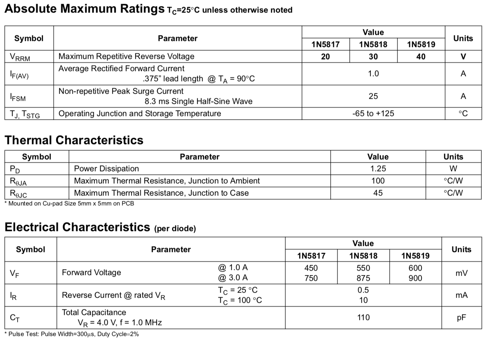
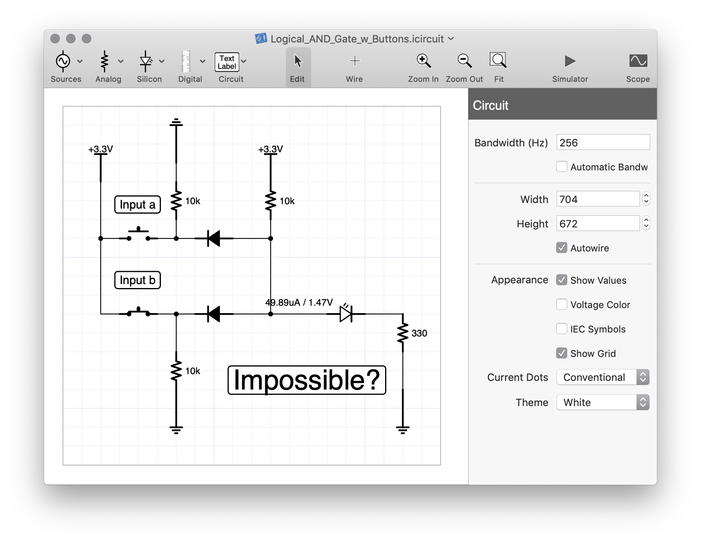

## Intro

In this lab we're going to create some logic gate circuits that can be used as building blocks for more complex circuit control later, and examine some interesting practical challenges of designing circuits in regards to logic inversion.

These circuits use the LED circuits from the last lab as indicators of the output from the logic operations.


## Requirements

| Item                                     | Approximate Cost (USD) |
| ---------------------------------------- | ---------------------- |
| 1N5817 Schottky Diodes                    |
| (2) Switches                             |
| LEDs  ||
| Push Buttons   ||

## Schottky Diodes

[model number, specs]
[can build with other diodes, too]

## Switches

[Pole and throw]

[pole is...]

[throw is how many endpoints you can "throw the switch to."]

[SPST - Single Pole, Single Throw]

[SPDT - Single Pole, Dual Throw]

# Exercise 1: OR Gate

This lab


## Understanding the Datasheet



[couple of confusing things:]

[First, `I`<sub>`F(AV)`</sub> as _Average Rectified Forward Current_; the diode can handle EMF spikes up known as _surge current_ up to `25A`, but can nominally pass `1A` of current constantly.]

[`V`<sub>`f`</sub> is given at two current ratings, `1A` and `3A`, at `450mV`, and `750mV`, as the current flow increases above the normal operating amount, it pushes back a little more. [how the feck? this is different than the LED PN, is it because it's a barrier diode with no P-type?]

[In our case, we're passing a small amount of current, so `0.45V` is the number we'll use for our calculations.]

[therefore, important values]

* **`V`<sub>`f`</sub>**: `0.45V`
* **`I`<sub>`f`</sub>**: `1A`
* **`P`<sub>`D`</sub>**: `1.25W`


## Step 1 - Design

[going through two diodes, the logic/Schottky diode and the LED, so have to account for both voltage drops]

### Circuit Model

[when designing circuits, i usually start off by modeling them.
If you have [iCircuit](http://icircuitapp.com), you can begin your design in there. It will help to get the various values of your circuit components at least close to correct:


### Power Calculation

[rough napkin calculation]

```
Given:
PD = Vf * I

Therefore:

```

### Final Numbers

[for my circuit;]


### Lab Files

* [iCircuit file](../Support_Files/LAB_OR_Gate.icircuit)
* Breadboard Overlay (Coming soon)


# Exercise 2: AND Gate w/Switches


# Exercise 3: Inverted AND Gate w/Buttons

[And Gate needs fully shorted high or low on the left hand side. If you try to use buttons and a pull-down resistor, you wind up with an impossible circuit:]



[the issue here is that the pull down resistors have to be small enough to provide ground, but blah]

[you can play with the iCircuit file [here](../Support_Files/Logical_AND_Gate_w_Buttons.icircuit).]

[all is not lost however, there's another way to approach this. if we define an open circuit on the buttons (UP) as `1`/`True` we can actually create an AND gate with buttons:]


[in this case, it's a bit of a logical inversion. This circuit may not fit our programmer definition of AND, (this is technically NOT?), but it's a useful circuit to think about, because as a software engineer, I tend to think of on as `1`, and in fact, often times in circuits, we can use an inversion like this to solve tricky designs]

[don't have to build this]


## [Next - Review](../Review)
