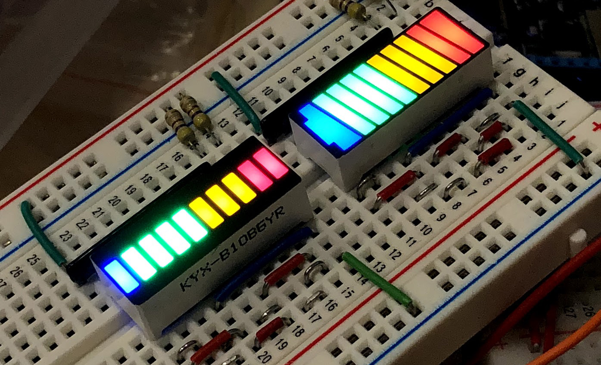

# Intro

As we examined in the last section, a diode is basically just a P-N junction:

[Note: Add Anode/Cathode labels to legs]

The symbol is a triangle pointing in the direction of current (hole-flow) connected to a perpendicular line:

There are a number of different types of diodes, but all of their circuit symbols are based on the one above.

But depending on how they're constructed, a diode can have some interesting behaviors. 

[image of various diodes]

The Wikipedia diode page lists almost 20 different types of diodes, but in practice, most circuit design only uses a handful of them.

## Common Types of Diodes

 * **Discrete Signal Diodes** - These are the most common type of diode.
 * **Power/Rectifier Diodes** - 
 * **Light Emitting Diodes (LEDs)** - LEDs emit photons as electrons flow through the P-N junction.
 * **Photodiodes** - Photodiodes 
Schottky Diodes
Zener diodes

## Diode Uses

Diodes are incredibly common in circuit design. Here are just a few common uses:

### Lights/Indicators/Screens

LEDs are probably the second most common type of diode in use. They're used as lights, indicators, and even display screens. 

https://en.wikipedia.org/wiki/LED_display

OLED

### Rectifiers

### Flywheel Diodes

### Voltage Clamping

### Voltage Reference

voltage reference - using zener diodes

# [Next - LEDs](../LEDs)