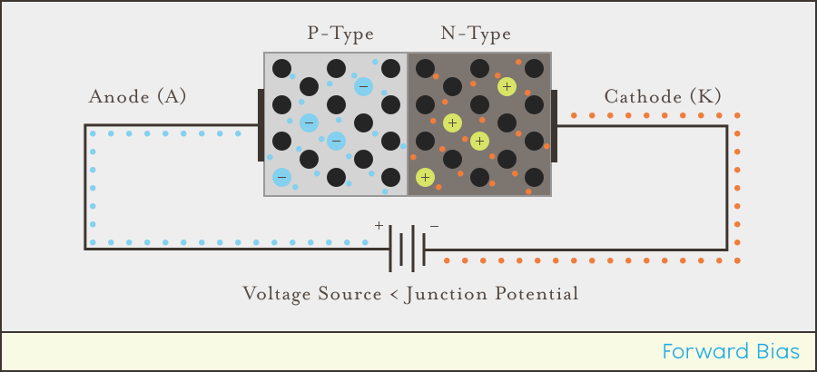
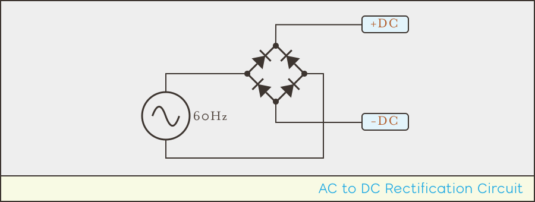
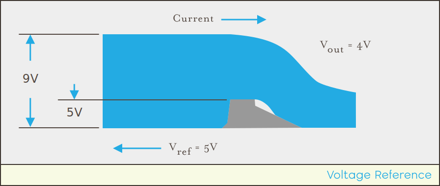

# Notes:

* Need to condense this page a bit and make it more intro
* [notes: https://www.rohm.com/electronics-basics/diodes/types-of-diodes]


# Intro

As we examined in the last section, a diode is basically just a P-N junction with leads attached to either side. The anode (`A`) is the lead attached to the P-type side, the cathode (`K`) is attached to the N-type side, and the preferential, or forward bias is when electrons flow from cathode to anode (which means anode is hooked to the positive voltage source):



The symbol is a triangle pointing in the direction of current (hole-flow) connected to a perpendicular line:


There are a number of different types of diodes, but all of their circuit symbols are based on the one above.

The [Wikipedia diode entry](https://en.wikipedia.org/wiki/Diode) lists almost 20 different types of diodes, but in practice, most circuit design only uses a handful of them. As we explore more circuits, we'll also introduce additional, specialized diodes. 

## Diode Characteristics

Depending on how they're constructed, a diode can have some interesting behaviors. For general diodes, there are a number of characteristics that are used to describe how they work:

 * **Forward Voltage (`V`<sub>`f`</sub>)** - This is the amount of voltage drop, or the amount of voltage needed to enable current flow. 
 * **Maximum Forward Current (`I`<sub>`f(max)`</sub>)** - This is the maximum amount of current that the diode can safely conduct when forward-biased without breaking.
 * **Peak Inverse Voltage (PIV) or _maximum reverse voltage_ (`V`<sub>`R(max)`</sub>)** - This is the maximum amount of voltage that can be applied in reverse bias without an avalanche breakdown.
 * **Total Power Dissipation (`P`<sub>`D(max)`</sub>)** - A diode has some resistance, so some power is lost in the form of heat. As such, a diode usually has a maximum amount of power that it can safely conduct without overheating. Total power dissipation is based on the voltage of the junction potential, and the current: `P`<sub>`D`</sub> = `V`<sub>`f`</sub> * `I`.
 * **Reverse Recovery Time (`Trr`)** - This is how quickly a diode can go from `OFF` to `ON`. It's generally only important in fast-switching circuits.

# Common General Diodes

 * **Switching Diodes** - Extremely fast `Trr`, used for current switching.
 * **Rectifier/Power Diodes** - High current capacity, usually `1A` or more. Used for converting AC to DC and protection of circuits from power spikes.
 * **Schottky Barrier Diodes** - Have a very low voltage drop, so they can be used in a clever way to get to a digital `0`/`OFF`. Also very fast. Used for basic logic control.
 * **Zener Diodes** - Have a precise breakdown voltage. Typically used in a reverse bias configuration to provide a voltage reference.


## Switching Diodes

[image of a switching diode]

These are the most common type of diode. Typically, they have a `V`<sub>`f`</sub> (forward voltage) drop of `0.7v` and a low maximum current rating. The [1N4148](https://amzn.to/2OfaP2n) is a common signal diode with a `500mA` maximum forward current rating. 

[power switching]

## Power/Rectifier Diodes

Power (aka _rectifier_) diodes are similar to signal diodes but are designed to handle higher current. The [1N4001](https://amzn.to/2DECgyK) is a common rectifier diode and is capable of handling `1A`, but the `V`<sub>`f`</sub> (forward voltage) drop is `1.1V`. These are commonly used to protect certain parts of circuits from voltage spikes, as well as for conversion of AC to DC electricity.

Because diodes control the direction of current, they're often used to protect circuits from unwanted current, especially power spikes.

### Flywheel Diodes

Flywheel diodes provide circuit protected from collapsing magnetic fields created by de-powering electric motors and other coils by feeding excess current back into the coil. We'll use a flywheel diode in a later chapter to safely control a relay.

### Voltage Clamping

[Voltage clamping allows us to adapt an input signal to an acceptable range.]
[need a better explanation]

### Rectifiers

Alternating Current (AC) electrical signals can be converted into Direct Current (DC) through a clever arrangement of diodes known as a _rectifier_:



[illustration of waveform in and out]

Rectifiers are used as the first stage in converting household mains AC current into smooth DC current for use in electronics in nearly all power AC power adapters. For example, the USB wall adapter that you plug your phone into to charge converts AC to DC using a rectifier. In fact, nearly every electronic around you that plugs into the wall use a rectifier someplace.

## Schottky Barrier Diodes

[typically just called Schottky diodes, [metal instead of the N-type layer, but same general principal]

[ON 1N5817 - move this to the lab]


[illustration of a Schottky cross section]


Schottky diodes typically have a very low voltage drop (`V`<sub>`f`</sub>), typically around `0.2V` (`0.15V` to `0.45V`) which makes them very fast and also allow them to be used to form simple circuit logic.

### Diode Logic Gates

These logic circuits can be arranged to provide operations such as `AND` and `OR`, called _logic gates_. This allows you to determine if multiple inputs are all `ON` as well as if any of the inputs are `ON` or `OFF`.

Consider the following circuits:


#### OR Gate Truth Table

_Truth tables_ are used to describe the resulting output from inputs based on the operation/function. The following truth table describes the resulting output based on the possible inputs to an `OR` gate:

| Input 1 | Input 2 | Output |
|---------|---------|--------|
| 0       | 0       | 0      |
| 0       | **1**   | **1**  |
| **1**   | 0       | **1**  |
| **1**   | **1**   | **1**  |

In the truth table, `0` and `1` represent `LOW` and `HIGH`, respectively. In the case of our circuit, this means somewhere around `0V` for `LOW` and `3.3V` for `HIGH`. 

In the case of an `OR` gate, as long as any input is `1`, the output will also be `1`. This makes sense, because applying voltage to either diode will provide voltage to the output.

However, recall from [earlier](link) that digital logic levels don't have to be exactly `0V` and `3.3V`, but rather, `LOW` can be up to `1.1V`, and `HIGH` can be as low as `2.2V`. This is important, because in a practical circuit implementation of the above, some voltage is actually lost to the voltage drop of the diode. If the `V`<sub>`f`</sub> of the diodes are `0.2V`, then only `3.1V` is actually read on the output.


#### AND Gate Truth Table

The `AND` gate is a slightly more clever than the `OR` gate. In the case of the `AND` operation, a `HIGH` voltage is only seen at the output when both inputs are `HIGH`, therefore, blocking the ground path for the `3.3V` voltage source:

| Input 1 | Input 2 | Output |
|---------|---------|--------|
| 0       | 0       | 0      |
| 0       | 1       | 0      |
| 1       | 0       | 0      |
| **1**   | **1**   | **1**  |

#### Logic Gate Uses

In this way, low `V`<sub>`f`</sub> Schottky diodes can be used to determine if conditions are met within a circuit, such as if multiple inputs are `ON`. We'll explore this more by building these gates in one of this chapter's labs.

# Logic Levels [Move to DC section of the tutorial]

[digital isn't true digital/on/off]

[note about how digital is a lie. it's all an approximation. so a schottky with a back pressure of `200mV` still reads as `0`]

[Logic Levels for _CMOS_:]

[0 V to 1/3 VDD	2/3 VDD to VDD]

* `0V` - `1.1V` = `0`
* `2.2V` - `3.3V` = `1`

[illustration of digital signal 


```
0 = OFF = ~0V = GND = LOW
1 = ON = ~3.3V = VDD = HIGH
```


 
## Zener Diodes

Zener diodes have a known, precise breakdown voltage, which as we'll explore, can make them very useful for providing a _reference voltage_.
   
### Voltage Reference

Sometimes, a circuit needs a reference signal at a precise voltage. Because zener diodes have a precise breakdown voltage, they can be reverse biased in a circuit to use the back-pressure of their `V`<sub>`f`</sub> to provide a reference. Consider the following circuit:


In the case of the circuit above, a zener with a `5V` breakdown voltage is being reverse biased with `9V`, which means that it's breakdown threshold has been reached, and will conduct current, with a `5V` voltage drop. Since the voltage drop acts like a dam, no matter how much voltage is applied, `5V` of back pressure will always be present:



As long as the current is limited, in this case with a resistor, it will stay within that precise operating band. Recall the diode behavior chart from before, specifically the breakdown behavior:


While this circuit looks a lot like a two resistor voltage divider, it's got a huge advantage over a divider; as long as the current is limited, no matter what amount of voltage is applied (within the diode's tolerance), the `V`<sub>`out`</sub> reference will always be the same. 

And while the limited amount of current prevents this from being a useful voltage regulator, it does serve as a reliable voltage reference, [necessary for ADC conversions/comparators, and voltage regulators]

# [Next - Light-Related Diodes](../Light_Related_Diodes)