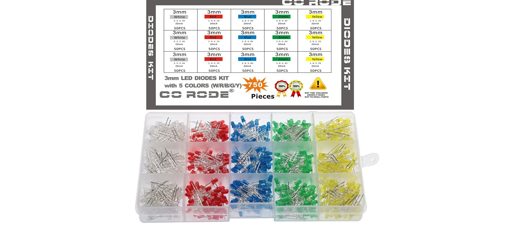

# Intro

In this lab, we're going to build some simple push button activated LED circuits that use a ballast resistor to limit the current.

Part of the challenge of these labs is building a breadboard circuit based on a schematic, so try to build them first without using the breadboard layout solutions.

# Requirements

To do this lab, you'll need the following new items:

| Item                                     | Approximate Cost (USD) |
| ---------------------------------------- | ---------------------- |
| (2) LEDs, any color                      | < $1                   |
| (2) 6mm x 6mm Pushbuttons                | ~ $0.04                |
| `9V` Battery Adapter (optional)          |  |
| `9V` Battery (optional)                  |  |

Additionally, you'll reuse the following items from earlier labs:

 * Breadboard
 * Resistor Kit
 * Breadboard Jumper Wires

### LEDs

[$8 pack of 350 LEDs](https://amzn.to/2Rp1rL9)



includes RGB LEDs as well as a bunch of different colors

### Pushbuttons

These are also sometimes called _tactile switches_, and for prototyping on breadboards, the 6mm x 6mm versions fit well. They usually come in a variety of colors and dimensions. These are 6mm x 6mm x 4.3mm:


4.3mm refers to the height of the button; these are available in tall heights to account for designs where the circuit board is far away from the control panel.

A pack of 100 black ones runs [~USD$7 on Amazon](https://amzn.to/2StraPJ). Also, AliExpress has a fantastic [160pc set of 8 different colors of them for ~USD$5](https://www.aliexpress.com/item/Each-color-20PCS-Red-blue-black-green-white-Yellow-brown-Orange-6x6-5mm-Tactile-Touch-micro/32847719379.html?spm=a2g0s.9042311.0.0.5be34c4daVxxQw)

# Exercise 1: Single LED Circuit

For the first lab exercise, we're going to build a very simple, pushbutton activated, single-LED circuit with a ballast resistor:


Note that the new circuit symbol introduced above represents a pushbutton:


The power can come from the `3.3V` rail on the Meadow or Netduino board. Use an LED of your choosing that has less than a `3.3V`<sub>`f`</sub>.

## Step 1 - Design

This is a very simple circuit, so design is not complex. First, determine the size of resistor you nee. In my circuit I used a green LED with a `2.1V`<sub>`f`, and a `20mA` max current rating:

```
R = V / I
R = 3.3V - 2.1V / 0.02A = 60Ω
```

For mine, I'd need at least `60Ω` to prevent the LED from overcurrent. However, recall that resistors come in magnitudes of [preferred values](/Hardware/Tutorials/Electronics/Part4/Resistor_Tolerance#preferred-values), with the nearest larger resistor being `68Ω`, so that's a good resistor to start with.

## Step 2 - Build and Test

Once your resistor value is chosen, build the circuit and power it.

Try various resistor values to see where the LED brightness lands. If you have extra LEDs, I recommend trying smaller and smaller resistors to see when/if the LED will burn out.

### Troubleshooting

In this simple circuit, the most likely failure point is getting the polarity of the LED wrong. If it doesn't work, first try reversing the LED leads.

You can also test the voltage across the resistor with a multimeter:

[image of multimeter test leads on both sides of the LED]

# Exercise 2: Series LED Circuit

[Button actuated, ballast resistor, but two LEDs, blue and red]

[3.3V and 2.1V voltage drop = 5.4V total. So we'll power with a 9V battery]

[if you don't have a 9V battery and/or connector, you can choose two LEDs with smaller voltage drops and power from the `5V` power rail on the Meadow or Netduino board]


## Step 1 - Design

```
R = V / I
R = 9V - (3.3V + 2.1V) / 0.02A = 180Ω
```

## Step 2 - Build and Test

# Breadboard Solutions


# [Next - Diode Logic Gate Lab](../Diode_Logic_Lab)