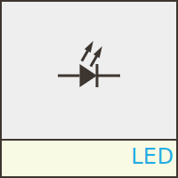
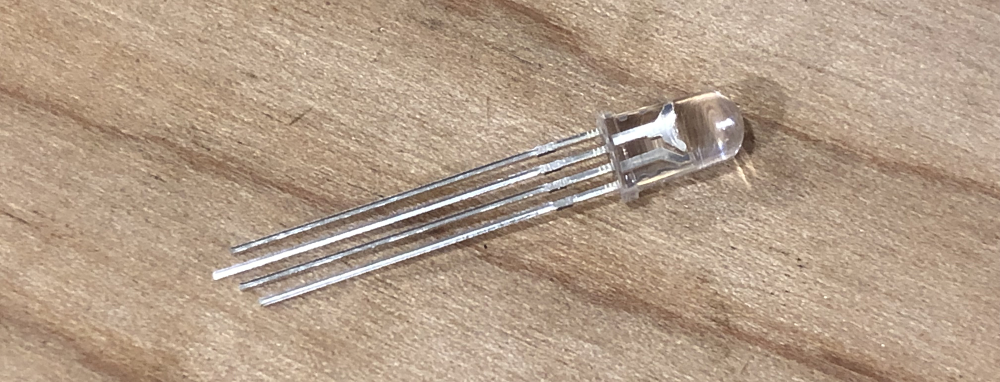
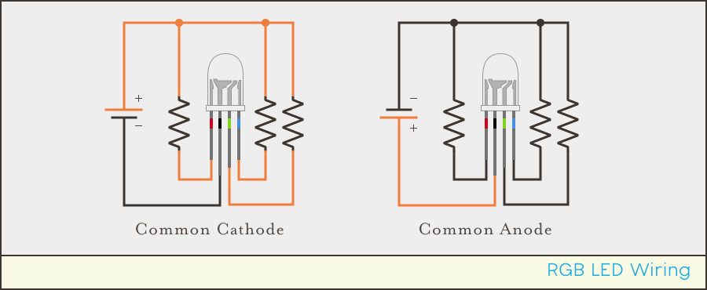

# Overview

LEDs come in a variety of packages and combinations. Many packages have an arrangement of multiple LEDs in one, such as bar graphs and _7 segment_ displays that are often used to show levels or digit characters, respectively:


However, no matter what they look like, they're all basically the same to use and there are only two practical circuit concerns; first, making sure the _polarity_ is correct, and second, limiting the current through them so they don't burn out.

The circuit symbol for an LED is a diode with arrows coming out of it, signifying the photon emission:



## Physics

As electrons move into the holes in the P-Type lattice from the N-Type, they move from a higher energy orbit/state, known as the _conductance band_, to a lower energy orbit/state. When that transition happens, they lose energy. However, as the [first law of thermodynamics](https://en.wikipedia.org/wiki/First_law_of_thermodynamics) states; energy cannot be destroyed or created, only converted; so that energy is released in the form of photons (light particles):


In silicon, the electron orbital drop is very small, so the light released is also low energy, and the photon escapes at a low frequency of vibration. Since the color of light depends on its frequency, the light emitted is in the infrared spectrum, which is just below the frequency energies of the visible light spectrum.

Most diodes are designed in such a way that the P-N junction is hidden inside its casing, so these emissions are not visible. LEDs, however, are constructed in such a way that light can escape through them, and the materials used also have a much higher electron orbital energy drop when they combine with the holes. 

Typical through-hole LEDs have a flat spot on the cathode side, and a longer anode leg, signifying how to wire them up with the correct polarity:


Through-hole RGB LEDs will have a "common" leg that's longer than the rest, which could be anode or cathode, depending on if they're _common anode_ or _common cathode_:



## LED Colors

Because LEDs have a higher electron orbital energy transition than most diodes, the photons released are at higher energy/frequency, usually in the visible light spectrum (note that the energy/frequency is higher to the left, and lower to the right in the following image):


What's interesting about this, is that in order to change the color of light emitted, differing voltage drops (`V`<sub>`f`</sub>) are needed. The voltage drop therefore generally increases with the light frequency:

| Color  | `V`<sub>`f`</sub> (Voltage drop)| `I`<sub>`fmax`</sub> (max. current) |
|--------|---------------|------------------|
| Red    | 1.8V          | 15mA - 20mA      |
| Yellow | 2.0V          | 15mA             |
| Green  | 2.1V          | 20ma - 30mA      |
| Blue   | 2.7V - 3.6 V  | 20mA             |
| White  | 1.9V - 2.4V   | 30mA             |

White LEDs are usually a blue LED with a coating that makes the light white, however, some higher-end white LEDs actually have red, green, and blue LEDs in them which light in unison to create white.

Powering blue LEDs can be tricky on `3.3V` because many of them have more than a `3.3V`<sub>`f`</sub>, requiring them to be driven by a special circuit that increases voltages. However, it's much easier just to use blue LEDs with a smaller voltage drop. There are many that have as low as `2.65V`<sub>`f`</sub>. So if you're using `3.3V` to power your LEDs, make sure that you check the voltage drop on them when purchasing them.

# Using LEDs in Circuits

Single LED circuits are typically fairly simple, requiring only a DC power source, and typically, a resistor to restrict current flow:


RGB LEDs are only slightly more complex, and come in two flavors, depending on whether they're common cathode common anode:



## Controlling Current

If you plug in an LED to a `3.3V` voltage source without reducing the voltage (and current), the LED is going to be very bright and then it's going to burn out.

### Non-Ohmic Devices

This failure illuminates some interesting P-N junction behaviors that warrant further explanation.

LEDs (actually, all P-N junctions) are referred to as _non-ohmic_ devices. Non-ohmic is a bit of a misnomer, because it implies that that they don't abide by Ohm's law; and this is a common source of confusion. To understand what this really means, we need to revisit Ohm's law. Ohm's law states that the amount of current than can pass through a device is a proportional function of how much force (voltage) is pushing against resistance:

```
Current = Force / Resistance
I = V / R
```

This means that as we increase the voltage (amount of force), as long as the resistance stays the same, the amount of current allowed to flow is proportional:


However, recall that with a P-N junction, as the voltage increases, the resistance actually goes down, which means that more current is allowed to flow. Recall the same scenario with a P-N junction looks like this:


Once the voltage requirement has been met to overcome the junction potential, further increase in voltage greatly reduce the resistance of the diode, and therefore, the amount of current that the diode will conduct rises rapidly. The trick then with LEDs is to supply just enough voltage to light them up.

### Options for Limiting Current

There are two common ways to control the voltage, either with a resistor, or by driving it with a PWM signal.

Using a resistor is the simplest way, but has the limitation of setting it at a fixed brightness when `ON`. A PWM signal is also reasonably simple, but is often done in software. The advantage of a PWM signal is that you have dynamic control of the voltage, allowing you to gently "pulse" the LED on and off.

### Limiting Current with a Ballast Resistor

A resistor that's used to limit runaway current is sometimes called a _ballast_ resistor.

To calculate the resistance needed to reduce the voltage, we start with Ohm's law, solved for resistance:

```
R = V / I
ohms = volts / amps
```

However, because P-N junctions have a voltage-drop (`V`<sub>`f`</sub>), in which they "push back," that does something interesting to our calculation.

This means that the overall voltage available to the LED is actually reduced by that `V`<sub>`f`</sub>. Therefore to calculate the resistance needed, we need to account for the voltage drop by subtracting it from the voltage source:

```
R = (Vs - Fv) / I
```


#### Example

For example, let's say that we have a red LED that has a maximum current rating of `20mA`, and a `V`<sub>`f`</sub> of `1.8V`, and we're driving it from a `3.3V` voltage source. Solving for `R` then:

```
R = (3.3V - 1.8V) / 0.020A = 75Ω
```

The circuit would need at least a `75Ω` resistor to safely drive the LED.

However, in practice, we typically use a much larger resistor value because at the maximum current, LEDs tend to be far too bright, and therefore need to be dimmed. I typically double the required resistor value and then tune from there.  In fact, most of the time when throwing together quick circuits, I just grab a `330Ω` resistor and call it good!

## LEDs in Parallel

It's technically possible to use a single resistor with LEDs in parallel:


However, in practice, it's nearly impossible, because the voltage drop of LEDs are almost never perfectly balanced, which causes only one of them to conduct, pass too much current and fail, thus starting a cascade of failing LEDs.

Instead, the best practice is to use a resistor for each LED:


In this case, each resistor is calculated as normal. If the LEDs are all roughly the same, then the same resistor can be used. To calculate the total current draw, simply add the current from each LED up. as per [Kirchhoff's Current Law](/Hardware/Tutorials/Electronics/Part5/Kirchhoffs_Current_Law/).

### Understanding the Failure

To understand the failure of parallel LEDs with a single resistor, imagine the circuit as a deep river gorge that has three dams. Each of these dams has a little different voltage height, due slight variations during manufacture:


When the river "turns on," behind the dams, the river will rise until it reaches the top of the first dam, and when it does, it'll start to flow over it:


However, as soon as that dam starts to let water flow, it actually gets lower, which means _more_ current is allowed to flow, current that was intended to spill over the other dams.


Finally, with ALL the current that was intended to be distributed across three dams, it will fail and for a brief moment, let a lot of current through, before the infrastructure completely gives out (diode breaks), and closes off that river:


Then the process repeats itself for the remaining dams.

## LEDs in Series

LEDs can be placed in series, as in the following configuration:


However, there are two important considerations in this particular configuration. 

First, since the [current for all the components in series is the same](/Hardware/Tutorials/Electronics/Part4/Series_Resistance/#common-current-different-voltage), all the LEDs have to be rated for the same current; you _can_ mix colors and get the same amount of brightness from each one, but they have to have the same current rating.

Secondly, the `V`<sub>`f`</sub> of each LED is additive; which requires a voltage source with a high enough voltage to overcome the sum of the voltage drops, with enough leftover voltage to still drive current. A general guide is to use a voltage source that is about `1.5x` the sum of the voltage drops.

### Resistor Calculation

Calculating the resistance needed is the same as a single LED, except that you must remove all the voltage drops from the voltage source, and the current (`I`) must be the same:

```
R = (Vs - Vf1 - Vfn...) / I
```

### Sample Circuit

Consider the following series LED circuit:


The first thing to consider here is the voltage requirement; the circuit contains two LEDs, one green LED with a `V`<sub>`f`</sub> of `2V`, and a blue LED with a `V`<sub>`f`</sub> of `3V`, for a total of `5V` voltage drop. That means that we'll likely need at least somewhere near `7.5V` to power the LEDs; something that would be impossible to power directly form a `3.3V` output from a Meadow or Netduino board. In this case, we'd need to power from an external power supply and switch via a transistor (which we'll cover in the next chapter). Instead it would probably be simpler just to wire them in parallel.

However, if we did have an adequate voltage source, the resistance needed is easy to solve for:

```
Given: 
R = (Vs - Vf1 - Vfn...) / I

Therefore:
R = (9V - 2V - 3V) / .020A
R = 200Ω
```

In this case, we'd need at least `200Ω` resistor to keep them within their current limits.

## Online LED Resistance Calculator

While [iCircuit](http://icircuitapp.com/) is my go to tool for circuit simulation and calculation, for one-off LED resistor calculations, there's a fantastic [LED resistor calculator at OhmsLawCalculator.com](http://www.ohmslawcalculator.com/led-resistor-calculator).

## Reducing Current with a PWM Signal

In order to "pulse" an LED, that is; gradually dim it on or off, you'd either need a complicated circuit, or use a Pulse-Width-Modulation (PWM) signal. 

PWM is a way of controlling voltage digitally to emulate an analog signal, in which instead of either being at `HIGH` or `LOW` such as `3.3V` or `0V`, it can actually have an intermediate value such as `1.6V`, by rapidly turning it off and on. Because of the inertia of electrons and the latency of the P-N junction change, the LED actually "sees" a voltage that is an average of the `ON`/`OFF` value:


A PWM signal generated by Meadow is a square wave. The two key parameters available to control it are the _frequency_ and the _duty cycle_.

In the above diagram, the time where the signal is high is the same as the time where the signal is low.  The percentage of time the signal is on (high) is called the duty cycle. So, in the above, the signal is high 50% of the one cycle and so the duty cycle is 50%. Therefore, the voltage is `1.6V`.

To lower the voltage, we typically reduce the duty cycle:


In the above diagram, the frequency is the same in both cases (note how the rising edges of the signal are aligned to the same point in time).  However, the lower signal is high for only 25% of the time compared to 50% for the upper trace.

### Frequency and Flicker

Because a PWM signal is actually a pulse, at lower frequencies, it can cause a noticeable flicker. Humans start to perceive a flicker around `60Hz` (60 cycles per second) or lower, so it's best to make sure the frequency is above that. Fortunately, this isn't typically an issue, since modern microcontrollers (like the ones that power Meadow and Netduino) are capable of driving PWM signals at many thousands of hertz (Hz).

Incidentally, pigeons notice flicker around `100hz`, so if you're designing circuits for pigeons, you'll need to make sure that your PWM frequency is `100Hz` or higher. 🤣


# [Next - LED Lab](../LED_Lab)