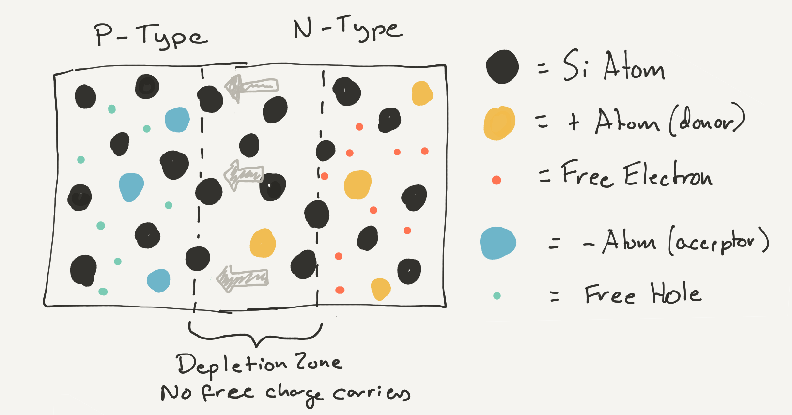
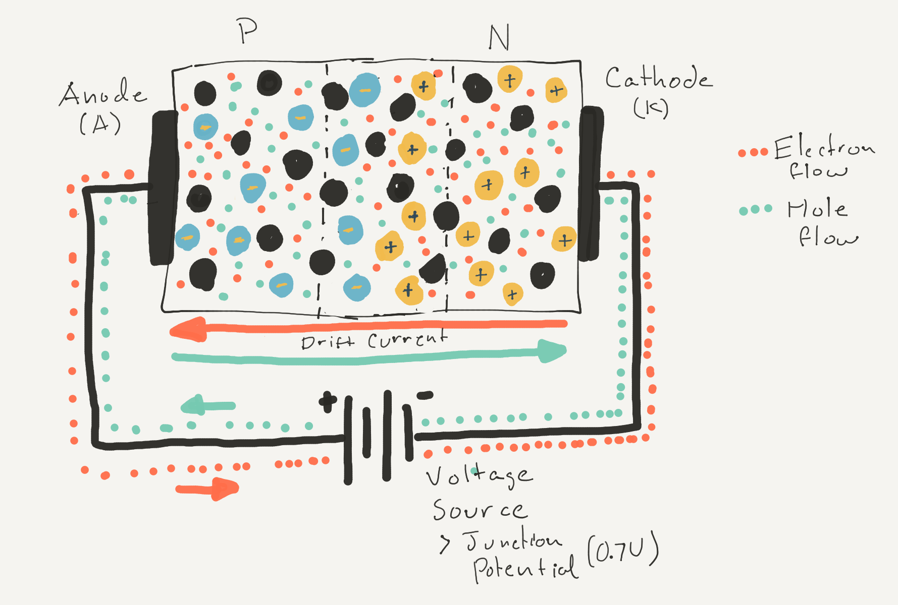
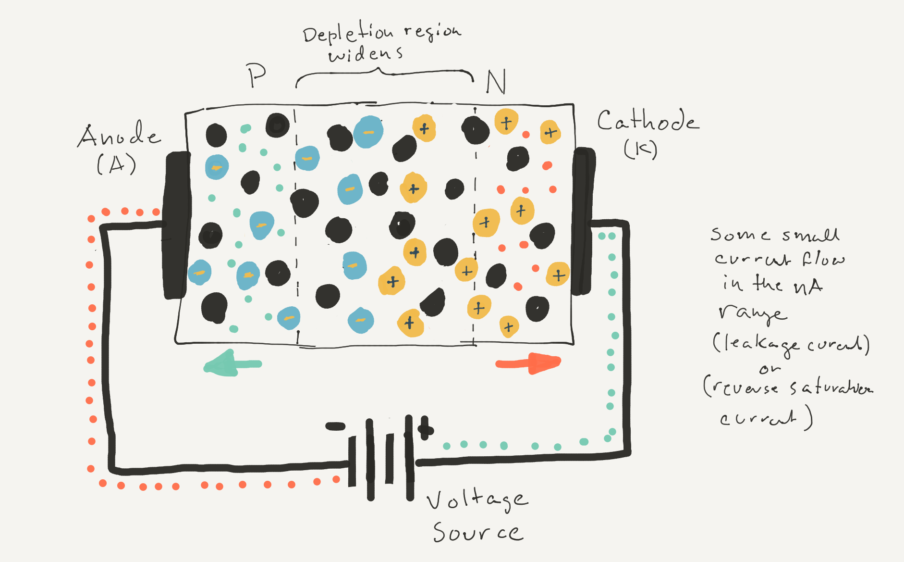
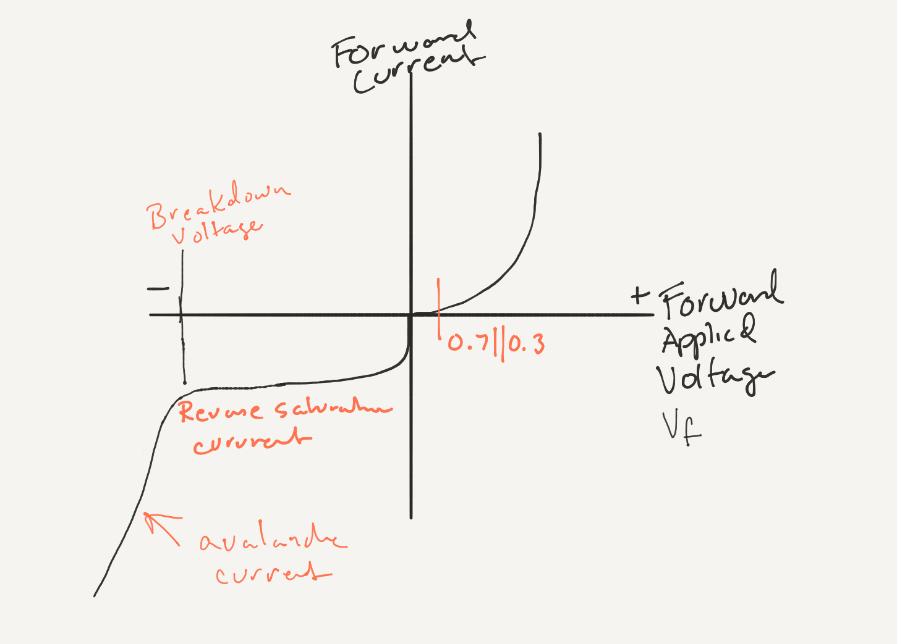

# Combining P-Type and N-Type Semiconductors

[can put P-Type and N-Type semiconductors together, and interesting behaviors occur]

[these behaviors are the foundation of many different kinds of components, including Diodes, Transistors, and more.]

[apart, either P-Type, or N-Type semiconductors will conduct electricity]

[at the junction between the two materials, the free electrons from the N-type _diffuse_ to fill the holes in the P-Type side]:

[this creates a region called the _depletion zone_, or _depletion region_ because it's been depleted of free charge carriers:]

## Junction Electric Field

[depletion zone creates an electric field because the ions are still there]

[called the Junction Potential]

[the electric field potential is known as the _Junction Potential_ and is `600mV - 700mV (0.6V - 0.7V)` in silicon, and `0.3V` in germanium]

### Anode + Cathode

Anode (A) is on the P-Type side, Cathode (K) is on the N-Type side

## Forward Biasing

[applying a voltage in the preferential direction of current flow is called _forward biasing_]

[to propel charge carriers (current) through this region, they must overcome this electric field, meaning that it takes > `0.7V` of electromotive force (EMF) to get them through. Because they pass through this field, it's also the amount of EMF they lose in the process. This is know as the Forward Voltage (`V``f`), or _voltage drop_, because if charge carriers are pushed through this region at `1.0V`, when they come out on the other side, they will only have `0.3V` (`1.0V` - `0.7V`) of energy.]

## Reverse Biasing

[when reversed bias, that is voltage in the opposite direction of preferential current flow, the PN junction behaves in the opposite manner. The holes in the P-Type side are attracted to the Anode, and the electrons in the N-Type side are attracted to the Cathode, causing the depletion region to widen. This also increases the junction potential:]

### Leakage Current/Reverse Saturation Current

[Some small current will flow in a reverse current because the polarity of the depletion region is opposite to the small amount of minority carriers that are present. So holes can flow from P-Type to N-Type, and electrons can flow from N-Type to P-Type. This current, however, is negligible, usually in the range of nano-amperes (nA)][a nA is 1/1,000,000,000A]

[need illustration]

### Breakdown Voltage and Avalanche Current

[when the reverse breakdown voltage is exceeded, an avalanche breakdown will occur, in which electrons will flow so quickly that they knock other electrons out of their holes, which leads them to knocking out more, and so on, causing an "avalanche" of electron flow.]

[some diodes are specifically designed with this in mind]

## Voltage and Current Response Characteristics

# [Next - Diodes](../Diodes)
