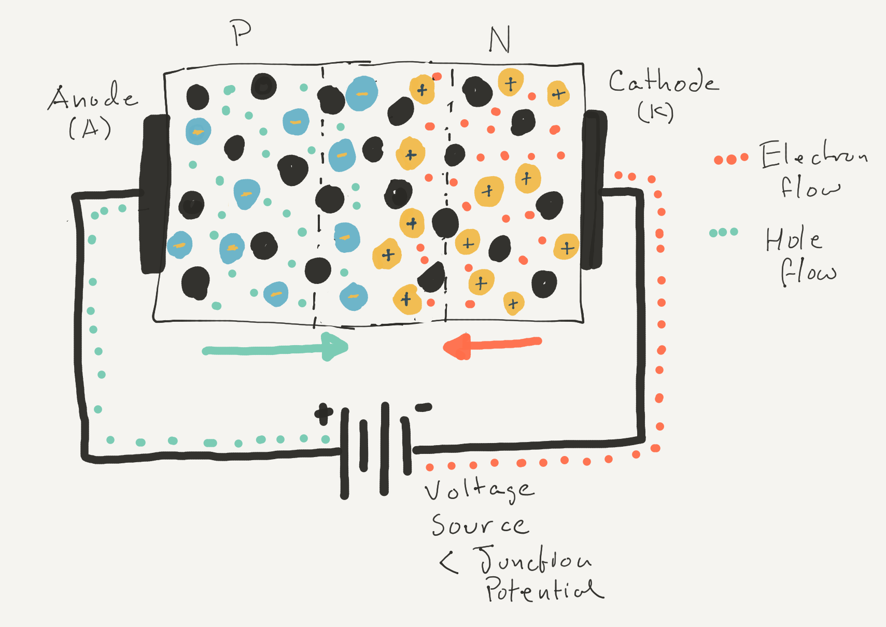

# Combining P-Type and N-Type Semiconductors

[can put P-Type and N-Type semiconductors together, and something interesting occurs]

[apart, either P-Type, or N-Type semiconductors will conduct electricity]

[at the junction between the two materials, the free electrons from the N-type _diffuse_ to fill the holes in the P-Type side]:

[this creates a region called the _depletion zone_, or _depletion region_ because it's been depleted of free charge carriers:]

# Junction Electric Field

[depletion zone creates an electric field because the ions are still there]

[called the Junction Potential]

[the electric field potential is known as the _Junction Potential_ and is `0.7V` in silicon, and `0.3V` in germanium]

## Anode + Cathode

Anode (A) is on the P-Type side, Cathode (K) is on the N-Type side

# Forward Biasing

[to propel charge carriers (current) through this region, they must overcome this electric field, meaning that it takes > `0.7V` of electromotive force (EMF) to get them through. Because they pass through this field, it's also the amount of EMF they lose in the process. This is know as the Forward Voltage (`V``f`), or _voltage drop_, because if charge carriers are pushed through this region at `1.0V`, when they come out on the other side, they will only have `0.3V` (`1.0V` - `0.7V`) of energy.]

# [Next - Diodes](../Diodes)
