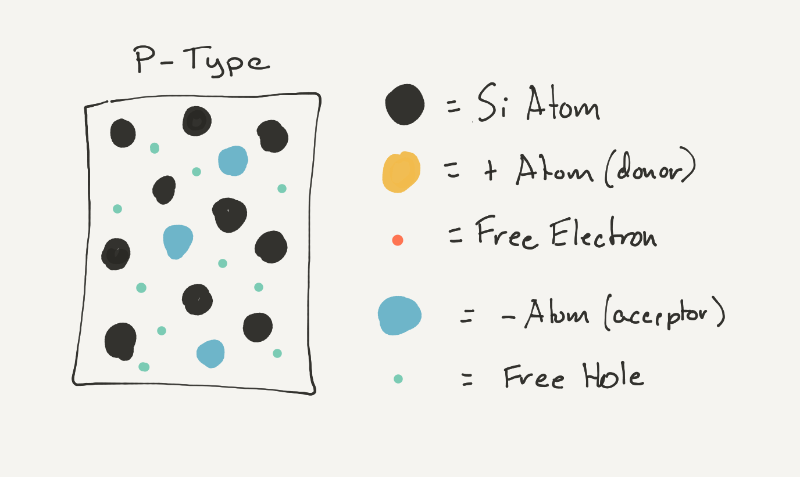

# Intro

Silicon doped with tetravalent elements (elements that have 3 valence electrons), such as boron, create a _P-Type_ semiconductor.

[a neutral charged boron atom has 3 electrons in its valence shell]

[electrons from the surrounding silicon atoms try to fill the "hole" which, which cause the boron atom to become a negative ion, because it has now has an extra electron (negative charge carrier):]

## Acceptor Impurities

[Acceptor impurities "accept" electrons into their holes.]

## Neutral Electric Charge

[however, it's important to note that while the boron ion may have a negative charge, the overall charge of the P-Type material is still neutral, because the number of holes (positive charge) = number of negatively charged acceptor ions.]

## Positive-Type Semiconductor

[the hole is filled by not just one electron, but one electron will pop out, and another one will be in its place, etc.]

[the result is a piece of silicon that has too few electrons, which means it has an abundance of holes (positive charge carriers)][giving it its name of P-Type, or _Positive-Type_]

# [Next - N-Type Semiconductor](../N-Type)