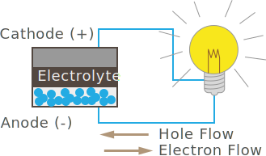

TODO: Add [Battery vs Supercapacitors](https://www.machinedesign.com/batteriespower-supplies/what-s-difference-between-batteries-and-capacitors)

Batteries are made by placing two conductive materials, an anode (`-`) and a cathode (`+`), in paralell and separating them with an electrically conductive solution known as an [electrolyte](https://en.wikipedia.org/wiki/Electrolyte).

The chemical reactions in the battery causes a build of electrons in the electrolyte at the anode side, but they are unable to travel directly to the cathode through the solution becuse of the voltage differential. 

Connecting a wire between the anode and cathode allows those electrons to flow from from the anode to the cathode:

{:standalone}

Most common batteries are cylindrical, which offers a compromise between a perfect volume to surface area ratio, e.g. a sphere, and an arrayable/stackable shape, such as a rectangle. These batteries are made by making a rectangular stack of cathode, electrolyte, and anode and rolling it up. Because of this, they're known as [jelly roll batteries](https://en.wikipedia.org/wiki/Jelly_roll_(battery)).

### Battery Circuit Symbol

The circuit symbol for a battery is two uneven plates:

{:standalone}

Batteries that have more than one cell, or a battery pack, have the plates repeated:

{:standalone}

In some circuit diagrams, they have polarity markings:

{:standalone}

{:standalone}

If no polarity markings are present, polarity can be reasoned by the mnemonic that the longer side has more (`+`), and the short side has less (`-`).

### [Next - Battery Types](../Battery_Types)

 