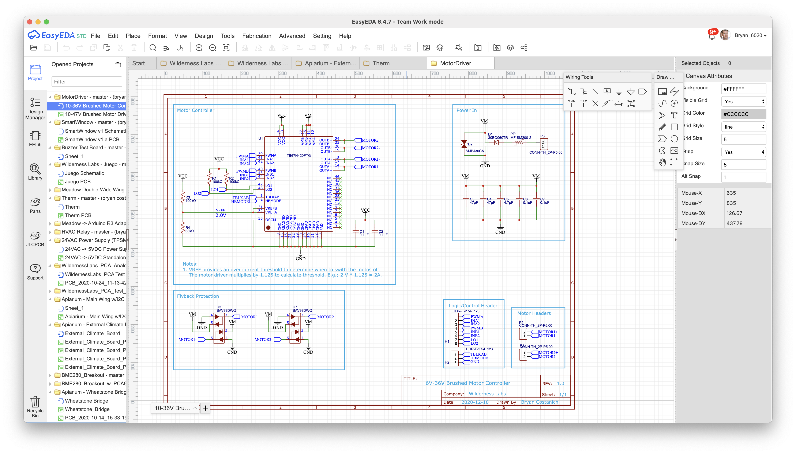
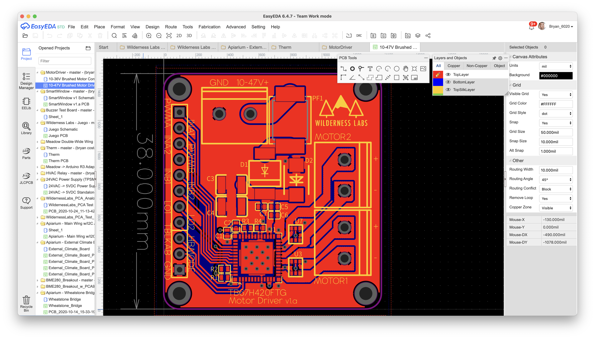

The most effective way to learn PCB design is to actually design and build one. So that's what we'll do. In this multipart tutorial, we're going to design and build a PCB that is a partial version of [Clima](https://store.wildernesslabs.co/collections/frontpage/products/clima-weather-station-kit) that includes  BME280 to track temperature, humidity, and barometric pressure, and get its power from a solar power input. In the end, you'll come away with a general grasp of PCB design from start to finish.

## Process

Along the way, we're going to cover the following:

 * **[Schematic Design, AKA Capture](Schematic_Design)** - Creating a drawing of the circuit parts that will comprise the PCB, including:
   * Reading and Understanding Datasheets
   * Component Selection
   * Creating Custom Schematic Symbols & PCB Footrpints
   * Laying out a circuit in a logical drawing
 * **[PCB Layout/Design](PCB_Layout)** - Designing the physical PCB layout, including:
   * Layer Stackups
   * Component Placement
   * Routing
 * **[PCB Assembly](PCB_Assembly)** - Practical, at-home assembly of SMT and PTH PCBs.

This tutorial will take a hybrid approach, with most content in the form of a three-part video, along with reference textual content.

## Electronic Design Automation (EDA) Tools

PCB design is done almost exclusively with computer software today and is also known as Electronic Design Automation (EDA), and typically consists of two parts:

* Schematic Design (AKA _Schematic Capture)
* PCB Layout

[take the images below and make a side by side (crop them):]

Creating PCBs is a core skill of designing hardware, and although it can be intimidating when starting out, designing PCBs for most IoT solutions is a fairly simple process, and the modern PCB supply chain means you can churn a design and have a professionally printed board in your hands within a week or so.

## Choosing an EDA Tool

Unfortunately, while there are a [lot of EDA tools to choose from](https://en.wikipedia.org/wiki/Comparison_of_EDA_software), as software, they tend to still be a little primitive in their user experience (UX).

Internally, we use two tools; [EasyEDA](https://easyeda.com/) and [KiCAD](https://kicad.org/). KiCAD is a little more advanced, creates slightly nicer schematics, but has a very idiosyncratic and dated UX that can be frustrating.

EasyEDA is much more beginner and user-friendly, so these guides use that as an example, but the concepts generally apply across most EDA tools.

For KiCAD-specific tutorials, we recommend [BaldEngineer.com](https://www.baldengineer.com/?s=kicad&submit=Search), and [SparkFun](https://learn.sparkfun.com/tutorials/beginners-guide-to-kicad).

In this tutorial, we'll use EasyEDA, because of its ease-of-use and beginner friendly parts libraries and such.

## Compared to Breadboarding

In comparison to breadboard prototyping, PCBs _massively_ simplify routing. In fact, many modern IoT projects become impractical to route on a breadboard. PCBs also provide much better electrical connections, which can often cause debugging headaches that take a long time to solve.

In fact, because of the ease at which PCBs can be created, as well as their relative low cost, we often find ourselves skipping the breadboarding phase and churning a PCB.

## [Next: Part 1 - Schematic Capture](Schematic_Design)
