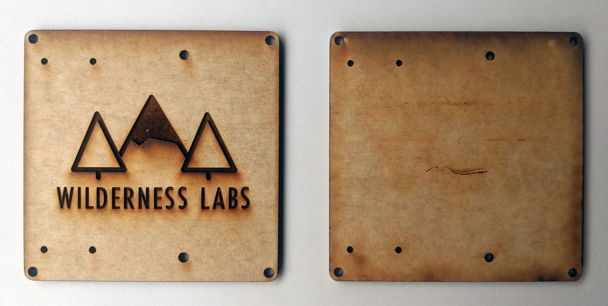
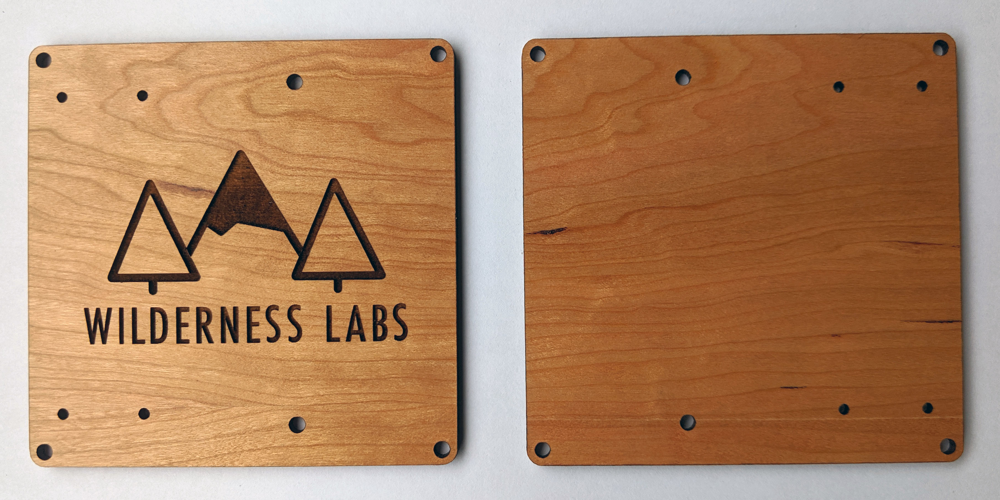
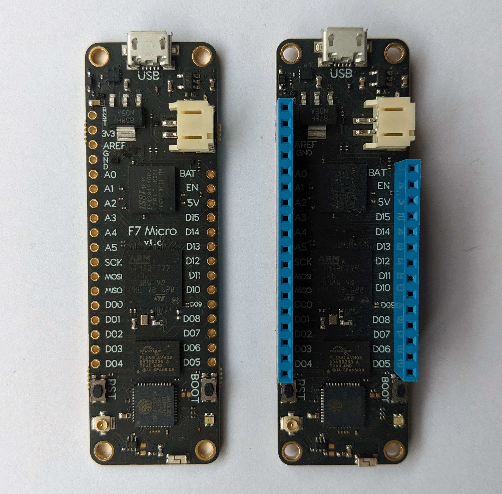
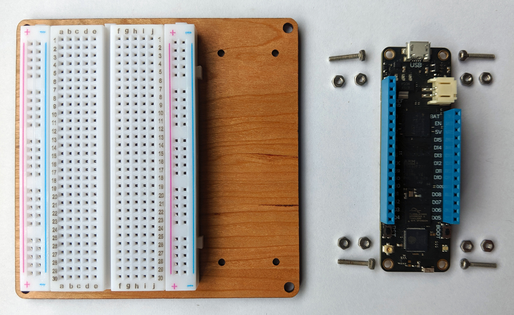

# Assembling Meadow

You have finally received your brand new Meadow dev kit and cant wait to start playing with it. But first thing you will need to do is assemble your hardware dev board, and here we would guide you how to exactly do that.

### Parts

Your kit should include:
 - 1 Meadow board
 - 1 Wooden Wilderness Labs base plate
 - 2 blue female header pins
 - 4 Screws
 - 8 Bolts

 

## Assembling

### Step 1 - Remove cover on the wooden base boards

The Wilderness Labs wooden baseboards come with a protective skin cover to protect the surface from dents and scratches.

Peel it from the corners, and make sure to remove the little bits in the the logo and letters. Once done, you're board should look like this:

### Step 2 - Solder Meadow Header Pins

Next up is solder your female header pins to the board. 

### Step 3 - Place breadboard and Meadow to the base board

Meadow has battery connector on the right side of the device. For this reason, you have to place the breadboard to the left and Meadow to right on the wooden base. Make sure your breadboard is in the right orientation, and the four holes on the wooden boards are on the right side.

Remove the plastic cover under the breadboard and stick it to the board as firm and straight as possible.

Put each screw in the corners on the Meadow board with one bolt so when placing it on the base it will sit flat and the soldered header pins wont get in contact with the base.

Now you can finally fix Meadow through the base board passing each screw through the holes, and use the remaining 4 bolts to firmly hold them together.

Additionally, you could get metal or nylon fasteners so you screw them in the corners of the base board so it can sit flat on any surface.

Congratulations, you now have your Meadow developer kit assembled, and now you can move on to 

## [Next - Deploy a Test App](/Meadow/Getting_Started/Deployment/)
